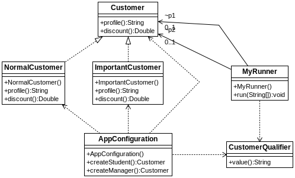

## Cualifcadores personalizados

[Proyecto s01.advancedqualifiers]

En un proyecto podemos utilizar cualificadores personallizados creando nuestras propias anotaciones. Se pueden crear anotaciones específicas solo para determinadas instancias o bien se pueden crear anotaciones que permitan pasar parámetros para así poder distinguir distintos subtipos.
Supongamos que en un proyecto tenemos una clase que representa clientes y que las queremos poder cualificar con nuestrar propias anotaciones, pero distinguiendo distintos tipos de instancias. Las anotaciones nos permiten usar parámetros, tal y como se ve en este ejemplo.



** Componentes del proyecto**


La definición de una anotación es muy sencilla. Se trata de una interface donde se pueden además especificar, a través de anotaciones el tipo de anotación que será y si contiene alǵun método o parámetro.

**Listado - Fichero CustomerQualifier.java**

```java
@Target({ElementType.FIELD, ElementType.METHOD, ElementType.PARAMETER})
@Retention(RetentionPolicy.RUNTIME)
@Qualifier
public @interface CustomerQualifier {
    String value();
}
```

Esta es la interface que nos permitirá crear instancias de Customer más especializadas.

**Listado - Fichero del interface Customer.java.**
```java
public interface Customer {
    public String profile();
    public Double discount();
}
```

La primera clase que hereda de Customer es NormalCustomer, la cual implementa los dos métodos. Observe que tanto esta clase como la de ImportantCustomer tienen la anotación Component, lo cual indicará a Spring que cree una instancia de cada una.

**Listado - Fichero NormalCustomer.java.**

```java
@Component
public class NormalCustomer implements Customer {

	@Override
	public String profile() {
		return "NormalCustomer";
	}

	@Override
	public Double discount() {
		return 0.10d;
	}
}
```

La otra clase que hereda de Customer es ImportantCustomer, la cual tiene unas variantes en los resultados que producen los métodos.

**Listado - Fichero ImportantCustomer.java.**

```java
@Component
public class ImportantCustomer implements Customer {

    @Override
    public String profile() {
        return "ImportantCustomer";
    }

	@Override
	public Double discount() {
		return 0.20d;
	}
}
```
Y esta sería la configuración del proyecto.

**Listado - Fichero AppConfiguration.java modificado.**

```java
@Configuration
public class AppConfiguration {

    @CustomerQualifier("normalCustomer")
    public Customer createStudent() {
        return new NormalCustomer();
    }

    @CustomerQualifier("importantCustomer")
    public Customer createManager() {
        return new ImportantCustomer();
    }
}
```

Para probar las dos intancias configuradas, se configura la siguiente clase MyRunner que nos permite ejecutar la aplicación como Spring Boot desde la línea de comandos. En esta caso, se lanzará desde la clase Application.java, la cual tiene el código habitual.
Observe cómo se hace el autowire de p1 y p2 a través de nuestro cualificador personalizado, al cual se le pasa un parámetro para poder distinguirlo.

**Listado - Fichero MyRunner.java.**

```java
@Component
public class MyRunner implements CommandLineRunner {

    @Autowired
    @CustomerQualifier("normalCustomer")
    Customer p1;

    @Autowired
    @CustomerQualifier("importantCustomer")
    Customer p2;

    @Override
    public void run(String... args) throws Exception {
        System.out.println(p1.profile() + " Dis: " + p1.discount());
        System.out.println(p2.profile() + " Dis: " + p2.discount());
    }
}
```
Como resultado de la ejecución, por pantalla veremos:

```bash
NormalCustomer Dis: 0.1
ImportantCustomer Dis: 0.2
```
