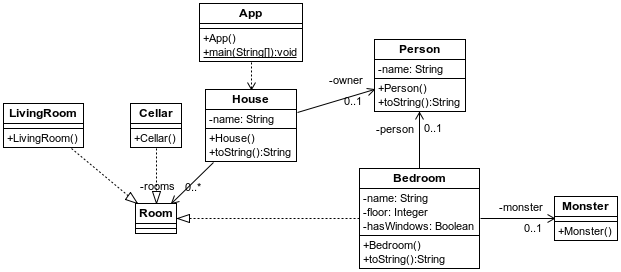

## Autowiring
[Proyecto s01.autowired.house]

La configuración a través de XML puede resultar un tanto tediosa, ya que nos obliga a gestionar un fichero con un formato algo engorroso que además puede tener errores que no se detectan hasta el tiempo de ejecución. Los IDEs como Eclipse pueden detectar algunos errores como las referencias a clases no existentes, sin embargo puede haber valores que no se establezcan correctamente ya que en XML no se pueden indicar los tipos.
A través del autowiring, se pueden añadir una serie de anotaciones en las clases que Spring detecta y permite instancias e inyectar las instancias ahí donde sea preciso.
En el siguiente ejemplo, se monta una especie de casa con habitaciones, dueño e incluso un monstruo. Los componentes son los siguientes:



**Figura 1.31. Componentes del proyecto**


Por un lado, se define una interface Room

**Listado - Fichero Room.java.**

```java
public interface Room {
}
```

Y por otro, se definen otras habitaciones que implementan ese interface.

**Listado - Fichero Cellar.java**

```java
@Component
public class Cellar implements Room {
}
```

**Listado - Fichero Bedroom.java**

```java
@Component
public class LivingRoom implements Room {
}
```

La casa está encantada, así que no podía faltar el monstruo:

**Listado - Fichero Monster.java.**

```java
@Component
public class Monster {
}
```

En el caso de la persona que habita la casa, además de declararla como componente, también se le asigna el valor al nombre.

**Listado - Fichero Person.java.**

```java
@Component
public class Person {
	@Value("Charles Dexter Ward")
	private String name;
...
}
```

Y la habitación interesante sin duda es BedRoom, que es donde se hace referencia a la persona y al monstruo. Mediante la anotación @Autowired, ambos componentes serán inyectados en sus respectivos atributos. La forma que Spring utilizará para la inyección será por tipo. Al resto de atributos, name, floor y hasWindows les asignamos valores.

**Listado - Fichero Bedroom.java.**

```java
package es.anaya.spring.basic.s01.autowired.house;

import org.springframework.beans.factory.annotation.Autowired;
import org.springframework.beans.factory.annotation.Value;
import org.springframework.stereotype.Component;

@Component
public class Bedroom implements Room {
	@Value("MyRoom")
	private String name;
	@Value("1")
	private Integer floor;
	@Value("false")
	private Boolean hasWindows;
	@Autowired
	private Person person;
	@Autowired
	private Monster monster;

...
}
```

Y por último la casa. De forma similar a Bedroom, se le inyectan los otros componentes, pero hay uno especialmente interesante: una lista de habitaciones. ¿Cómo se inyectan? Spring lo hace por tipo. Todos los componentes que existan de ese tipo se incluirán en la lista:

**Listado - Fichero House.java.**

```java

@Component("hauntedHouse")
public class House {
	@Value("Derceto")
	private String name;
	@Autowired
	private List<Room> rooms = new ArrayList<Room>();
	@Autowired
	private Person owner;

	public House() {}
...
}
```

En el fichero de configuración XML se puede omitir toda configuración y dejar simplemente una línea para indicarle a Spring que debe escanear los componentes dentro del paquete del proyecto. Gracias a eso, Spring buscará todas aquellas clases con la anotación @Component o sus derivadas.

**Listado - Fichero beans.xml.**

```xml
<?xml version="1.0" encoding="UTF-8"?>
<beans xmlns="http://www.springframework.org/schema/beans"
 xmlns:xsi="http://www.w3.org/2001/XMLSchema-instance"
 xmlns:context="http://www.springframework.org/schema/context"
 xsi:schemaLocation="http://www.springframework.org/schema/beans
 http://www.springframework.org/schema/beans/spring-beans.xsd
 http://www.springframework.org/schema/context
 http://www.springframework.org/schema/context/spring-context-2.5.xsd">

 <context:component-scan base-package="es.anaya.spring.basic.s01.autowired.house" />


</beans>
```

Y por último, en la clase principal se recupera la instancia del componente que se ha marcado como “hauntedHouse” y se vuelca su contenido.

**Listado - Fichero App.java.**

```java
public class App {

	public static void main(String[] args) {
		ApplicationContext context =
			new ClassPathXmlApplicationContext("beans.xml");

		House hauntedHouse = (House) context.getBean("hauntedHouse");

		System.out.println("House was created " + hauntedHouse);

		((ConfigurableApplicationContext) context).close();
	}
}
```

Resultado que confirma que las instancias y las inyecciones se han hecho correctamente.

```bash
INFORMACIÓN: Loading XML bean definitions from class path resource [beans.xml]
House was created House [name=Derceto, rooms=[Bedroom [name=MyRoom, floor=1, hasWindows=false, person=Person [name=Charles Dexter Ward], monster=es.anaya.spring.basic.s01.autowired.house.Monster@77be656f], es.anaya.spring.basic.s01.autowired.house.Cellar@7181ae3f, es.anaya.spring.basic.s01.autowired.house.LivingRoom@46238e3f], owner=Person [name=Charles Dexter Ward]]
```
