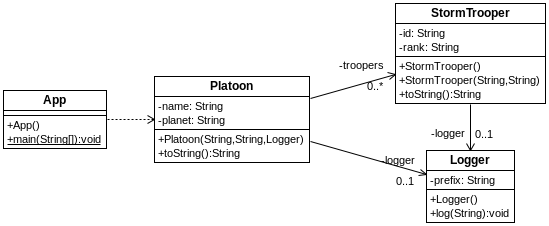

## Ámbito de beans
[Proyecto s01.beanscope]

El scope o ámbito de las instancias en una aplicación controlada por Spring puede ser manipulado para que se comporte como a nosotros nos interesa.
*	singleton: es el modo por defecto, se crea una instancia única de la clase indicada.
*	prototype: se crean distancias diferentes por cada uno.

En el siguiente ejemplo, se crean un bean que representa un pelotón (Platoon) como instancia singleton (de forma explícita aunque no sería necesario indicarlo ya que así sea hace por defecto), y los soldados se instancian con el scope prototype. Además, ambos utilizan una clase para el registro de mensajes.
¿Por qué puede ser interesante hacerlo así en este caso? Porque nos interesa crear muchas instancias distintas de determinado tipo, sin tener que hacer cada una explícitamente. En este caso, definiremos una instancia de StormTrooper como prototype que luego podremos inyectar a modo de colección dentro de Platoon.
Estos son los componentes.



**Figura - Componentes del proyecto**

En primer lugar, usaremos una clase específica para el registro de mensajes. Este es el caso típico de singleton, cuando no queremos crear múltiples instancias de una clase de utilidad como esta, se suele aplicar el patrón singleton. En este caso, en lugar de aplicar el patrón de diseño, dejaremos en manos de Spring que solamente se cree una instancia.

**Listado - Fichero Logger.java.**


```java
package es.anaya.spring.basic.s01.beanscope;

public class Logger {
	private String prefix;

	public Logger() {
		prefix = "Log> ";
		log("Logger was instantiated");
	}

	public void log(String message) {
		System.out.println(prefix + message);
	}
}
```

Esta es la clase StormTrooper, la cual no tiene nada en particular salvo que también le inyectaremos el logger definido antes.

**Listado - Fichero StormTrooper.java.**

```java
package es.anaya.spring.basic.s01.beanscope;

public class StormTrooper {
	private String id;
	private String rank;
	private Logger logger;

	public StormTrooper() {
	}

	public StormTrooper(String id, String rank) {
		this.id = id;
		this.rank = rank;
	}
...
}
```

La clase Platoon contiene un colección donde meteremos los StormTroopers.

**Listado - Fichero Platoon.java.**

```java
package es.anaya.spring.basic.s01.beanscope;

import java.util.ArrayList;
import java.util.List;

public class Platoon {
	private String name;
	private String planet;
	private List<StormTrooper> troopers = new ArrayList<StormTrooper>();
	private Logger logger;

	public Platoon(String name, String planet, Logger logger) {
		this.name = name;
		this.planet = planet;
		this.logger = logger;

		this.logger.log("Platoon instantiated> " + toString());
	}
...
}
```

Lo interesante en este caso está en el fichero de configuración de beans, donde indicamos a cada instancia su ámbito o scope. Logger y Platoon tienen un ámbito de singleton mientras que los Stormtrooper  son prototype, lo cual resulta especialmente útil porque se precisan instancias distintas del mismo objeto.
La clave se aprecia en la lista de StormTroopers de Platoon. Pese a hacer referencia a la misma instancia, al tener esta el ámbito de prototype estaremos creando una instancia distinta cada vez.

**Listado - Fichero beans.xml.**

```xml
<?xml version="1.0" encoding="UTF-8"?>
<beans xmlns="http://www.springframework.org/schema/beans"
	xmlns:xsi="http://www.w3.org/2001/XMLSchema-instance"
	xsi:schemaLocation="http://www.springframework.org/schema/beans
	http://www.springframework.org/schema/beans/spring-beans.xsd">

	<bean id="logger" class="es.anaya.spring.basic.s01.beanscope.Logger" scope="singleton" />

	<bean id="stormTrooper" class="es.anaya.spring.basic.s01.beanscope.StormTrooper" scope="prototype" >
		<constructor-arg name="id" value="#{ T(java.lang.Math).random() * 9999.0 }" />
		<constructor-arg name="rank" value="Soldier" />
	</bean>

	<bean id="platoon" class="es.anaya.spring.basic.s01.beanscope.Platoon" >
		<constructor-arg name="name" value="XIII" />
		<constructor-arg name="planet" value="Tatooine" />
		<constructor-arg name="logger" ref="logger" />
		<property name="troopers">
			<list>
				<ref bean="stormTrooper" />
				<ref bean="stormTrooper" />
				<ref bean="stormTrooper" />
				<ref bean="stormTrooper" />
			</list>
		</property>
	</bean>

</beans>
```

La clase principal se limita a recuperar la instancia de Platoon para sacar todas sus propiedades.


**Listado - Fichero App.java modificado.**

```java
package es.anaya.spring.basic.s01.beanscope;

import org.springframework.context.ApplicationContext;
import org.springframework.context.ConfigurableApplicationContext;
import org.springframework.context.support.ClassPathXmlApplicationContext;;

public class App {
	public static void main(String[] args) {
		ApplicationContext context = new ClassPathXmlApplicationContext("beans.xml");

		Platoon platoon = (Platoon) context.getBean("platoon");

		System.out.println("Platoon was created " + platoon);

		((ConfigurableApplicationContext) context).close();
	}
}
```

En cuanto a la salida del programa, esto es lo que se vería por consola. Se pueden apreciar los logs que se generan a través del bean de logging. Y vemos cómo, efectivamente, cada instancia de StormTrooper es distinta.

```bash
INFORMACIÓN: Loading XML bean definitions from class path resource [beans.xml]
Log> Logger was instantiated
Log> Platoon instantiated> Platoon [name=XIII, planet=Tatooine, troopers=[]]
Platoon was created Platoon [name=XIII, planet=Tatooine, troopers=[StormTrooper [id=7106.767486874284, rank=Soldier], StormTrooper [id=6684.56009481228, rank=Soldier], StormTrooper [id=2836.107980734295, rank=Soldier], StormTrooper [id=5425.433851310928, rank=Soldier]]]
```
