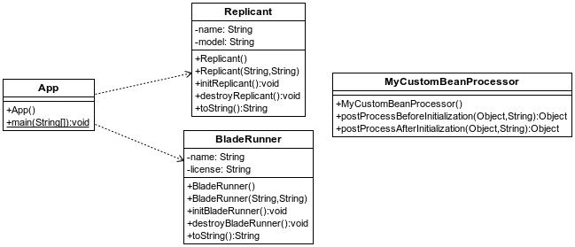

## Ciclo de vida de los beans
[Proyecto s01.lifecycle.replicant]

Cuando Spring se encarga de instanciar aquellas clases que se le hayan indicado, esas instancias pasan por un ciclo de vida desde su inicialización a su destrucción.
A través de código se puede intervenir en ese ciclo de vida. Aunque no es algo que se precise de forma frecuente, aquí se muestra un ejemplo de cómo hacerlo
Para ilustrar el concepto se utilizan clases inspiradas en una conocida película donde conviven serés artificiales con fecha de caducidad y los agentes que los deben retirar.



**Figura - Componentes del proyecto**

En primer lugar se define una clase llamada BladeRunner, la cual utiliza dos anotaciones específicas de Java que indican que determinados métodos se ejecutan cuando se crea una instancia de la misma y otra cuando se destruye.

**Listado 1.1. Fichero BladeRunner.java.**

```java
import javax.annotation.PostConstruct;
import javax.annotation.PreDestroy;

public class BladeRunner {
	private String name;
	private String license;

	public BladeRunner() {
	}

	public BladeRunner(String name, String license) {
		this.name = name;
		this.license = license;
	}

...

	@PostConstruct
	public void initBladeRunner() {
		System.out.println("BladeRunner> ready to serve. " + this);
	}

	@PreDestroy
	public void destroyBladeRunner() {
		System.out.println("BladeRunner> retired. " + this);

	}
}
```

La clase Replicant no tiene las anotaciones del BladeRunner pero sí que define un par de métodos que pueden ser utilizados en el inicio y la destrucción del mismo.

**Listado 1.1. Fichero Replicant.java.**

```java
public class Replicant {
	private String name;
	private String model;
	
	public Replicant () {}
	
	public Replicant(String name, String model) {
		this.name = name;
		this.model = model;
	}
...
	
    public void initReplicant()  {
        System.out.println("Replicant> I'll see things.. " + this);
    }

    public void destroyReplicant() {
        System.out.println("Replicant> Time to die. " + this);

    }    
}
```

Este proyecto utiliza configuración basada en XML. En este caso, además de una instancia de Blade Runner y otra de Replicant, se crean otras dos instancias:
*	CommonAnnotationBeanPostProcessor: es una clase que nos permite controlar el ciclo de vida de las instancias a través de anotaciones.
*	MyCustomBeanProcessor: se trata de una clase propia con la que se muestra cómo se puede interactuar con el ciclo de vida de las instancias, la cual se muestra al final.

**Listado 1.1. Fichero beans.xml.** 

```xml
<?xml version="1.0" encoding="UTF-8"?>
<beans xmlns="http://www.springframework.org/schema/beans"
	xmlns:xsi="http://www.w3.org/2001/XMLSchema-instance"
	xsi:schemaLocation="http://www.springframework.org/schema/beans 
	http://www.springframework.org/schema/beans/spring-beans.xsd">
	
<bean class="org.springframework.context.annotation.CommonAnnotationBeanPostProcessor" />
  <bean class="es.anaya.spring.basic.s01.lifecycle.replicant.MyCustomBeanProcessor" /> 
    
  <bean id="replicant" 
    		class="es.anaya.spring.basic.s01.lifecycle.replicant.Replicant" 
    		init-method="initReplicant" destroy-method="destroyReplicant">
      <property name="name" value="Rachel" />
      <property name="model" value="Nexus 7" />
  </bean>
    
  <bean id="bladeRunner" 
     		class="es.anaya.spring.basic.s01.lifecycle.replicant.BladeRunner">
      <property name="name" value="Deckard" />
      <property name="license" value="K-5322" />
  </bean>
    
</beans>
```

La clase principal, simplementa carga el contexto y recupera un par de instancias, por lo tanto en el ciclo de vida de las instancias deberíamos ver algo. Luego destruye el contexto por lo que se debería registrar algo por la destrucción de esas instancias.


**Listado 1.1. Fichero App.java**

```java
import org.springframework.context.ApplicationContext;
import org.springframework.context.ConfigurableApplicationContext;
import org.springframework.context.support.ClassPathXmlApplicationContext;;

public class App {
	public static void main(String[] args) {
	 ApplicationContext context = 
		new ClassPathXmlApplicationContext("beans.xml");

	 Replicant replicant = (Replicant) context.getBean("replicant");
	 BladeRunner bladeRunner = (BladeRunner) context.getBean("bladeRunner");
		
	 ((ConfigurableApplicationContext) context).close();
	}
}
```

La clase que nos permite interactuar con el ciclo de vida de los beans debe ser una clase Java que implemente alguna interface específica, en este caso la interface BeanPostProcessor. A través de los métodos  postProcessBeforeInitialization y  postProcessAfterInitialization, se puede saber qué beans se han instanciado o destruido.

**Listado 1.1. Fichero MyCustomBeanProcessor.java.** 

```java

import org.springframework.beans.BeansException;
import org.springframework.beans.factory.config.BeanPostProcessor;

public class MyCustomBeanProcessor 
				implements BeanPostProcessor {

    public Object postProcessBeforeInitialization(Object bean, String beanName) 
    		throws BeansException {
   	 System.out.println("MyCustomProcessor> " + beanName 
   			 	+ "was instantiated. Type: " + bean.getClass()); 
       return bean;
   }
    
    public Object postProcessAfterInitialization(Object bean, String beanName) 
    		throws BeansException {
        System.out.println("MyCustomProcessor> "+ beanName 
        			+ "was destroyed. Type: " + bean.getClass());
        return bean;
    }

}
```

Al ejecutar la aplicación, se ve cómo entran en juego los métodos vinculados al ciclo de vida de los beans.

```bash
INFORMACIÓN: Loading XML bean definitions from class path resource [beans.xml]
MyCustomProcessor> replicantwas instantiated. Type: class es.anaya.spring.basic.s01.lifecycle.replicant.Replicant
Replicant> I'll see things.. Replicant [name=Rachel, model=Nexus 7]
MyCustomProcessor> replicantwas destroyed. Type: class es.anaya.spring.basic.s01.lifecycle.replicant.Replicant
MyCustomProcessor> bladeRunnerwas instantiated. Type: class es.anaya.spring.basic.s01.lifecycle.replicant.BladeRunner
BladeRunner> ready to serve. BladeRunner [name=Deckard, license=K-5322]
MyCustomProcessor> bladeRunnerwas destroyed. Type: class es.anaya.spring.basic.s01.lifecycle.replicant.BladeRunner
ene 04, 2018 9:41:06 AM org.springframework.context.support.AbstractApplicationContext doClose
INFORMACIÓN: Closing org.springframework.context.support.ClassPathXmlApplicationContext@27f8302d: startup date [Thu Jan 04 09:41:06 CET 2018]; root of context hierarchy
BladeRunner> retired. BladeRunner [name=Deckard, license=K-5322]
Replicant> Time to die. Replicant [name=Rachel, model=Nexus 7]
```
