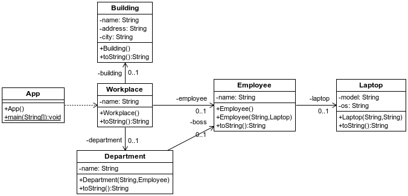

## Definición de beans anidados

Las definiciones de beans en el fichero xml puede hacerse a base de referencias, es decir, primero podemos definir beans de manera independiente y luego usamos los ids asignados para inyectarlos en los otros beans. El orden no tiene importancia, y queda en manos del desarrollador establecer un orden del fichero más o menos coherente con la jerarquía que forman las clases del proyecto.
Sin embargo, en estos ficheros existe la interesante posibilidad de definir los beans de manera anidada, emulando en cierto modo la jerarquía de las clases. Esto puede resultar más natural en muchos casos, y en proyectos en los que solamente se usan y se inyectan las instancias una vez, encajaría muy bien.
Puedes comprobarlo en el siguientes ejemplo: [Proyecto s01.nested.workplace]



**Figura - Componentes del proyecto**

Empezamos por la clase más simple y sin ninguna dependencia, la clase que representa un Laptop o portátil.

**Listado 1.1. Fichero Laptop.java.**

```java
package es.anaya.spring.basic.s01.nested.workplace;

public class Laptop {
	private String model;
	private String os;
	
	public Laptop(String model, String os) {
		this.model = model;
		this.os = os;
	}
...
}
```

Building también es otra clase que no depende de nadie, simplemente representa un edificio.

**Listado 1.1. Fichero Building.java**

```java
package es.anaya.spring.basic.s01.nested.workplace;

public class Building {
	private String name;
	private String address;
	private String city;
	
	public Building() {}	
...
}
```

La clase departamento, tiene una referencia a empleado pero referida al empleado jefe de ese departamento:

**Listado 1.1. Fichero Department.java.**

```java
package es.anaya.spring.basic.s01.nested.workplace;

public class Department {
	private String name;
	private Employee boss;
	
	public Department(String name, Employee boss) {
		this.name = name;
		this.boss = boss;
	}
...
}
```


La clase Employee tiene como referencia la clase Laptop.

**Listado 1.1. Fichero Employee.java.**

```java
package es.anaya.spring.basic.s01.nested.workplace;

public class Employee { 
	private String name;
	private Laptop laptop;
	
	public Employee() {}
	
	public Employee(String name, Laptop laptop) {
		this.name = name;
		this.laptop = laptop;
	}
...
}
```

Y por último, la clase Workplace o puesto de trabajo, es la que contiene a todas, desde el edificio, el departamento al trabajador.

**Listado 1.1. Fichero Workplace.java.**

```java
package es.anaya.spring.basic.s01.nested.workplace;

public class Workplace {
	private String name;
	private Building building;
	private Department department;
	private Employee employee;
	
	public Workplace () {}	
...
}
```

Aquí estaría la parte interesante de este proyecto. Una forma de definir los beans anidados, sin necesidad de usar referencias. Esto no deja de ser una opción diferente, que quiza para algunos pueda resultar más intuitiva.

**Listado 1.1. Fichero beans.xml.**

```xml
<?xml version="1.0" encoding="UTF-8"?>
<beans xmlns="http://www.springframework.org/schema/beans"
  xmlns:xsi="http://www.w3.org/2001/XMLSchema-instance"
  xsi:schemaLocation="http://www.springframework.org/schema/beans 
  http://www.springframework.org/schema/beans/spring-beans.xsd">

<bean id="workplace" class="es.anaya.spring.basic.s01.nested.workplace.Workplace">
  <property name="name" value="Developer place" />
  <property name="building">
  
    <bean class="es.anaya.spring.basic.s01.nested.workplace.Building">
      <property name="name" value="Dennis Ritchie Memorial" />
      <property name="address" value="Linus Torvalds avenue" />
      <property name="city" value="San Francisco" />
    </bean>
  
  </property>
  <property name="department">
    <bean class="es.anaya.spring.basic.s01.nested.workplace.Department">
      <constructor-arg name="name" value="Information Technology" />
      <constructor-arg>
      
        <bean class="es.anaya.spring.basic.s01.nested.workplace.Employee">
          <property name="name" value="Steve Jobs" />
          <property name="laptop">
          
            <bean id="laptop2" class="es.anaya.spring.basic.s01.nested.workplace.Laptop">
              <constructor-arg index="0" value="Toshiba Mitnick" />
              <constructor-arg index="1" value="Ubuntu 16" />
            </bean>
          
          </property>
        </bean>
      
      </constructor-arg>
    </bean>
  </property>
  <property name="employee">
    <bean class="es.anaya.spring.basic.s01.nested.workplace.Employee">
      <constructor-arg name="name" value="Brian Kernigan" />
        <constructor-arg>
        
          <bean class="es.anaya.spring.basic.s01.nested.workplace.Laptop">
            <constructor-arg name="model"
              value="Dell Spontaneous Combustion" />
            <constructor-arg name="os" value="Windows 95" />
          </bean>
      
        </constructor-arg>
      </bean>
    </property>
  </bean>
  
</beans>
```

En el programa principal, se carga el contexto de Spring y se recupera el bean workplace, que es quien contiene al resto.

**Listado 1.1. Fichero App.java**

```java
import org.springframework.context.ApplicationContext;
import org.springframework.context.ConfigurableApplicationContext;
import org.springframework.context.support.ClassPathXmlApplicationContext;;

public class App {
	public static void main(String[] args) {
	  ApplicationContext context = 
		new ClassPathXmlApplicationContext("beans.xml");

	  Workplace workPlace = (Workplace) context.getBean("workplace");

	  System.out.println("WorkPlace was created: " + workPlace);

	  ((ConfigurableApplicationContext) context).close();
	}
}
```

El resultado de la ejecución, sería el siguiente, donde se aprecia que Workplace contiene el resto de elementos.

```bash
INFORMACIÓN: Loading XML bean definitions from class path resource [beans.xml]
WorkPlace was created: Workplace [name=Developer place, building=Building [name=Dennis Ritchie Memorial, address=Linus Torvalds avenue, city=San Francisco], department=Department [name=Information Technology, boss=Employee [name=Steve Jobs, laptop=Laptop [model=Toshiba Mitnick, os=Ubuntu 16]]], employee=Employee [name=Brian Kernigan, laptop=Laptop [model=Dell Spontaneous Combustion, os=Windows 95]]]
```
