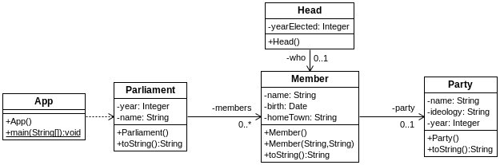

## A Iniciallización con factories
[Proyecto s01.parliament]

A la hora de inyectar valores en las clases, una de las situaciones que generan dudas son las fechas. Pasar una cadena y que esta se convierta a un formato concreto de fecha no es algo trivial. Afortunadamente, en Spring podemos utilizar el mecanismo de los factory-method, el cual nos permite crear instancias utilizando el patrón factory.
En el siguiente proyecto de ejemplo, que representa un parlamento político, se muestra cómo lidiar con los valores de fecha en un proyecto que utiliza XML para las definiciones.



**Figura - Componentes del proyecto s01.parliament**


La clase que representa un partido no tiene nada de particular.

**Listado - Fichero Party.java.** 

```java
package es.anaya.spring.basic.s01.parliament;

public class Party {
	private String name;
	private String ideology;
	private Integer year;
	
	public Party () {}
...
}
```

La clase que representa al presidente del parlamento contiene una referencia a la clase Member, es decir, un miembro del parlamento.

**Listado - Fichero Head.java.**

```java
package es.anaya.spring.basic.s01.parliament;

public class Head {
	private Integer yearElected;
	private Member who;
	
	public Head () {}
...
}
```

Esta es la clase que representa a un miembro del parlamento. Tiene el peculiar campo Date, el cual no se puede asignar de cualquier manera, y menos aún desde una configuración XML. En este caso, se usará su método set para ser establecido.

**Listado - Fichero Member.java.** 

```java
package es.anaya.spring.basic.s01.parliament;

import java.util.Date;

public class Member {
	private String name;
	private Date birth;
	private String homeTown;
	private Party party;
	
	public Member () {}
	
	public Member(String name, String homeTown) {
		this.name = name;
		this.homeTown = homeTown;
	}
...
}

```

La clase que contiene el parlamento tiene una colección de miembros del parlamento.

**Listado - Fichero Parliament.java. **

```java
package es.anaya.spring.basic.s01.parliament;

import java.util.ArrayList;
import java.util.List;

public class Parliament {
	private Integer year;
	private String name;
	private List<Member> members = new ArrayList<Member>();
	
	public Parliament () {}
...
}
```

Y llega la parte interesante. Para tratar con las fechas creamos una instancia del bean SimpleDateFormat que pertenece a la librería de utilidades de java. Le indicamos cómo parámetro cómo es el formato que le vamos a dar con la platilla yyyy-MM-dd. 
Utilizando este bean asignaremos un valor a los campos fecha de la clase que representa a los parlamentarios. El valor se asigna a través de las properties, pero previamente se usa un método factory del bean SimpleDateFormat.

**Listado - Fichero beans.xml.** 

```xml
<?xml version="1.0" encoding="UTF-8"?>
<beans xmlns="http://www.springframework.org/schema/beans"
  xmlns:xsi="http://www.w3.org/2001/XMLSchema-instance"
  xmlns:p="http://www.springframework.org/schema/p"
  xsi:schemaLocation="http://www.springframework.org/schema/beans 
  http://www.springframework.org/schema/beans/spring-beans.xsd">

  <bean id="dateFormat" class="java.text.SimpleDateFormat">
    <constructor-arg value="yyyy-MM-dd" />
  </bean>
  
  <bean id="libDems" class="es.anaya.spring.basic.s01.parliament.Party"
    p:name="Liberal" p:ideology="Liberal" p:year="1901" />
  
  <bean id="tories" class="es.anaya.spring.basic.s01.parliament.Party"
    p:name="Conservative" p:ideology="Right Wing" p:year="1811" />
  
  <bean id="labour" class="es.anaya.spring.basic.s01.parliament.Party"
    p:name="Labour" p:ideology="Left Wing" p:year="1950" />
      
  <bean id="mp1" class="es.anaya.spring.basic.s01.parliament.Member"
    p:name="Nick Clegg" p:homeTown="London" p:party-ref="libDems" >
    <property name="birth">
      <bean factory-bean="dateFormat" factory-method="parse">
        <constructor-arg value="1979-02-14" />
      </bean>
    </property>
  </bean>

  <bean id="mp2" class="es.anaya.spring.basic.s01.parliament.Member"
    p:name="Mariano Rajoy" p:homeTown="Pontevedra" p:party-ref="tories" >
    <property name="birth">
      <bean factory-bean="dateFormat" factory-method="parse">
        <constructor-arg value="1965-12-04" />
      </bean>
    </property>
  </bean>

  <bean id="mp3" class="es.anaya.spring.basic.s01.parliament.Member"
    p:name="Pedro Sánchez" p:homeTown="Madrid" p:party-ref="labour" >
    <property name="birth">
      <bean factory-bean="dateFormat" factory-method="parse">
        <constructor-arg value="1977-02-24" />
      </bean>
    </property>
  </bean>
  
    <bean id="parliament" class="es.anaya.spring.basic.s01.parliament.Parliament"
    p:name="Federation of Planets" p:year="1789"  >
    <property name="members">
      <list>
        <ref bean="mp1" />
                <ref bean="mp2" />
                <ref bean="mp3" />
      </list>
    </property>
  </bean>
    
</beans>
```


La clase principal se limita a recuperar la instancia de Parliament, que es quien contiene al resto
:
**Listado - Fichero App.java.**

```java
package es.anaya.spring.basic.s01.parliament;

import org.springframework.context.ApplicationContext;
import org.springframework.context.ConfigurableApplicationContext;
import org.springframework.context.support.ClassPathXmlApplicationContext;;

public class App {
  public static void main(String[] args) {
    ApplicationContext context = 
        new ClassPathXmlApplicationContext("beans.xml");

    Parliament parliament = (Parliament) context.getBean("parliament");

    System.out.println("Parliament was formed: " + parliament);

    ((ConfigurableApplicationContext) context).close();
  }
}
```

En cuanto a la ejecución, se aprecia como, efectivamente, las fechas se han establecido correctamente.

```xml
INFORMACIÓN: Loading XML bean definitions from class path resource [beans.xml]
Parliament was formed: Parliament [year=1789, name=Federation of Planets, members=[Member [name=Nick Clegg, birth=Wed Feb 14 00:00:00 CET 1979, homeTown=London, party=Party [name=Liberal, ideology=Liberal, year=1901]], Member [name=Mariano Rajoy, birth=Sat Dec 04 00:00:00 CET 1965, homeTown=Pontevedra, party=Party [name=Conservative, ideology=Right Wing, year=1811]], Member [name=Pedro Sánchez, birth=Thu Feb 24 00:00:00 CET 1977, homeTown=Madrid, party=Party [name=Labour, ideology=Left Wing, year=1950]]]]
```
