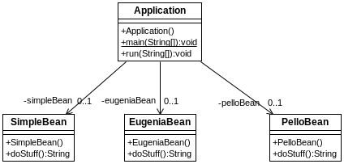
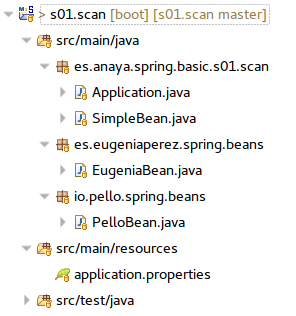

## Escaneo de componentes 
[Proyecto s01.scan]

En ocasiones los proyectos pueden estar organizados en distintos paquetes, que además puedes ser distintos incluso desde la raiz. Puede deberse a la propia organización del proyecto, a que se utilizan librerías de otro fabricante o porque se trata de dependencias de un proyecto distinto. En situaciones así hay que tener en cuenta que si se utiliza algún mecanismo de configuración por conveción o se aplica un escaneo, puede que Spring no sea capaz de encontrar todos los componentes que precise.
Cuando se le dice a Spring, ya sea por XML o por anotaciones, que haga un escaneo de las clases para descubrir componentes, servicios, etc. por defecto solo mira en el paquete en que se encuentra y en los subpaquetes que tiene bajo su nivel. Por tanto, en casos donde hay otras jerarquías de paquetes, es preciso indicar a Spring que debe escanear otros paquetes en busca de componentes a instanciar.
Como ejemplo se muestra el siguiente proyecto donde una clase principal debe utilizar tres instancias de tres clases.



**Figura - Componentes del proyecto**


Pero lo peculiar, desde el punto de vista de la organización de paquetes, es que todos ellos están en paquetes distintos, tal y como se aprecia mejor en el arbol del proyecto.



**Figura - Organización del proyecto**

Es decir, ahora se debe lidiar con componentes que se encuentran en tres paquetes distintos, desde la raiz.
*	es.anaya.spring.basic.s01.scan
*	es.eugeniaperez.spring.beans.
*	io.pello.spring.beans.

 
Ahora se muestra la forma que tiene cada uno de las clases llamadas Bean. El bean PelloBean, está definido como componente. Lo que hace es lo de menos.

**Listado - Fichero PelloBean.java.**

```java
package io.pello.spring.beans;

import org.springframework.stereotype.Component;

@Component
public class PelloBean {
	public String doStuff () {
		return "This is Pello's Bean";
	}
}
```

Por otro lado, en un paquete distinto se encuentra el componente EugeniaBean.

**Listado - Fichero EugeniaBean.java**

```java
package es.eugeniaperez.spring.beans;

import org.springframework.stereotype.Component;

@Component
public class EugeniaBean {
	public String doStuff () {
		return "This is Eugenia's Bean";
	}
}
```

El bean SimpleBean se encuentra en el mismo directorio que la clase principal y está marcado como component. Este no tendrá problemas para ser encontrado en el escaneo de clases.

**Listado - Fichero SimpleBean.java.**

```java
package es.anaya.spring.basic.s01.scan;

import org.springframework.stereotype.Component;

@Component
public class SimpleBean {
	public String doStuff () {
		return "This is a Simple Bean";
	}
}
```

En el fichero principal es donde se inyectan los componentes anteriores. Para asegurarnos de que son encontrados, se utiliza la anotación @ComponentScan, la cual admite una lista de paquetes e incluso el uso de wildcards. De esa manera, Spring hara un escaneo de esos paquetes y de sus subpaquetes. 

**Listado - Fichero Application.java.**

```java
package es.anaya.spring.basic.s01.scan;

import org.springframework.boot.SpringApplication;
import org.springframework.boot.autoconfigure.SpringBootApplication;
import org.springframework.context.annotation.ComponentScan;

import es.eugeniaperez.spring.beans.EugeniaBean;
import io.pello.spring.beans.PelloBean;

import org.springframework.beans.factory.annotation.Autowired;
import org.springframework.boot.CommandLineRunner;

@SpringBootApplication
@ComponentScan({"es.anaya.*","io.pello.*", "es.eugeniaperez.*"})
public class Application implements CommandLineRunner {
	
	@Autowired
	private EugeniaBean eugeniaBean; // Cannot be found unless we scan
	@Autowired
	private PelloBean pelloBean; // Needs scan
	@Autowired
	private SimpleBean simpleBean;
	
	public static void main(String[] args) {
		SpringApplication.run(Application.class, args);
	}

	public void run(String... args) throws Exception {
		System.out.println(eugeniaBean.doStuff());
		System.out.println(pelloBean.doStuff());
		System.out.println(simpleBean.doStuff());		
	}
}
```

En cuanto a la ejecución, esto es lo que se vería:

```bash
2018-01-04 23:31:11.625  INFO 6909 --- [           main] e.a.spring.basic.s01.scan.Application    : Started Application in 0.58 seconds (JVM running for 1.118)
This is Eugenia's Bean
This is Pello's Bean
This is a Simple Bean
```