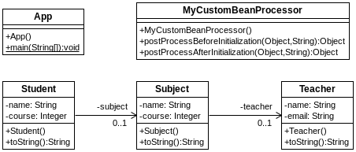

## Inyección por anotaciones
[Proyecto s01.stereotypes.school]

La instanciación de beans también puede hacerse sin utilizar XML, a través de anotaciones como @Component y asignando valores mediante @Value.



**Figura - Componentes del proyecto**

En primer lugar, definimos un profesor:

**Listado - Fichero Teacher.java.**

```java
@Component
public class Teacher {
	@Value("W. White")
	private String name;
	@Value("ww@bluemeth.us")
	private String email;
	
	public Teacher () {}
...	
}
```

La asignatura tiene unos valores y se le inyecta el profesor definido anteriormente:

**Listado - Fichero Subject.java.**

```java
@Component
public class Subject {
	@Value("Chemistry")
	private String name;
	@Value("1")
	private Integer course;
	
	@Autowired
	private Teacher teacher;
	
	public Subject () {}
...	
}
```

El estudiante a su vez, tiene asignada una asignatura:

**Listado - Fichero Student.java.** 

```java
@Component
public class Student {
	@Value("Paul")
	private String name;
	@Value("1")
	private Integer course;
	
	@Autowired
	private Subject subject;
	
	public Student () {}
...
}
```

En esta caso, aplicamos una procesador de Beans personalizado para poder registrar las instancias en el momento de crearse y de destruirse:

**Listado - Fichero MyCustomBeanProcessor.java.**

```java

public class MyCustomBeanProcessor 
				implements BeanPostProcessor {

    public Object postProcessBeforeInitialization(Object bean, String beanName) throws BeansException {
   	 System.out.println("MyCustomProcessor> " + beanName 
   			 + " was instantiated. Type: " + bean.getClass()); 
   	 System.out.println("\tDump: " + bean);
       return bean;
   }
    
    public Object postProcessAfterInitialization(Object bean, String beanName) throws BeansException {
        System.out.println("MyCustomProcessor> "+ beanName 
        		+ " was destroyed. Type: " + bean.getClass());
      	 System.out.println("\tDump: " + bean);
        return bean;
    }

}
```

Y esta sería la clase principal haciendo uso de las instancias:

**Listado - Fichero App.java.**

```java
package es.anaya.spring.basic.s01.stereotypes.school;

import java.util.Scanner;

import org.springframework.context.ApplicationContext;
import org.springframework.context.ConfigurableApplicationContext;
import org.springframework.context.support.ClassPathXmlApplicationContext;;

public class App {
	public static void main(String[] args) {
		ApplicationContext context = new ClassPathXmlApplicationContext("beans.xml");
		Scanner scanner = new Scanner(System.in);
		
		System.out.println("Press any key to continue.");
		scanner.nextLine();
		scanner.close();
		((ConfigurableApplicationContext) context).close();
	}
}
```

En la ejecución, se vería lo siguiente:

```bash
INFORMACIÓN: Loading XML bean definitions from class path resource [beans.xml]
MyCustomProcessor> teacherwas instantiated. Type: class es.anaya.spring.basic.s01.stereotypes.school.teacher.Teacher
	Dump: Teacher [name=W. White, email=ww@bluemeth.us]
MyCustomProcessor> teacherwas destroyed. Type: class es.anaya.spring.basic.s01.stereotypes.school.teacher.Teacher
	Dump2: Teacher [name=W. White, email=ww@bluemeth.us]
MyCustomProcessor> subjectwas instantiated. Type: class es.anaya.spring.basic.s01.stereotypes.school.subject.Subject
	Dump: Subject [name=Chemistry, course=1, teacher=Teacher [name=W. White, email=ww@bluemeth.us]]
MyCustomProcessor> subjectwas destroyed. Type: class es.anaya.spring.basic.s01.stereotypes.school.subject.Subject
	Dump2: Subject [name=Chemistry, course=1, teacher=Teacher [name=W. White, email=ww@bluemeth.us]]
MyCustomProcessor> studentwas instantiated. Type: class es.anaya.spring.basic.s01.stereotypes.school.student.Student
	Dump: Student [name=Paul, course=1, subject=Subject [name=Chemistry, course=1, teacher=Teacher [name=W. White, email=ww@bluemeth.us]]]
MyCustomProcessor> studentwas destroyed. Type: class es.anaya.spring.basic.s01.stereotypes.school.student.Student
	Dump2: Student [name=Paul, course=1, subject=Subject [name=Chemistry, course=1, teacher=Teacher [name=W. White, email=ww@bluemeth.us]]]
MyCustomProcessor> org.springframework.context.event.internalEventListenerProcessorwas instantiated. Type: class org.springframework.context.event.EventListenerMethodProcessor
	Dump: org.springframework.context.event.EventListenerMethodProcessor@f4168b8
MyCustomProcessor> org.springframework.context.event.internalEventListenerProcessorwas destroyed. Type: class org.springframework.context.event.EventListenerMethodProcessor
	Dump2: org.springframework.context.event.EventListenerMethodProcessor@f4168b8
MyCustomProcessor> org.springframework.context.event.internalEventListenerFactorywas instantiated. Type: class org.springframework.context.event.DefaultEventListenerFactory
	Dump: org.springframework.context.event.DefaultEventListenerFactory@58a90037
MyCustomProcessor> org.springframework.context.event.internalEventListenerFactorywas destroyed. Type: class org.springframework.context.event.DefaultEventListenerFactory
	Dump2: org.springframework.context.event.DefaultEventListenerFactory@58a90037
Press any key to continue.
```