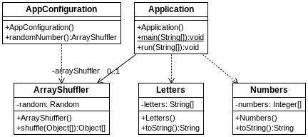

## Combinando XML y beans de configuración
[Proyecto s01.xmlandconfig]

A la hora de configurar la aplicación, las opciones no son excluyentes entre sí, y es posible definir beans e inyecciones usando a la vez ficheros XML, anotaciones o clases de configuración.
En el siguiente proyecto se definen clases que contienen distintos tipos de arrays: de números y de letras. Y se crea una instancia de una clase que es capaz de barajar los arrays de esas clases. Estos son los componentes:



**Figura 1.31. Componentes del proyecto**


La clase Numbers es la que contiene el array de Integers:

**Listado - Fichero Numbers.java.** 

```java
public class Numbers {
	private Integer[] numbers = {0,1,2,3,4,5,6,7,8,9};

	public Numbers () {}
...	
}
```

La clase Letters contiene un array de Strings:

**Listado - Fichero Letters.java.**

```java
public class Letters {
	private String[] letters = {"a","b","c","d","e","f","g","h"};
	public Letters () {}
...
}
```

ArrayShuffler es la clase que se encarga de barajar arrays, sean del tipo que sean:

**Listado - Fichero ArrayShuffler.java.**

```java
import java.util.Random;

public class ArrayShuffler {
  private Random random = new Random();
  
  public Object[] shuffle (Object[] array) {    
    for (int i=0;i<array.length;i++) {
      int j = random.nextInt(array.length-1);
      int k = random.nextInt(array.length-1);
      Object tmp = array[j];
      array[j] = array[k];
      array[k] = tmp;
    }
  
    return array;
  }
}
```

Utilizaremos este fichero XML para instanciar las clases que contienen arrays:

**Listado - Fichero beans.xml.**

```xml
<?xml version="1.0" encoding="UTF-8"?>
<beans xmlns="http://www.springframework.org/schema/beans"
	xmlns:xsi="http://www.w3.org/2001/XMLSchema-instance"
	xsi:schemaLocation="http://www.springframework.org/schema/beans 
	http://www.springframework.org/schema/beans/spring-beans.xsd">

<bean id="lettersBean" class="es.anaya.spring.basic.s01.xmlandconfig.Letters" />
<bean id="numbersBean" class="es.anaya.spring.basic.s01.xmlandconfig.Numbers" />

</beans>
```

Y la clase de ArrayShuffler se instanciará a través de esta clase de confguración:

**Listado - AppConfiguration.java.**

```java
import org.springframework.context.annotation.Bean;
import org.springframework.context.annotation.Configuration;

@Configuration
public class AppConfiguration {

	@Bean
	public ArrayShuffler randomNumber () {
		return new ArrayShuffler();
	} 

}
```

Y por último, la clase principal. Esta carga los beans de XML y recibe una inyección del ArrayShuffler que ha sido configurado en la clase anterior.

**Listado - Fichero Application.java.**

```java
package es.anaya.spring.basic.s01.xmlandconfig;

import org.springframework.beans.factory.annotation.Autowired;
import org.springframework.boot.CommandLineRunner;
import org.springframework.boot.SpringApplication;
import org.springframework.boot.autoconfigure.SpringBootApplication;
import org.springframework.context.ApplicationContext;
import org.springframework.context.support.ClassPathXmlApplicationContext;

// TODO: Improvement, check how official guide explains it https://docs.spring.io/spring/docs/current/spring-framework-reference/core.html#resources-app-ctx-classpathxml
@SpringBootApplication
public class Application implements CommandLineRunner {
  
  @Autowired
  private ArrayShuffler arrayShuffler;
  
  public static void main(String[] args) {
    SpringApplication.run(Application.class, args);
  }

  @Override
  public void run(String... args) throws Exception {
    ApplicationContext context = new ClassPathXmlApplicationContext("beans.xml");

    Letters myLetters = (Letters) context.getBean("lettersBean");
    Numbers myNumbers = (Numbers) context.getBean("numbersBean");
    
    System.out.println("All letters: " + myLetters.toString());
    System.out.println("All numbers: " + myNumbers.toString());
    
    myLetters.setLetters((String [])arrayShuffler.shuffle(myLetters.getLetters()));
    myNumbers.setNumbers((Integer [])arrayShuffler.shuffle(myNumbers.getNumbers()));  

    System.out.println("All letters: " + myLetters.toString());
    System.out.println("All numbers: " + myNumbers.toString());
    
  }
}
```

En cuanto al resultado, se confirma que todo funciona correctamente:

```bash
2018-01-05 09:19:56.080  INFO 9020 --- [           main] o.s.b.f.xml.XmlBeanDefinitionReader      : Loading XML bean definitions from class path resource [beans.xml]
All letters: a, b, c, d, e, f, g, h, 
All numbers: 0, 1, 2, 3, 4, 5, 6, 7, 8, 9, 
All letters: f, a, b, e, d, g, c, h, 
All numbers: 8, 2, 4, 7, 1, 6, 5, 3, 0, 9, 
```