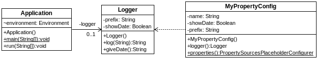

## Properties en formato YML
[Proyecto s01.ymlproperties]

YAML (se suele pronunciar “yamel”) es un lenguaje de configuración muy sencillo que goza de bastante popularidad frente a otras opciones como XML o JSON. La ventaja de YAML es que no utiliza ningún tipo de delimitador como <> o {}, y permite crear estructuras de configuración jerárquicas aplicando tabulaciones.
Spring también es capaz de leer properties desde ficheros YAML, los cuales permiten mucha mayor expresividad que los ficheros de properties tradicionales. Lo esencial es que, si se crea un fichero application.yml dentro de src/main/resources, Spring cargará las configuraciones ahí descritas. En el siguiente proyecto vemos un sencillo ejemplo donde lo más interesante es ver las distintas opciones utilizadas en el fichero YAML.
Los elementos son los vistos anteriormente, una clase Logger, una clase de configuración, y una clase principal:



**Figura - Componentes del proyecto**

El fichero contiene otras configuraciones a modo de muestra de la versatilidad de YAML. Como se puede ver existen una serie de tabulaciones que forman jerarquías. Para poder recuperar esos valores, se tiene que indicar por ejemplo:

```
other.config.name
```

**Listado - Fichero application.yml.**

```yml
# This is just a comment
other:
  config:
    name: Sample App Config
    description: This is a very long description
    showDate: true
sample:
  user:
    login: falken
    password: josua  # classic password ;)
   
samples:
  booleans:   
    truth: true
    also_truth: yes     # Yes, TES, True, true
    and_also_truthy: NO # No, NO, False, false
  lists:
    wizards:
      - Gandalf
      - Merlin
      - Dumbledore
      - Rincewind
    weapons: ['Foehammer', 'Goblin cleaver', 'Needle', 'Narsil']
  strings:
    quotes: "This is a string with 'quotes'"
    multiline: |
      This is a very long
      string dividen in
      multiple lines
    multiline_no_breaks: >
      This is a very long
      string in just one line
      we write like this
      for convenience  
  objects:
    customer: {id: 3, name: 'Peter Parker', superhero: true}
```

En la clase de configuración, podemos utilizar valores de los ficheros properties y también del fichero application.yml, los cuales se cargan automáticamente aunque no se indique explícitamente.


**Listado - Fichero MyPropertyConfig.java.**

```java
@Configuration
@PropertySources({@PropertySource("classpath:myapp.properties"), 
				  @PropertySource("classpath:logger.properties")})
public class MyPropertyConfig {
	
	@Value("${myapp.name}")
	private String name;
	
	@Value("${other.config.showDate}")
	private Boolean showDate;
	
	@Value("${logger.prefix}")
	private String prefix;
...
}
```

Lo interesante en este ejemplo es mostrar cómo se cargan algunos de esos valores, que an algunos casos se comportan como jerarquías y en otros como arrays.

**Listado - Fichero Application.java.**

```java
package es.anaya.spring.basic.s01.ymlproperties;

import org.springframework.beans.factory.annotation.Autowired;
import org.springframework.boot.CommandLineRunner;
import org.springframework.boot.SpringApplication;
import org.springframework.boot.autoconfigure.SpringBootApplication;
import org.springframework.core.env.Environment;

@SpringBootApplication
public class Application implements CommandLineRunner {

  @Autowired
  Environment environment;
  
  @Autowired
  private Logger logger;
  
  public static void main(String[] args) {
    SpringApplication.run(Application.class, args);
  }

  @Override
  public void run(String... args) throws Exception {
    System.out.println(logger.log("We log this message"));
    System.out.println("Yml: " 
		+ environment.getProperty("other.config.name"));  
    System.out.println("Yml:" 
		+ environment.getProperty("samples.strings.multiline"));
    System.out.println("Yml:" 
		+ environment.getProperty("samples.objects.customer.name"));
    System.out.println("Yml:" 
		+ environment.getProperty("samples.lists.weapons[2]"));
  }
}
```

En cuanto a la salida, se verifica que las propiedades se han cargado correctamente.

```bash
2018-01-05 09:56:52.589  INFO 9967 --- [           main] e.a.s.b.s01.ymlproperties.Application    : Started Application in 0.966 seconds (JVM running for 1.553)
Properties sampleMyAppFri Jan 05 09:56:52 CET 2018We log this message
Yml: Sample App Config
Yml:This is a very long
string dividen in
multiple lines

Yml:Peter Parker
Yml:Needle
```