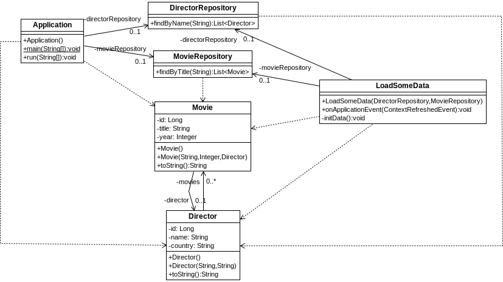

## Inicialización con Java
[Proyecto s03.context]

Otra manera de inicializar la BD es a través de clases Java. Si bien el uso de SQL parece más directo y simple, respecto a Java tiene algunas desventajas:
*	No sabremos si hay errores en el SQL hasta el momento de la ejecución, mientras que en Java lo sabremos en tiempo de compilación.
*	Si hay cambios debe mantenerse el fichero constantemente y cambiar todas las sentencias, mientras que en Java bastaría con cambiar anotaciones en las clases de entidad.
Por tanto no es tan descabellado. La manera de insertar con Java es creando entidades, relacionándolas y utilizando sus repositorios para que se almacenen en la BD.
El escenario que se utilizará para las pruebas es el siguiente.



**Figura - Aspecto de la configuración del proyecto.**

Como se puede ver, hay dos entidades relacionadas entre sí que representan películas y directores, en una relación uno a varios. En primer lugar veamos los detalles de la clase Director

**Listado - Fichero Director.java.**

```java
@Entity
public class Director {
    @Id
    @GeneratedValue(strategy = GenerationType.AUTO)
	private Long id;
	private String name;
	private String country;
	
	@OneToMany(cascade=CascadeType.ALL, mappedBy="director")  
	private List<Movie> movies = new ArrayList<Movie>();
...
}
```

Y por otro lado los de la clase Movie, que tiene una referencia a Director por lo que la relación es bidireccional.

**Listado - Fichero Movie.java.**

```java
@Entity
public class Movie {
    @Id
    @GeneratedValue(strategy = GenerationType.AUTO)
	private Long id;
	private String title;
	private Integer year;
	@ManyToOne
	private Director director;
...
}

```

Para cargar los datos desde Java, lo que se puede hacer es definir una clase que implemente la interface ApplicationListener, la cual, tal y como se vio en la primera parte del libro, permite interactuar con el ciclo de vida de Spring.
A este clase se le inyectan los repositorios de forma implícita a través del constructor.
Lo que se hace es sobrescribir el método onApplicationEvent(ContextRefreshedEvent contextRefreshedEvent) para llamar al método initData, que es quien insertará los datos.

**Listado - Fichero LoadSomeData.java.**

```java

@Component
public class LoadSomeData implements ApplicationListener<ContextRefreshedEvent> {

  private DirectorRepository directorRepository;
  private MovieRepository movieRepository;

  public LoadSomeData(DirectorRepository directorRepository, MovieRepository movieRepository) {
    this.directorRepository = directorRepository;
    this.movieRepository = movieRepository;
  }

  @Override
  public void onApplicationEvent(ContextRefreshedEvent contextRefreshedEvent) {
    initData();
  }

  private void initData(){
   System.out.println("Here we are, ready to Rock...");
   Director goodDirector = new Director("Ridley Scott","USA");
   Director betterDirector = 
		new Director("Denis Villeneuve", "Canada");
  
   Movie movie0 = new Movie("Alien", 1979, goodDirector);
   Movie movie1 = new Movie("Gladiator", 2000, goodDirector);
   Movie movie2 = 
		new Movie("Blade Runner 2049", 2017, betterDirector);
   
   directorRepository.save(goodDirector);
   directorRepository.save(betterDirector);
   
   movieRepository.save(movie0);
   movieRepository.save(movie1);
   movieRepository.save(movie2);
   
  }
}
```
La clase principal se limita a hacer consultas. En este caso resulta interesante ver cómo Spring se encarga de destruir las tablas existentes y crear las nuevas junto con las restricciones. Además se ve cómo entra en ejecución la clase LoadSomeData para insertar registros mediante Java. Y por último, las consultas que hace la clase principal permiten verificar que los datos se han insertado correctamente.
