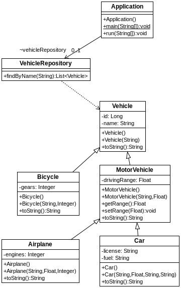
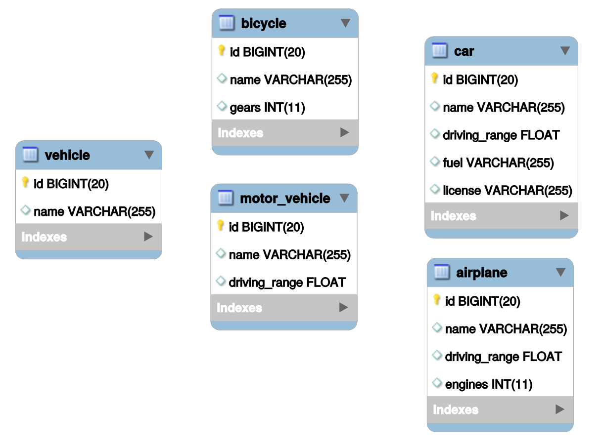

## s03.inheritancetableconcreteclass

Otra estrategia para mapear las relaciones de herencia sería creando una tabla por cada una de las clases concretas. Por lo tanto se deja de tener una única tabla y en el mapeo se creará una tabla por cada una de las entidades.



**Figura - Aspecto de la configuración del proyecto.**


Conviene pararse en la definición de la superclase, ya que ahí es donde se define la estrategia.

**Listado - Fichero Vehicle.java.**

```java
@Entity
@Inheritance(strategy = InheritanceType.TABLE_PER_CLASS)
public class Vehicle {
  @Id
  @GeneratedValue(strategy=GenerationType.AUTO)  
  private Long id;
  private String name;
  
  public Vehicle () {}
  
...
}
```

En este estrategia, el resto de clases no necesitan más que marcarse como @Entity. La relación de herencia entre clases hace el resto. No necesitan indicar un Id ya que vendrá heredado. Todas las subclases se configuran de esta manera.

**Listado - Fichero PrimerProyecto.java.**

```java

@Entity
public class MotorVehicle extends Vehicle {
	private Float drivingRange;

	public MotorVehicle() {}
...
}
```

Lo que cambia más obviamente en este caso es el modelo relacional. Ahora debe haber una tabla por cada clase. 



**Figura - Aspecto de la BD.**

**Listado - Fichero import.sql.**

```sql
insert into vehicle  (id, name) values (1,'Generic Vehicle');
insert into bycicle  (id, name, gears) values (2,'Mountain Bike', 21);
insert into bycicle  (id, name, gears) values (3, 'Simple Bike', 1);
insert into motor_vehicle  (id, name, driving_range) values (4,'Generic motor vehicle', 100);
insert into motor_vehicle  (id, name, driving_range) values (5,'Electric Skate', 50);
insert into motor_vehicle  (id, name, driving_range) values (6,'Generic motor vehicle', 100);
insert into car  (id, name, driving_range, license, fuel) values (7, 'Opel Corsa', 50, '0042GOD', 'Diesel');
insert into car  (id, name, driving_range, license, fuel) values (8,'Seat 124', 50, '0666EVL', 'Gasoline');
insert into airplane  (id, name, driving_range, engines) values (9,'Boeing 747', 500, 4);
insert into airplane  (id, name, driving_range, engines) values (10,'DC-10', 400, 2);

```
La ejecución ofrece el mismo resultado.

