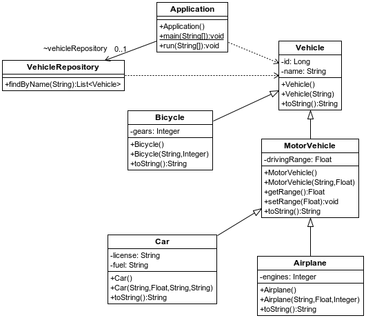
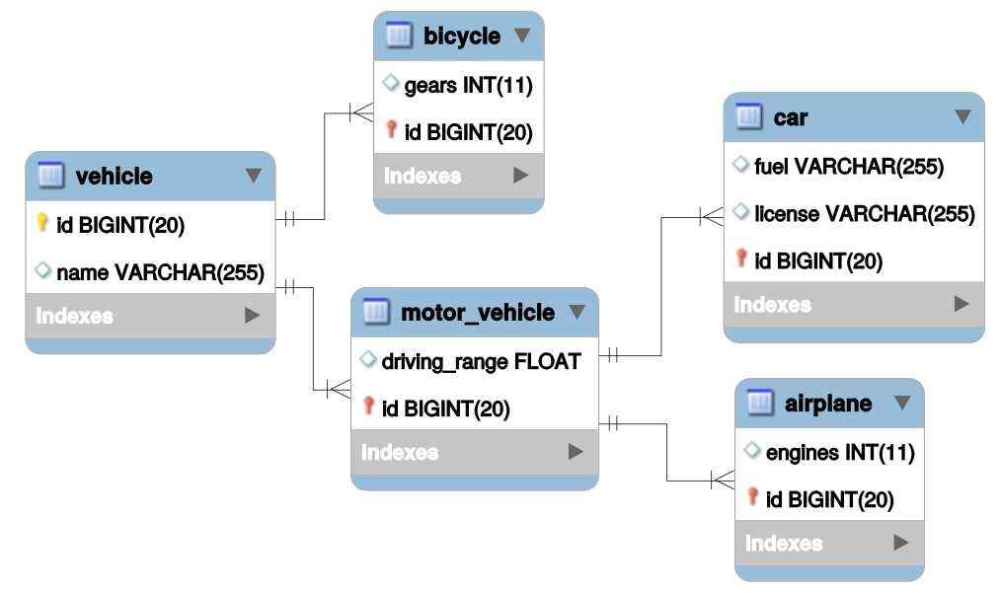

## s03.inheritancetablepersubclass

La otra estrategia también utiliza una tabla por cada clase optimizando el número de columnas que tiene cada tabla. Es decir, la tabla de una subclase no tendrá más que una columna por cada atributo que tenga la subclase a la que representa, más un Id que es una clave extranjera que apunta al id de la superclase. Esto se ve más claro en el SQL. Lo bueno es que en el lado de los objetos, todo es mucho más simple.

TODO


**Figura - Aspecto de la configuración del proyecto.**


En este caso también basta con un cambio en la superclase indicando la estrategia a aplicar en la herencia.

**Listado - Fichero Vehicle.java.**

```java
@Entity
@Inheritance(strategy = InheritanceType.JOINED)
public class Vehicle {
  @Id
  @GeneratedValue(strategy = GenerationType.IDENTITY)
  private Long id;
  private String name;
	
  public Vehicle () {}
...
}
```

En cuanto a las subclases, también resulta suficiente con indicar que son entidades, y en todas se haría lo mismo.

**Listado - Fichero MotorVehicle.java.**

```java
@Entity
public class MotorVehicle extends Vehicle {
	private Float drivingRange;
	public MotorVehicle() {}
...
}
```

En este caso, hay que preparar varias tablas en las que además se debe usar una clave que en las subclases será una clave extranjera a la tabla inicial Vehicle.

En este caso, así se ve cada tabla.



**Figura - Aspecto de las tablas en la BD.**

En cuanto al SQL:

**Listado - Fichero import.sql.**

```sql
insert into vehicle  (id, name) values (1,'Generic Vehicle');
insert into vehicle  (id, name) values (2,'Mountain Bike');
insert into vehicle  (id, name) values (3,'Simple Bike');
insert into vehicle  (id, name) values (4,'Generic motor vehicle');
insert into vehicle  (id, name) values (5,'Electric Skate');
insert into vehicle  (id, name) values (6,'Generic motor vehicle');
insert into vehicle  (id, name) values (7,'Opel Corsa');
insert into vehicle  (id, name) values (8,'Seat 124');
insert into vehicle  (id, name) values (9,'Boeing 747');
insert into vehicle  (id, name) values (10,'DC-10');
insert into bycicle  (id, gears) values (2, 21);
insert into bycicle  (id, gears) values (3, 1);
insert into motor_vehicle  (id, driving_range) values (4, 100);
insert into motor_vehicle  (id, driving_range) values (5, 50);
insert into motor_vehicle  (id, driving_range) values (6, 100);
insert into motor_vehicle  (id, driving_range) values (7, 50);
insert into motor_vehicle  (id, driving_range) values (8, 50);
insert into motor_vehicle  (id, driving_range) values (9, 500);
insert into motor_vehicle  (id, driving_range) values (10, 400);
insert into car  (id, license, fuel) values (7, '0042GOD', 'Diesel');
insert into car  (id, license, fuel) values (8, '0666EVL', 'Gasoline');
insert into airplane  (id, engines) values (9, 4);
insert into airplane  (id, engines) values (10, 2);
```


La salida del programa principal, sigue siendo la misma.
