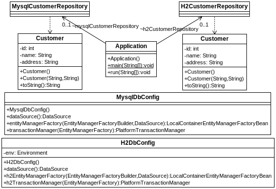
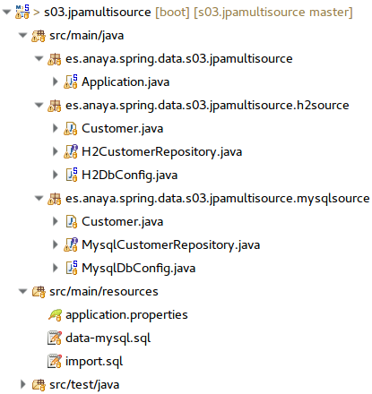

## Orígenes de datos múltiples
[Proyecto s03.jpamultisource]

En los proyectos lo habitual es tener un único origen de datos, pero no son del todo descartables entornos en los que se precise manejar más de una base de datos a la vez. Cabe pensar por ejemplo, situaciones en las que se deben integrar distintos sistemas, cosa necesaria en procesos de absorción de empresas, lo cual lleva en muchos casos a la migración e integración de sistemas y datos. En algún momento, el software tendrá que gestionar datos de dos fuentes distintas. Este es un escenario en el que también podría entrar en juego SpringBatch, el cual veremos más adelante.
En Spring se puede manejar más de un origen de datos distinto a la vez. Vamos a mostrar un ejemplo en el que conviven dos orígenes de datos, uno para MySQL y otro para H2. Los componentes del proyecto serían los siguientes.



**Figura - Aspecto de los componentes  del proyecto.**

Y el aspecto del proyecto en el IDE sería:



**Figura - Aspecto de la configuración del proyecto.**

El fichero Customer para H2:

**Listado - Fichero Customer.java.**

```java

@Entity
public class Customer {
    @Id
    @GeneratedValue(strategy=GenerationType.IDENTITY)
    private int id;
    private String name;
    private String address;
...
}
```

El repositorio de H2:

**Listado - Fichero H2Repository.java.**

```java
@Repository
public interface H2CustomerRepository 
			extends JpaRepository<Customer, Long> {
}
```
La configuración de H2:

**Listado - Fichero H2DbConfig.java.**

```java

@Configuration
@PropertySource({ "classpath:application.properties" })
@EnableJpaRepositories(
  entityManagerFactoryRef = "h2EntityManagerFactory", 
  transactionManagerRef = "h2TransactionManager", 
  basePackages = {"es.anaya.spring.data.s03.jpamultisource.h2source" })
public class H2DbConfig {
 @Autowired
 private Environment env;

 @Bean(name = "h2DataSource")
 public DataSource dataSource() {
  DriverManagerDataSource dataSource = new DriverManagerDataSource();
  dataSource.setDriverClassName(env.getProperty("source2.datasource.driverClassName"));
  dataSource.setUrl(env.getProperty("source2.datasource.url"));
  dataSource.setUsername(env.getProperty("source2.datasource.username"));
  dataSource.setPassword(env.getProperty("source2.datasource.password"));

  return dataSource;
 }

 @Bean(name = "h2EntityManagerFactory")
 public LocalContainerEntityManagerFactoryBean h2EntityManagerFactory(EntityManagerFactoryBuilder builder,
   @Qualifier("h2DataSource") DataSource dataSource) {

     HashMap<String, Object> properties = new HashMap<>();
     properties.put("hibernate.hbm2ddl.auto","create-drop");
     
     LocalContainerEntityManagerFactoryBean em = 
       builder.dataSource(dataSource)
       .packages("es.anaya.spring.data.s03.jpamultisource.h2source")
       .build(); 
     em.setJpaPropertyMap(properties);
     
     return em;
 }

 @Bean(name = "h2TransactionManager")
 public PlatformTransactionManager h2TransactionManager(
   @Qualifier("h2EntityManagerFactory") EntityManagerFactory h2EntityManagerFactory) {
  return new JpaTransactionManager(h2EntityManagerFactory);
 }
}

```
El fichero Customer para MySQL:

**Listado - Fichero Customer.java.**

```java

@Entity
@Table(schema = "Customer")
public class Customer {
 
    @Id
	@GeneratedValue(strategy=GenerationType.AUTO)
    private int id;
    private String name;
    private String address;
...
}
```

El repositorio para MySQL:

**Listado - Fichero MysqlCustomerRepository.java.**

```java
@Repository
public interface MysqlCustomerRepository 
		extends JpaRepository<Customer, Long> {
}
```

Y la configuración para MySQL:

**Listado - Fichero MysqlDbConfig.java.**

```java

@Configuration
@EnableTransactionManagement
@EnableJpaRepositories(
	entityManagerFactoryRef = "entityManagerFactory", 
	basePackages = { "es.anaya.spring.data.s03.jpamultisource.mysqlsource" })
public class MysqlDbConfig {

	@Primary
	@Bean(name = "dataSource")
	@ConfigurationProperties(prefix = "spring.datasource")
	public javax.sql.DataSource dataSource() {
		return DataSourceBuilder.create().build();
	}

	@Primary
	@Bean(name = "entityManagerFactory")
	public LocalContainerEntityManagerFactoryBean entityManagerFactory(EntityManagerFactoryBuilder builder,
			@Qualifier("dataSource") DataSource dataSource) {
		return builder.dataSource(dataSource)
				.packages("es.anaya.spring.data.s03.jpamultisource.mysqlsource")
					.build();
	}

	@Primary
	@Bean(name = "transactionManager")
	public PlatformTransactionManager transactionManager(
			@Qualifier("entityManagerFactory") EntityManagerFactory entityManagerFactory) {
		return new JpaTransactionManager(entityManagerFactory);
	}
}
```

Y esta sería la clase principal:

**Listado - Fichero Application.java.**

```java

@SpringBootApplication
public class Application implements CommandLineRunner {

 public static void main(String[] args) {
  SpringApplication.run(Application.class, args);
 }
 
  @Autowired
  H2CustomerRepository h2CustomerRepository;
  
  @Autowired
  MysqlCustomerRepository mysqlCustomerRepository;

  @Transactional(readOnly = true)
  @Override
  public void run(String... args) throws Exception {
    
   System.out.println("MySQL: " + mysqlCustomerRepository.findAll());
   System.out.println("H2: " + h2CustomerRepository.findAll());
  }
}
```

En este caso, se utiliza el fichero por defecto application.properties para configurar ambos orígenes de datos. Para MySQL se usan los campos por defecto, mientras que para la BD H2, lo que se hace es crear un prefijo arbitrario llamado source2. Gracias a eso, en la clase de configuración se le puede indicar sin riesgo de ambiguedades para que cargue las configuracines precisas.

**Listado - Fichero application.properties.**

```properties
# datasource: mysql
spring.datasource.url=jdbc:mysql://127.0.0.1/customers
spring.datasource.driverClassName=com.mysql.jdbc.Driver
spring.datasource.username=root
spring.datasource.password=changeme
spring.jpa.database-platform=org.hibernate.dialect.MySQLDialect
spring.jpa.hibernate.ddl-auto=create-drop
spring.datasource.data=data-mysql.sql
spring.datasource.platform=mysql

source2.datasource.url=jdbc:h2:mem:customersdb;DB_CLOSE_DELAY=-1;DB_CLOSE_ON_EXIT=FALSE
source2.datasource.driverClassName=org.h2.Driver
source2.datasource.username=sa
source2.datasource.password=
source2.jpa.database-platform=org.hibernate.dialect.H2Dialect
source2.jpa.hibernate.ddl-auto=create-drop

es
```

**Listado - Fichero data-mysql.sql.**

```sql
insert into Customer (name, address) values ('Eugenia', 'c/ Mayor 15');
insert into Customer (name, address) values ('Pello', 'c/ Deep thougth 42');
```

**Listado - Fichero import.sql.**

```sql
insert into Customer (name, address) values ('Lara Croft', 'Baker St.');
insert into Customer (name, address) values ('Indiana Jones', 'Ark avenue 42');
```
