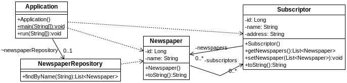

## s03.manytomanybidir

Una vez más, en la versión bidireccional solo cambia el hecho de que las dos entidades se hacen referencia la una a la otra. En este caso, la entidad Subscriptor también contendrá una colección de Newspaper. La definición de cómo debe ser la relación sigue estando en Newspaper, lo único que cambia ahora es que desde una instancia de Subscriptor se podrá acceder a todas las instancias de Newspaper relacionadas.
 


**Figura - Aspecto de los elementos del proyecto.**


La clase subscription es lo único que cambia. Ahora tiene una lista de Newspaper con la anotación @ManyToMany, indicando simplemente cuál es el campo de la otra entidad con el que se vincula.

**Listado - Fichero Subscription.java.**

```java
@Entity
public class Subscriptor {
    @Id
    @GeneratedValue(strategy = GenerationType.AUTO)
	private Long id;
	private String name;
	private String address;
	
	@ManyToMany(mappedBy = "subscriptors")
	private List<Newspaper> newspapers = new ArrayList<Newspaper>();
	
	public Subscriptor () {}
...

	@Override
	public String toString() {
		return "Subscriptor [id=" + id + ", name=" + name + ", address=" + address + "]";
	}
	
}
```

En este escenario, también hay que tener cuidado con la recursividad. En el método toString o en cualquier otra situación donde se haga referencia a la otra entidad, hay que procurar no caer en un bucle de recursividad. Así que en el toString, se opta por no mostrar el Newspaper.
Ahora, en el programa principal es posible acceder a los Newspapers a partir de los Subscriptors, tal y como se ve en este ejemplo de clase principal.

**Listado - Fichero Application.java.**

```java
…
  @Transactional(readOnly = false)
  @Override
  public void run(String... args) throws Exception {

  System.out.println("All: " + newspaperRepository.findAll());
  Newspaper newspaper = newspaperRepository.findOne(1L);
  
  System.out.println("From subs: " + newspaper.getSubscriptors().get(0).getNewspapers());
  
  newspaperRepository.delete(newspaper);
  
  Newspaper newspaper2 = new Newspaper();

  newspaper.setName("Spring Gazette");
  
  newspaper2.getSubscriptors().add(new Subscriptor());
  newspaper2.getSubscriptors().add(new Subscriptor());
  
  newspaperRepository.save(newspaper2);
  
  System.out.println("All: " + newspaperRepository.findAll());
 }
...
```

El resultado por consola lo confirma

```bash
From subs: [
Newspaper [id=1, name=Wall Street Journal, subscriptors=[
	Subscriptor [id=1, name=c/ Mayor 3, address=Juan], 
	Subscriptor [id=2, name=Evergreen Terrace 642, address=Homer], 
	Subscriptor [id=3, name=Uber Strasse 42, address=Merkel]]], 
Newspaper [id=3, name=Frankfurter Allemaigne Zaitüng, subscriptors=[
	Subscriptor [id=1, name=c/ Mayor 3, address=Juan]]]]
```
