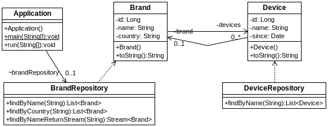

## s03.onetomanybidir

Ahora haremos que la relación entre las dos entidades sea bidireccional. Lo único que se debe cambiar es la configuración de la entidad Device, para que tenga una referencia a la clase Brand. Ahora en el diagrama se ve esa relación recíproca.



**Figura - Aspecto de la configuración del proyecto.**


Por ver la diferencia entre una configuración y otra, en este caso se añade una opción a la clase Brand, para que cualquier operación que se haga sobre este entidad se ejecute en cascada sobre sus dependencias. Para eso añadimos la opción de CascadeType.ALL.

**Listado - Fichero PrimerProyecto.java.**

```java
@Entity
public class Brand {
    @Id
    @GeneratedValue(strategy = GenerationType.AUTO)
	private Long id;
	private String name;
	private String country;
	@OneToMany(cascade = CascadeType.ALL, fetch= FetchType.EAGER, mappedBy="brand")
	private List<Device> devices = new ArrayList<Device>();
	
	public Brand () {}
...
}
```

La clase dispositivo, tiene una referencia a su marca, en este caso indicada con la anotación ManytoOne.

**Listado - Fichero Device.java.**

```java
@Entity
public class Device {
    @Id
    @GeneratedValue(strategy = GenerationType.AUTO)
	private Long id;
	private String name;
    @DateTimeFormat(pattern = "yyyy-MM-dd")
	private Date since;
	@ManyToOne
	private Brand brand;
	
	public Device () {}
...
	@Override
	public String toString() {
		return "Device [id=" + id + ", name=" + name 
			+ ", since=" + since
			+ ", brand=" + brand.getName() + "]";
	}
	
}
```

También es importante observar el sutil cambio que se hace en el método toString para que al mostrar el campo brand solo muestre el nombre. Si mostrase todo su contenido se crearía una llamada recursiva infinita porque brand mostraría sus devices y cada devide mostraría su brand infinitamente, terminando la aplicación en una excepción de Stack Overflow. Una forma simple de impedirlo es mostrando solo el nombre.


**Listado - Fichero PrimerProyecto.java.**

```java
@Transactional(readOnly = false)
  @Override
  public void run(String... args) throws Exception {

   System.out.println("All: " + brandRepository.findAll());

   System.out.println("By name: " + brandRepository.findByName("LG"));
   
   brandRepository.delete(1L);
   System.out.println("All: " + brandRepository.findAll());

  }

```

En la ejecución, se puede observar cómo se aplica el borrado en cascada.

```bash
All: [
Brand [id=1, name=Samsung, country=Korea, devices=[
	Device [id=1, name=Samsung S7, since=2007-01-12 00:00:00.0, brand=Samsung], 
	Device [id=2, name=Samsung S8, since=2008-01-12 00:00:00.0, brand=Samsung]]], 
Brand [id=2, name=LG, country=Korea, devices=[]], 
Brand [id=3, name=Huawei, country=China, devices=[]], 
Brand [id=4, name=Xiaomi, country=China, devices=[]]]

By name: [
Brand [id=2, name=LG, country=Korea, devices=[]]]
2018-01-08 11:46:12 DEBUG org.hibernate.SQL - delete from device where id=?
2018-01-08 11:46:12 DEBUG org.hibernate.SQL - delete from device where id=?
2018-01-08 11:46:12 DEBUG org.hibernate.SQL - delete from brand where id=?

All: [
Brand [id=2, name=LG, country=Korea, devices=[]], 
Brand [id=3, name=Huawei, country=China, devices=[]], 
Brand [id=4, name=Xiaomi, country=China, devices=[]]]
```

