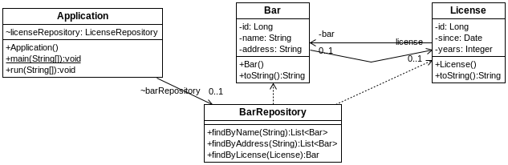

## s03.onetoonebidir

Una variante de la relación uno a uno es hacerla bidireccional. Gracias a eso, tanto Bar como License tendrán una referencia a la otra entidad. En el diagrama se aprecia que efectivamente ambas entidades son conscientes de la otra.



**Figura 1.6. Aspecto de los elementos del proyecto.**


En la entidad Bar no haría falta cambiar nada.

En el caso de la entidad License, añadimos una referencia a Bar, indicando que es una relación @OneToOne y que en la otra entidad debe haber un campo llamado license con el que debe establecerse el vínculo.

**Listado - Fichero License.java.**

```java
@Entity
public class License {
    @Id
    @GeneratedValue(strategy = GenerationType.AUTO)
	private Long id;
    @DateTimeFormat(pattern = "yyyy-MM-dd")
	private Date since;
	private Integer years;
	
	@OneToOne(mappedBy = "license")
	private Bar bar;

	public License () {}
...
}

```
Para comprobar lo que pasa, se cambia un poco la clase principal para hacer operaciones de modificación y comprobar que efectivamente, se aplican en cascada.

**Listado - Fichero Application.java.**

```java
@SpringBootApplication
public class Application implements CommandLineRunner {
 @Autowired
 BarRepository barRepository;

 @Autowired
 LicenseRepository licenseRepository;

 public static void main(String[] args) {
  SpringApplication.run(Application.class, args);
 }

 @Transactional(readOnly = false)
 @Override
 public void run(String... args) throws Exception {

  System.out.println(barRepository.findAll());

  Bar bar = new Bar();
  bar.setName("Haddock");
  bar.setAddress("c/ Drunkard 6");
  bar.setLicense(new License());

  barRepository.save(bar);
  System.out.println(barRepository.findAll());

  barRepository.delete(bar);
  System.out.println(barRepository.findAll());
 }
}
```

A la hora de ejecutar, se puede apreciar como al guardar un nuevo objeto Bar primero se inserta la licencia. Una vez insertada la instancia de License, se usa su id de License para insertar el nuevo Bar. Al eliminar el Bar, se elimina primero el Bar y luego la instancia de License asociada.

```bash
[Bar [id=1, name=Bar eto, address=c/ Carrera de San Jerónimo 3, license=License [id=1, since=2007-01-12 00:00:00.0, years=5]], Bar [id=2, name=Bar Mageddon, address=av/ Apocalípsis 666, license=License [id=2, since=2008-01-12 00:00:00.0, years=10]], Bar [id=3, name=Bar Buerto, address=c/ Beodo 15, license=License [id=3, since=2008-01-12 00:00:00.0, years=10]]]
2018-01-07 20:08:43 DEBUG org.hibernate.SQL - insert into license (id, since, years) values (null, ?, ?)
2018-01-07 20:08:43 DEBUG org.hibernate.SQL - insert into bar (id, address, license_id, name) values (null, ?, ?, ?)
2018-01-07 20:08:43 DEBUG org.hibernate.SQL - select bar0_.id as id1_0_, bar0_.address as address2_0_, bar0_.license_id as license_4_0_, bar0_.name as name3_0_ from bar bar0_
[Bar [id=1, name=Bar eto, address=c/ Carrera de San Jerónimo 3, license=License [id=1, since=2007-01-12 00:00:00.0, years=5]], Bar [id=2, name=Bar Mageddon, address=av/ Apocalípsis 666, license=License [id=2, since=2008-01-12 00:00:00.0, years=10]], Bar [id=3, name=Bar Buerto, address=c/ Beodo 15, license=License [id=3, since=2008-01-12 00:00:00.0, years=10]], Bar [id=4, name=Haddock, address=c/ Drunkard 6, license=License [id=4, since=null, years=null]]]
2018-01-07 20:08:43 DEBUG org.hibernate.SQL - delete from bar where id=?
2018-01-07 20:08:43 DEBUG org.hibernate.SQL - delete from license where id=?
2018-01-07 20:08:43 DEBUG org.hibernate.SQL - select bar0_.id as id1_0_, bar0_.address as address2_0_, bar0_.license_id as license_4_0_, bar0_.name as name3_0_ from bar bar0_
[Bar [id=1, name=Bar eto, address=c/ Carrera de San Jerónimo 3, license=License [id=1, since=2007-01-12 00:00:00.0, years=5]], Bar [id=2, name=Bar Mageddon, address=av/ Apocalípsis 666, license=License [id=2, since=2008-01-12 00:00:00.0, years=10]], Bar [id=3, name=Bar Buerto, address=c/ Beodo 15, license=License [id=3, since=2008-01-12 00:00:00.0, years=10]]]
```