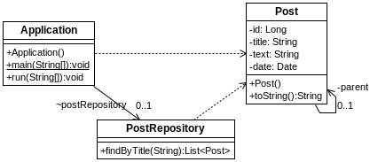
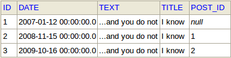

## s03.onetooneself

Existen situaciones en las que una entidad debe hacer referencia a otro elemento de la misma entidad, con lo cual se crea una relación de uno a uno recíproca. Pese a que suene raro, se trata de una relación común que puede existir en situaciones como un mensaje y su mensaje de respuesta, un empleado y su empleado jefe, etc.



**Figura - Aspecto de los componentes del proyecto.**

Como es obvio, solamente es una entidad, con una referencia one to one a un campo del mismo tipo que la propia clase.

**Listado - Fichero Post.java.**

```java
@Entity
public class Post {
    @Id
    @GeneratedValue(strategy = GenerationType.AUTO)
	private Long id;
	private String title;
	private String text;
	private Date date;
	@OneToOne(cascade={CascadeType.ALL})
	@JoinColumn(name="post_id")
	private Post parent;

	public Post () {}
...
}
```

El repositorio no tiene nada de particualr.

**Listado - Fichero PostRepository.java.**

```java
public interface PostRepository extends CrudRepository<Post, Long> {
	List<Post> findByTitle(String title);
}
```

En cuanto a los datos iniciales, este es el aspecto que tendrían en la BD.

**Listado - Fichero import.sql**

```sql
insert into post (id, title, text, date, post_id) values (1,'I know','...and you do not','2007-01-12', null);
insert into post (id, title, text, date, post_id) values (2,'I know','...and you do not','2008-11-15', 1);
insert into post (id, title, text, date, post_id) values (3,'I know','...and you do not','2009-10-16', 2);

```
Así quedaría en la tabla:



**Figura - Así quedaría en la tabla.**


En esta caso, en el programa principal, además de mostrar datos también se elimina un registro, provocando una eliminación en cascada.

**Listado - Fichero Application.java.**

```java

@SpringBootApplication
public class Application implements CommandLineRunner {
 @Autowired
 PostRepository postRepository;

 public static void main(String[] args) {
  SpringApplication.run(Application.class, args);
 }

 @Transactional(readOnly = false)
 @Override
 public void run(String... args) throws Exception {

  System.out.println("Showing all: " + postRepository.findAll());

  Post post = postRepository.findById(3L).get();
  postRepository.delete(post);

  System.out.println("Showing all after: " 
				+ postRepository.findAll());
 }
}
```

En la salida de la ejecución, se ve cómo al eliminar un registro que no tiene referencias, sus padres son eliminados en cascada.

```bash
2018-01-08 08:55:37 DEBUG org.hibernate.SQL - select post0_.id as id1_0_, post0_.date as date2_0_, post0_.post_id as post_id5_0_, post0_.text as text3_0_, post0_.title as title4_0_ from post post0_
Showing all: [Post [id=1, title=I know, text=...and you do not, date=2007-01-12 00:00:00.0, parentid= ], Post [id=2, title=I know, text=...and you do not, date=2008-11-15 00:00:00.0, parentid=1 ], Post [id=3, title=I know, text=...and you do not, date=2009-10-16 00:00:00.0, parentid=2 ]]
2018-01-08 08:55:37 DEBUG org.hibernate.SQL - delete from post where id=?
2018-01-08 08:55:37 DEBUG org.hibernate.SQL - select post0_.id as id1_0_, post0_.date as date2_0_, post0_.post_id as post_id5_0_, post0_.text as text3_0_, post0_.title as title4_0_ from post post0_
Showing all after: []
```