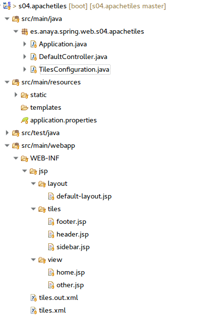
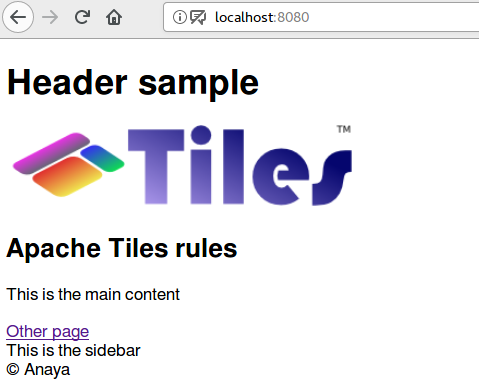

## Apache Tiles
Todas las vistas tienen una estructura común, ya que constan de barra de menú, cuerpo y pie de página. Es frecuente que se repita el código en todas las JSPs, pero obviamente esto no es lo ideal, ya que si posteriormente queremos hacer cualquier modificación por ejemplo en la barra de navegación, habría que propagar dicho cambio a todas las páginas de nuestra aplicación (y en una aplicación grande hay muchas páginas).
Es por ello que se suelen utilizar layouts que definan el esqueleto general de las páginas, y luego cada vista define sólo aquellas partes que la caractericen. 

Para conseguir esto, Spring MVC puede integrarse con muchos motores de plantillas distintas. A continuación mostraremos el uso de Apache Tiles, ya que es uno de los más maduros (lleva mucho tiempo en el mercado, al haber nacido con Struts 1), y que podemos aplicar en el caso de utilizar JSPs.
Para utilizarlo, debemos primero de todo añadir la dependencia en nuestro fichero pom.
Esta podría ser la configuracón de dependencias de un proyecto Spring Boot con soporte para JSP y Apache Tiles:

```xml
 <dependencies>
    <dependency>
      <groupId>org.springframework.boot</groupId>
      <artifactId>spring-boot-starter-web</artifactId>
    </dependency>

    <dependency>
      <groupId>org.springframework.boot</groupId>
      <artifactId>spring-boot-starter-tomcat</artifactId>
      <scope>provided</scope>
    </dependency>
 
    <dependency>
      <groupId>org.apache.tomcat.embed</groupId>
      <artifactId>tomcat-embed-jasper</artifactId>
      <scope>provided</scope>
    </dependency>
 
    <dependency>
      <groupId>javax.servlet</groupId>
      <artifactId>jstl</artifactId>
    </dependency>
 
    <dependency>
      <groupId>org.apache.tiles</groupId>
      <artifactId>tiles-core</artifactId>
      <version>3.0.7</version>
    </dependency>
 
    <dependency>
      <groupId>org.apache.tiles</groupId>
      <artifactId>tiles-jsp</artifactId>
      <version>3.0.7</version>
    </dependency>
    
    <dependency>
      <groupId>org.springframework.boot</groupId>
      <artifactId>spring-boot-starter-test</artifactId>
      <scope>test</scope>
    </dependency>
  </dependencies>
```

La configuración del proyecto tiene su importancia en este caso, y será la siguiente:



** Figura - Configuración del proyecto**

La parte de Java apenas tiene código. Lo interesante estará, como veremos, dentro del directorio webapp.

A continuación, debemos crear una clase de configuración que nos permitirá utilizar Apache Tiles.

**Listado - TilesConfiguration.java**

```java
import org.springframework.context.annotation.Bean;
import org.springframework.context.annotation.Configuration;
import org.springframework.web.servlet.view.UrlBasedViewResolver;
import org.springframework.web.servlet.view.tiles3.TilesConfigurer;
import org.springframework.web.servlet.view.tiles3.TilesView;

@Configuration
public class TilesConfiguration {

  @Bean
  public TilesConfigurer tilesConfigurer() {
    TilesConfigurer tilesConfigurer = new TilesConfigurer();
    String[] definitions = { "WEB-INF/tiles.xml" };
    tilesConfigurer.setDefinitions(definitions);
    return tilesConfigurer;
  }

  @Bean
  public UrlBasedViewResolver tilesViewResolver() {
    UrlBasedViewResolver tilesViewResolver = new UrlBasedViewResolver();
    tilesViewResolver.setViewClass(TilesView.class);
    return tilesViewResolver;
  }
}
```

El controlador no tiene ningún misterio:


**Listado - DefaultController.java**

```java
@Controller
public class DefaultController {
 
	@RequestMapping("/")
	String home() {
		return "home";
	}
	
	@RequestMapping("/other")
	String other() {
		return "other";
	}
}
```

### Configuración de tiles

Toda la configuración parte del fichero tiles.xml, donde se definen las distintas partes o tiles que puede tener la plantilla. Uno de los tiles, llamado body, es el que contendrá el contenido cambiante.
La clave para aplicar una misma plantilla a distintos contenidos está en la segunda etiqueta, donde se extiende el baseLayout
y cuyo tile *body* toma el contenido específico de cada JSP:

**Listado - tiles.xml**

```xml
<?xml version="1.0" encoding="UTF-8"?>
<!DOCTYPE tiles-definitions PUBLIC "-//Apache Software Foundation//DTD Tiles Configuration 3.0//EN" "http://tiles.apache.org/dtds/tiles-config_3_0.dtd">
<tiles-definitions>
  <!-- Templates -->
  <definition name="baseLayout" template="/WEB-INF/jsp/layout/default-layout.jsp">
    <put-attribute name="header" value="/WEB-INF/jsp/tiles/header.jsp" />
    <put-attribute name="sidebar" value="/WEB-INF/jsp/tiles/sidebar.jsp" />
    <put-attribute name="footer" value="/WEB-INF/jsp/tiles/footer.jsp" />
    <put-attribute name="body" value="" />
  </definition>
  
  <definition name="*" extends="baseLayout">
    <put-attribute name="body" value="/WEB-INF/jsp/view/{1}.jsp" />
  </definition>
</tiles-definitions>
```

El fichero default-layout.jsp es quien contiene el diseño base. Será nuestra plantilla para el resto de páginas. La plantilla está, a su vez, compuesta de tiles.


**Listado - default-layoutjsp**

```html
<%@ page language="java" contentType="text/html; charset=UTF-8"
	pageEncoding="UTF-8"%>
<%@ taglib uri="http://tiles.apache.org/tags-tiles" prefix="tiles"%>
 
<!DOCTYPE html>
<html>
<head>
	<meta charset="UTF-8">
<title>Apache tiles</title>
</head>
<body>
	<tiles:insertAttribute name="header" />
	<tiles:insertAttribute name="body" />
	<tiles:insertAttribute name="sidebar" />
	<tiles:insertAttribute name="footer" />
</body>
</html>
```

Header es el tile que se utilliza como cabecera:

**Listado - header.jsp**

```html
<%@ page language="java" contentType="text/html; charset=UTF-8"
	pageEncoding="UTF-8"%>
<header><h1>Header sample</h1>

</header>

```

Sidebar se utilizar como sección lateral o de menú:

**Listado - sidebar.jsp**

```html
<%@ page language="java" contentType="text/html; charset=UTF-8"
	pageEncoding="UTF-8"%>
<sidebar>
This is the sidebar
</sidebar>
```

Footer sería, obviamente, el pie de página:

**Listado - footer.jsp**

```html
<%@ page language="java" contentType="text/html; charset=UTF-8"
	pageEncoding="UTF-8"%>
<footer>&copy; Anaya</footer>
```

Y por ultimo, sustituyendo al tile body tenemos las páginas home.jsp:

**Listado - home.jsp**

```html
<%@ page language="java" contentType="text/html; charset=UTF-8"
	pageEncoding="UTF-8"%>
<main>
<h2>Apache Tiles rules</h2>
<p>This is the main content</p>
<a href="/other" >Other page</a>
</main>
```



** Figura - Aspecto de la página home**

Y la página other.jsp, no es más que otro ejemplo de aplicación de tiles:

**Listado - other.jsp**

```html
<%@ page language="java" contentType="text/html; charset=UTF-8"
	pageEncoding="UTF-8"%>
<main>
<h2>Apache Tiles rules - other</h2>
<p>This is the other content, in another page</p>
</main>
```

