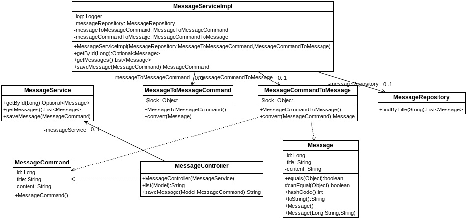
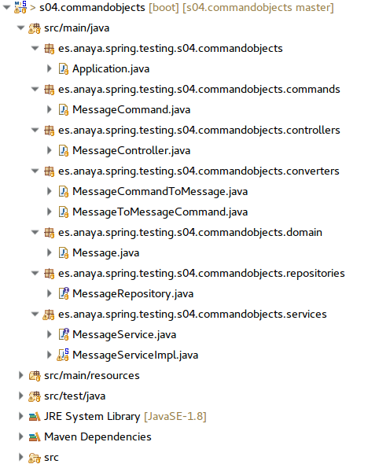

## Uso de command objects
[Proyecto s04.commandobjects]

Aunque un formulario se puede asociar sin problemas a una entidad, no siempre existe una relación exacta entre el formulario que se presenta al usuario y una entidad que mapea un registro de una BD. De hecho incluso puede haber formularios sin ninguna relación con la BD. Es frecuente por tanto, que se utilicen unos objetos intermedios, a veces llamados command objects, que son los que se utilizan para contener los formularios. Esos command objects pueden ser casi idénticos a las clases del dominio, pero en cualquier caso se precisará hacer una conversión de uno a otro. Normalmente al mandar formularios se utilizarán los command objects, y en cuanto estos lleguen a la capa de servicio se llevará a cabo la conversión. Por lo tanto serán precisas dos clases para hacer esas conversiones, tal y como se verá en el siguiente ejemplo.
Esto hará que el proyecto aumente y tenga bastantes más elementos, tal y como muestra el diagrama:



**Figura - Componentes del proyecto s04.proyecto.png.**

Los componentes se organizan de la siguiente manera en el proyecto:



**Figura - El proyecto en el IDE**

La entidad a manejar en este caso es Message, utilizando además anotaciones Lombok para facilitar nuestra tarea.

**Listado - Fichero Message.java.**

```java
@Entity
@Data
@NoArgsConstructor
@AllArgsConstructor
public  class Message {
    @Id
    @GeneratedValue(strategy = GenerationType.IDENTITY)
    private Long id;
    private String title;
    @Lob
    private String content;
}
```

En este caso, se va a utilizar un objeto command, el cual se utilizará entre la capa de servicio y la vista para las operaciones de modifiquen los datos. Todo lo que esté en una instancia de Message será trasladado a una instancia MessageCommand y viceversa, y eso se hará en el servicio.
Siendo esta la clase que se utilizará entre la vista, los controladores y el servicio, aplicaremos las anotaciones de validación. En este caso hay una interesante que se puede aplicar en los campos tipo fecha para garantizar que una fecha introducida no es del futuro, un requisito a veces necesario en las validaciones. También se aplica Lombok para ahorrar el mantenimiento de métodos, pero ojo, no debe contener la anotación @Data, ya que esta clase no mapea una tabla del SGBD.

**Listado - Fichero MessageCommand.java.**

```java
@Setter
@Getter
@NoArgsConstructor
public class MessageCommand {
    private Long id;
    private String title;
    private String content;
}
```

El repositorio no tiene nada de particular, pero eso sí, siempre trabajará con objetos de dominio.

**Listado - Fichero MessageRepository.java.**

```javac
@Repository
public interface MessageRepository extends CrudRepository<Message, Long> {
	List<Message> findByTitle(String title);

}
```

Para poder convertir las instancias de Message a MessageCommand y viceversa, se puede utilizar una clase de conversión. Spring ofrece, además, una interface Converter que se puede aplicar en estos casos. Se aplica la anotación Synchronized para evitar que en el momento de la conversión se alteren los datos y dejen de ser coherente lo que contiene Message y MessageCommand.
Además anotaremos con @Component, ya que los conversores se utilizarán en el servicio.
En primer lugar, vemos el conversor MessageToMessageCommand.

**Listado - Fichero MessageToMessageCommand.java.**

```java
@Component
public class MessageToMessageCommand implements Converter<Message, MessageCommand> {

  @Synchronized
  @Nullable
  @Override
  public MessageCommand convert(Message message) {
    if (message == null) {
      return null;
    }

    final MessageCommand messageCommand = new MessageCommand();

    messageCommand.setId(message.getId());
    messageCommand.setTitle(message.getTitle());
    messageCommand.setContent(message.getContent());

    return messageCommand;
  }
}
```

Este sería el conversor de MessageCommand a Message:

**Listado - Fichero MessageCommandToMeessage.java.**

```java
@Component
public class MessageCommandToMessage 
		implements Converter<MessageCommand, Message>{

    @Synchronized
    @Nullable
    @Override
	public Message convert(MessageCommand messageCommand) {
    if (messageCommand == null) {
      return null;
    }

    final Message message = new Message();
    message.setId(messageCommand.getId());
    message.setTitle(messageCommand.getTitle());
    message.setContent(messageCommand.getContent());
    return message;
  }
}
```

En cuanto al servicio, se definen unos servicios básicos para consultas e inserción:

**Listado - Fichero MessageService.java.**

```java
public interface MessageService {
	public Optional<Message> getById(Long id);
	public List<Message> getMessages();
	public MessageCommand saveMessage(MessageCommand messageCommand);
}
```

Y esta sería la implementación. Se inyectan las instancias necesarias de forma implícita a través del constructor, y es en el método de saveMessage donde se utiliza y convierte el MessageCommand:

**Listado - Fichero MessageServiceImpl.java.**

```java
@Slf4j
@Service
public class MessageServiceImpl implements MessageService {

  private MessageRepository messageRepository;
  private MessageToMessageCommand messageToMessageCommand;
  private MessageCommandToMessage messageCommandToMessage;
  
  
  public MessageServiceImpl(MessageRepository messageRepository, 
      MessageToMessageCommand messageToMessageCommand,
      MessageCommandToMessage messageCommandToMessage) {
    this.messageRepository = messageRepository;
    this.messageToMessageCommand = messageToMessageCommand;
    this.messageCommandToMessage = messageCommandToMessage;
  }

  @Override
  public Optional<Message> getById(Long id) {
    return messageRepository.findById(id);
  }
  
  @Override
  public List<Message> getMessages() {
    return (List<Message>)messageRepository.findAll();
  }

  @Override
  public MessageCommand saveMessage(MessageCommand messageCommand) {
    Message message = messageCommandToMessage.convert(messageCommand);
    Message savedMessage = messageRepository.save(message);
    
    return messageToMessageCommand.convert(savedMessage);
  }

}
```

El controlador es quien orquesta las operaciones básicas. En esta caso únicamente dos:
*	@RequestMapping(“/messages”): prepara el formulario de inserción cargando una instancia de MessageCommand en el model, donde también mete una consulta con todos los registros.
*	@PostMapping(“/messages”): es quien procesa la instancia de MessageCommand que contiene el formulario para insertarla a través del servicio. 

**Listado - Fichero MessageController.java.**

```java
@Controller
public class MessageController {

  private MessageService messageService;
  
  public MessageController(MessageService messageService) {
  this.messageService = messageService;
  }

  @RequestMapping("/messages")
  public String list (Model model) {    
    model.addAttribute("messageCommand", new MessageCommand());
    model.addAttribute("messages", messageService.getMessages());
    return "messages";
  }
  
  @PostMapping("/messages")
  public String saveMessage(Model model, @ModelAttribute MessageCommand messageCommand) {
    MessageCommand savedMessageCommand = messageService.saveMessage(messageCommand);
    model.addAttribute("message", savedMessageCommand);
    return "messageSaved";
  }
}
```

La vista que merece la pena mostrar es la que contiene el formulario, en la cual se muestra el uso del command object.

**Listado - Fichero message.html.**

```html
<!DOCTYPE HTML>
<html xmlns:th="http://www.thymeleaf.org">
<head>
    <title>Guestbook - s04.commandobjects</title>
	<meta charset="UTF-8">
</head>
<body>
  <div class="container">
 	<h1>Guestbook</h1>
 	<form action="#" th:action="@{/messages}" th:object="${messageCommand}" method="post">
    	<div><label for="title">Title</label></div>
    	<div><input type="text" th:field="*{title}" /></div>
    	
    	<div><label for="content">Content</label></div>
    	<div><textarea th:field="*{content}" /></div>
        
        <p><input type="submit" value="Submit" /></p>
    </form>
	<div th:each="message : ${messages}">
		<div>
	  		<h4 th:text="${message.title}">Default title</h4>
			<div  th:text="${message.content}">			
				Default message
			</div>
		<div>
	<div>
	</div>
</body>
</html>
```
