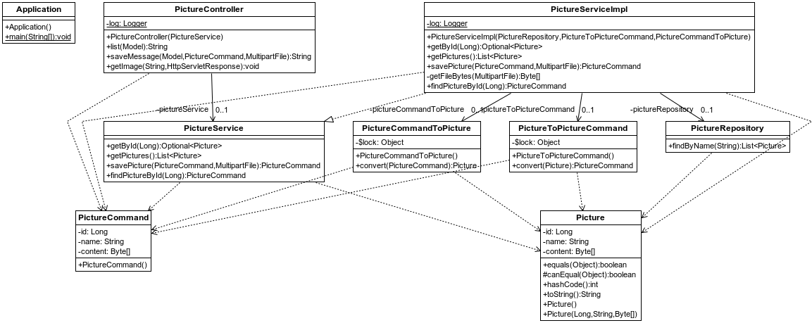
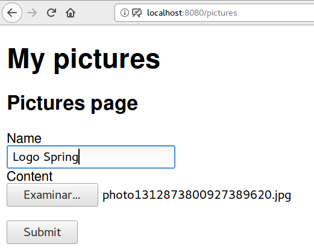
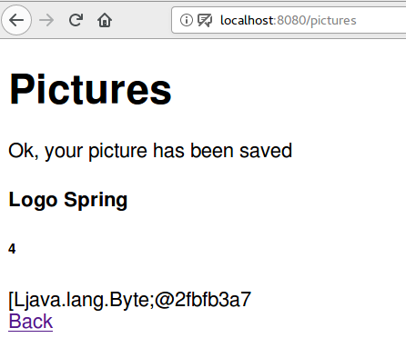

## Subida de ficheros
Una de las necesidades habituales en las aplicaciones web es la posibilidad de poder subir ficheros. Esto puede hacerse a través del método post cargando el fichero como un dato más de un formulario. Pero obviamente, el tratamiento que precisa el contenido binario es un poco más especial.

En principio utilizaremos un modelo para contener el fichero binario, utilizando un campo especial de tipo array de bytes.

La aplicación de ejemplo es un proyecto Spring MVC que gestiona fotos. Utiliza Lombok y el controlador maneja un objectcommand para la gestión de datos en lugar de la entidad final. Por lo demás contiene los elementos habituales: repositorio, interface de servicio y su implementación, mapeadores de entidad a command object, etc..



**Figura - Componentes del proyecto**

Esta sería la clase que representa el modelo y donde almacenaremos las imágenes.
¡OJO! Como veremos más adelante, la imagen no se guardará directamente cuando se mande en el formulario.
Será el servicio quien la gestione y la almacene en ese campo content.

Como se puede apreciar también, aplicamos una anotación especial @Lob, utilizada para campos de gran tamaño en formato binario. En Java, ese tipo de campos se almacenarán como array de Bytes.

**Listado - Fichero Picture.java**

```java
@Entity
@Data
@NoArgsConstructor
@AllArgsConstructor
public  class Picture {
    @Id
    @GeneratedValue(strategy = GenerationType.IDENTITY)
	private Long id;
	private String name;
	 @Lob
	 private Byte[] content;
}

```

En cuanto al repositorio, no tiene nada en particular:

**Listado - Fichero PictureRepository.java**

```java
@Repository
public interface PictureRepository extends CrudRepository<Picture, Long> {
	List<Picture> findByName(String name);

}

```
El servicio de la aplicación es una interface con los métodos CRUD básicos, pero lo interesante será ver cómo se implementan aquellos que deben manipular el campo binario de la imagen. 
En este caso, lo que cambia respecto a los formularios vistos hasta ahora es que, la imagen se procesa aparte.

**Listado - Fichero PictureServiceImpl.java**

```java
public interface PictureService {
	public Optional<Picture> getById(Long id);
	public List<Picture> getPictures();
	public PictureCommand savePicture(PictureCommand pictureCommand, MultipartFile file);
	public PictureCommand findPictureById(Long valueOf);
}
```

En la implementación podemos ver los detalles de manejo del binario. Como se puede ver, debe ir aparte,
y el servicio se encarga de almacenarlo y extraerlo.

**Listado - Fichero PictureServiceImpl.java**

```java
@Slf4j
@Service
public class PictureServiceImpl implements PictureService {

	private PictureRepository pictureRepository;
	private PictureToPictureCommand pictureToPictureCommand;
	private PictureCommandToPicture pictureCommandToPicture;
	
	
	
	public PictureServiceImpl(PictureRepository pictureRepository, 
			PictureToPictureCommand pictureToPictureCommand,
			PictureCommandToPicture pictureCommandToPicture) {
		this.pictureRepository = pictureRepository;
		this.pictureToPictureCommand = pictureToPictureCommand;
		this.pictureCommandToPicture = pictureCommandToPicture;
	}

	@Override
	public Optional<Picture> getById(Long id) {
		return pictureRepository.findById(id);
	}

	@Override
	public List<Picture> getPictures() {
		return (List<Picture>)pictureRepository.findAll();
	}

	@Override
	public PictureCommand savePicture(PictureCommand pictureCommand, MultipartFile file) {
		Picture picture = pictureCommandToPicture.convert(pictureCommand);
		
		Byte[] byteObjects = getFileBytes(file);

        picture.setContent(byteObjects);
        
		Picture savedMessage = pictureRepository.save(picture);
		
		return pictureToPictureCommand.convert(savedMessage);
	}

	private Byte[] getFileBytes(MultipartFile file)  {
		Byte[] byteObjects = new Byte[1];
		
		try {
			byteObjects = new Byte[file.getBytes().length];
         int i = 0;

         for (byte b : file.getBytes()){
             byteObjects[i++] = b;
         }
		} catch (IOException ioe) {
			log.error("Error getting bytes fron file: " + ioe.getMessage());
		}
         
		return byteObjects;
	}

	@Override
	public PictureCommand findPictureById(Long valueOf) {
		return pictureToPictureCommand.convert(pictureRepository.findById(valueOf).get());
	}

}


```

El controlador es otro elemento interesante en este caso. Vemos cómo en el envío del fichero, por un lado van los campos normales a través de una instancia Picture, pero el contenido del fichero se manda en un parámetro distinto.

¿Y cómo se carga la imagen en la vista?
La imagen es generada al vuelo y servida por el controlador en el método getImage. Este método consulta la BD, convierte la imagen a un Strema de bytes y lo sirve marcando las cabeceras content-type: image/jpeg.

**Listado - Fichero PictureController.java**

```java
@Slf4j
@Controller
public class PictureController {

	private PictureService pictureService;
		
    public PictureController(PictureService pictureService) {
		this.pictureService = pictureService;
	}

	@RequestMapping("/pictures")
    public String list (Model model) {    	
        model.addAttribute("pictureCommand", new PictureCommand());
    	model.addAttribute("pictures", pictureService.getPictures());
        return "pictures";
    }
	
    @PostMapping("/pictures")
    public String saveMessage(Model model, @ModelAttribute PictureCommand pictureCommand, @RequestParam("imagefile") MultipartFile file) {
    	PictureCommand savedPictureCommand = pictureService.savePicture(pictureCommand, file);
    	log.info("Uploaded image: " + file.getName());
    	model.addAttribute("picture", savedPictureCommand);
        return "pictureSaved";
    }
    
	@RequestMapping("/pictures/image/{id}")
    public void getImage (@PathVariable String id, HttpServletResponse response) throws IOException {
        PictureCommand pictureCommand = pictureService.findPictureById(Long.valueOf(id));

        if (pictureCommand.getContent() != null) {
            byte[] byteArray = new byte[pictureCommand.getContent().length];
            int i = 0;

            for (Byte wrappedByte : pictureCommand.getContent()){
                byteArray[i++] = wrappedByte; //auto unboxing
            }

            response.setContentType("image/jpeg");
            InputStream is = new ByteArrayInputStream(byteArray);
            IOUtils.copy(is, response.getOutputStream());
        }
}
}


```

En las vistas, primero mostramos la página que contiene el formulario.
Los formularios que mandan ficheros, además de campos file, deben configurar la etiqueta form
con el atributo enctype="multipart/form-data".

Por otro lado, también se muestran las imágenes existentes, y para ello las etiquetas img hacen referencia a una URL del controlador que es la que carga el stream de bytes con la imagen.

**Listado - Fichero pictures.html**

```html

<!DOCTYPE HTML>
<html xmlns:th="http://www.thymeleaf.org">
<head>
<title>Spring Web : s04.fileupload</title>
<meta http-equiv="Content-Type" content="text/html; charset=UTF-8" />
</head>
<body>
	<header>
		<h1>My pictures</h1>
	</header>
	<main>
	<h2>Pictures page</h2>
	<form action="#" th:action="@{/pictures}" th:object="${pictureCommand}" method="post" enctype="multipart/form-data">
    	<div>
    		<label for="title">Name</label>
    	</div>
    	<div>
  			 <input type="text" th:field="*{name}" />
    	</div>
    	<div>
    		<label for="content">Content</label>
    	</div>
    	<div>
  			 <input id="imagefile" name="imagefile" type="file" class="file">
    	</div>
        <p><input type="submit" value="Submit" /></p>
    </form>

	<div th:each="picture : ${pictures}">
		<div class="card">
	  	<div class="card-block">
		 <h4 class="card-title" th:text="${picture.name}">Default name</h4>
		 <h6 class="card-subtitle mb-2 text-muted" th:text="${picture.id}">0</h6>
		    <div> 
			</div>
		</div>
		<div>
	</div>

	</main>
</body>
</html>


```

**Figura - Aspecto del formulario**



El formulario de resultado, no hace más que mostrar un mensaje de confirmación.

**Listado - Fichero pictureSaved.html**

```html
<!DOCTYPE HTML>
<html xmlns:th="http://www.thymeleaf.org">
<head>
    <title>Spring - s04.fileupload</title>
    <meta http-equiv="Content-Type" content="text/html; charset=UTF-8" />
        <link rel="stylesheet" 
       src="https://maxcdn.bootstrapcdn.com/bootstrap/4.0.0-alpha.6/js/bootstrap.min.js" 
       integrity="sha384-vBWWzlZJ8ea9aCX4pEW3rVHjgjt7zpkNpZk+02D9phzyeVkE+jo0ieGizqPLForn" 
       crossorigin="anonymous"
	   th:href="@{/webjars/bootstrap/4.0.0-beta.2/css/bootstrap.min.css}">
</head>
<body>
  <div class="container">
 	<h1>Pictures</h1>
 	<p>Ok, your picture has been saved</p>
	<div class="card">
  	<div class="card-block">
	 <h4 class="card-title" th:text="${picture.name}">Default name</h4>
	 <h6 class="card-subtitle mb-2 text-muted" th:text="${picture.id}">0</h6>
	  <div class="card-text" th:text="${picture.content}">Default content</div>
	</div>
	<div>
	<a href="/pictures">Back</a>
	</div>
</body>
</html>
```

**Figura - Resultado del envío**


