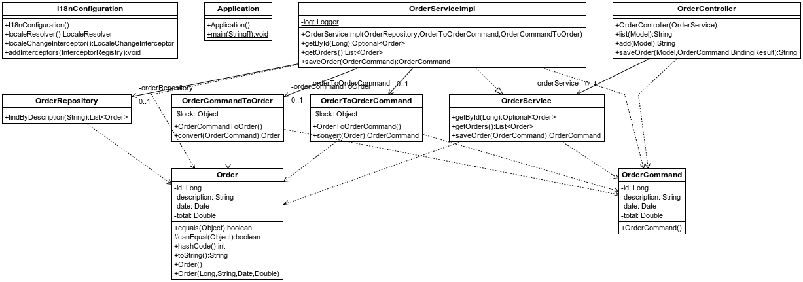
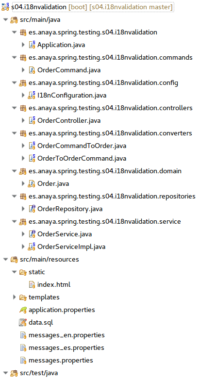

## Validación e internacionalización
[Proyecto s04.i18nvalidation]


Vamos ahora a poner varios elementos en juego a la vez, ya que en aplicaciones reales serán requisitos inexcusables: validación de datos, internacionalización del interfaz de usuario y de los mensajes de error y validación, y como extra, veremos una forma sencilla de añadir frameworks de interfaz de usuario como Bootstrap, jQuery de forma muy sencilla.

Este proyecto contiene bastantes más elementos.



**Figura - Componentes del proyecto s04.proyecto.png.**

En cuanto a la organización del proyecto. tendría el siguiente aspecto:



**Figura - Organización del proyecto**

La entidad en esta ocasión representa un pedido. Para facilitar la definición de pojos, aplicamos el proyecto Lombok.

**Listado - Fichero Order.java.**

```java
@Entity
@Data
@NoArgsConstructor
@AllArgsConstructor
@Table(name="orders")
public  class Order {
    @Id
    @GeneratedValue(strategy = GenerationType.IDENTITY)
	private Long id;
	private String description;
	private Date date;
	private Double total;
}
```

El repositorio no tiene nada de particular, es un CrudRepository y tiene un método específico.

**Listado - Fichero OrderRepository,java.**

```java
@Repository
public interface OrderRepository extends CrudRepository<Order, Long> {
	List<Order> findByDescription(String description);

}
```

En este caso, también se va a utilizar un objeto command sobre todo en las operaciones donde se usen formularios. Por eso, es aquí donde se aplicarán las anotaciones de validación.

**Listado - Fichero OrderCommand.java.**


```java
@Setter
@Getter
@NoArgsConstructor
public class OrderCommand {
    
    private Long id;
    
    @NotBlank
    @Size(min = 3, max = 255)
    private String description;
    
    @DateTimeFormat(pattern = "yyyy-MM-dd")
    @PastOrPresent
    private Date date;
    
    @Min(1)
    @Max(1000)
    private Double total;
}
```

Para poder convertir las instancias de Order a OrderCommand y viceversa, se aplicarán las clases de conversión similares a las explicadas anteriormente.

El servicio contendrá tres métodos:
*	getById: para recuperar un única instancia de Order.
*	getOrders: para recuperar una lista de Order.
*	saveOrder: para guardar un orderCommand.
Solo el último método utiliza OrderCommand, ya que es el método que hace modificaciones. También se puede hacer que se use OrderCommand en todas las operaciones de tal forma que se aisle al resto de capas de las instancias del dominio.

**Listado - Fichero OrderService.java.**

```java
public interface OrderService {
	public Optional<Order> getById(Long id);
	public List<Order> getOrders();
	public OrderCommand saveOrder(OrderCommand orderCommand);
}
```

La implementación utiliza una serie de componentes que se inyectan por constructor. Se trata del repositorio, imprescindible para gestionar los datos, y los conversores de Order a OrderCommand.
En cuanto al controlador no tiene mucho misterio respecto a los otros controladores vistos hasta el momento. Quizá lo más interesante esté en el @PostMapping, ya que es donde se recibe el OrderCommand como parámetro y además es validado. En el resto se trabaja directamente con objetos Order.

Se precisa una clase de configuración, en este caso mucho más completa que en el primer ejemplo de i18n visto anteriormente. Además de habilitar la internacionalización, permite añadir un mecanismo para que se pueda cambiar el idioma por defecto en el momento en que cualquier petición a la aplicación reciba un parámetro lang, por ejemplo /?lang=es
Gracias a eso, resulta muy sencillo añadir enlaces o listas de selección para que los usuarios cambien el idioma cuando así lo necesiten.

**Listado - Fichero I18nConfiguration.java.**

```java
@Configuration
@EnableWebMvc
public class I18nConfiguration extends WebMvcConfigurerAdapter {

	@Bean
	public LocaleResolver localeResolver() {
	    SessionLocaleResolver slr = new SessionLocaleResolver();
	    slr.setDefaultLocale(Locale.US);
	    return slr;
	}
	
	@Bean
	public LocaleChangeInterceptor localeChangeInterceptor() {
	    LocaleChangeInterceptor lci = new LocaleChangeInterceptor();
	    lci.setParamName("lang");
	    return lci;
	}
	
	@Override
	public void addInterceptors(InterceptorRegistry registry) {
	    registry.addInterceptor(localeChangeInterceptor());
	}

}
```

En cuanto a los ficheros properties, el fichero que se cargará en cualquier caso es messages.properties. Es, además, el fichero de fallback, ya que si no existe ningún otro fichero de messages, se utilizará este. En este caso se utiliza para añadir dos entradas que se aplicarán sea cual sea el idioma que esté seleccionado.

**Listado - Fichero messages.properties.**

```properties
language.es=Spanish
language.en=English
```

Y esta sería una muestra del fichero de traducciones. Contiene algunos mensajes con parámetros, lo cual permite que haya partes dinámicas en los mensajes. En las vistas se verá cómo se cargan esos mensajes. Además, gracias a una convención de nombres obvia, obtenemos los mensajes de validación de la clase OrderCommand. Por ejemplo, la clave Min.orderCommand.total, contienen el mensaje de error que se tiene que mostrar en caso de que haya ese error en ese campo de la instancia de OrderCommand.

**Listado - Fichero messages_en.properties.**

```properties
page.title=Orders management
orderCommand.errorsBelow=Check errors below
orderCommand.description=Description
date=Order date
orderCommand.total=Order total
NotBlank.orderCommand.description=Description cannot be blank
Size.orderCommand.description={0} length must be between {2} and {1} characters long.
Min.orderCommand.total={0} must be more than {1}
Max.orderCommand.total={0} must be less than {1}
```

Las vistas deben tener buen aspecto, y para ello se puede echar mano de frameworks de diseño como Bootstrap, Foundation, Material-UI o librerías JavaScript como jQuery. En lugar de tener que bajarnos esas librerías a mano, existe un mecanismo por el cual basta con añadir una serie de dependencias para obtener de forma automática cualquier de los frameworks más populares.
Se trata del proyecto **Webjars**. En primer lugar, se tiene que añadir su dependencia en el fichero pom.xml de Maven, y a continuación cualquiera de los frameworks que precisemos, como otra dependencia más. 
Para conocer la disponibilidad y versiones, echa un vistazo en la web oficial http://www.webjars.org


**Listado - Fichero pom.xml.**

```xml
	<dependencies>
	...
		<dependency>
			<groupId>org.webjars</groupId>
			<artifactId>bootstrap</artifactId>
			<version>4.0.0-beta.2</version>
		</dependency>
		<dependency>
			<groupId>org.webjars</groupId>
			<artifactId>font-awesome</artifactId>
			<version>4.7.0</version>
		</dependency>
		<dependency>
			<groupId>org.webjars</groupId>
			<artifactId>jquery</artifactId>
			<version>3.2.1</version>
		</dependency>
	</dependencies>
```

Y llega el momento de ver las vistas. En primer lugar se aprecia cómo se cargan recursos css gracias a Webjars, utilizando como enlace a las mismas el prefijo @{/webjars/librería/versión/..}
Además, se utiliza i18n para todos los mensajes. En la página índice, además de mostrar todos los pedidos, hay un enlace para el formulario de creación.

**Listado - Fichero orders.html.**

```html
<!DOCTYPE HTML>
<html xmlns:th="http://www.thymeleaf.org">
<head>
    <title>Spring/S04.18nvalidation : index</title>
	<meta charset="UTF-8">
    <link rel="stylesheet" 
       src="https://maxcdn.bootstrapcdn.com/bootstrap/4.0.0-alpha.6/js/bootstrap.min.js" 
       integrity="sha384-vBWWzlZJ8ea9aCX4pEW3rVHjgjt7zpkNpZk+02D9phzyeVkE+jo0ieGizqPLForn" 
       crossorigin="anonymous"
     th:href="@{/webjars/bootstrap/4.0.0-beta.2/css/bootstrap.min.css}">
</head>
<body>
  <div class="container">
   <h1 th:text="#{page.title}">Orders</h1>
  <div><a href="?lang=en">EN</a> | <a href="?lang=es">ES</a></div>
   <div><a href="/orders/add">Add new</a></div>
  <div th:each="order : ${orders}">
      <div class="card-block">
      <b th:text="${order.id}">0</b>: 
        <span th:text="${order.description}">Default title</span>
      <span th:text="${order.date}">Default message</span>
    </div>
  <div>
  </div>
</body>
</html>
```


En el formulario de creación aplicaría las etiquetas específicas para mostrar errores traducidos.

**Listado - Fichero addOrder.html.**

```html
<!DOCTYPE HTML>
<html xmlns:th="http://www.thymeleaf.org">
<head>
  <title>Spring/S04.18nvalidation : index</title>
	<meta charset="UTF-8">
  <link rel="stylesheet" 
     src="https://maxcdn.bootstrapcdn.com/bootstrap/4.0.0-alpha.6/js/bootstrap.min.js" 
     integrity="sha384-vBWWzlZJ8ea9aCX4pEW3rVHjgjt7zpkNpZk+02D9phzyeVkE+jo0ieGizqPLForn" 
     crossorigin="anonymous"
	   th:href="@{/webjars/bootstrap/4.0.0-beta.2/css/bootstrap.min.css}">
</head>
<body>
  <div class="container">
 	<h1>Orders</h1>
   <div><a href="?lang=en">EN</a> | <a href="?lang=es">ES</a></div>
 	<form action="#" th:action="@{/orders}" th:object="${orderCommand}" method="post">
 	  <div th:if="${#fields.hasErrors('*')}" class="alert alert-danger">
        <p th:text="#{orderCommand.errorsBelow}">Default errors message</p>
  </div>
  	<div>
    <label for="description">Description</label>
    <span class="help-block" th:if="${#fields.hasErrors('description')}">
      <ul>
         <li th:each="err : ${#fields.errors('description')}" th:text="${err}"/>
      </ul>
  	</span>
  	</div>
  	<div>
  	 <input type="text" th:field="*{description}" />
  	</div>
  	<div>
    <label for="date">Date</label>
    <span class="help-block" th:if="${#fields.hasErrors('date')}">
        <ul>
         <li th:each="err : ${#fields.errors('date')}" th:text="${err}"/>
        </ul>
  	</span>
  	</div>
  	<div>
  	 <input type="text" th:field="*{date}" />
  	</div>
  	<div>
    <label for="total">Total</label>
     <span class="help-block" th:if="${#fields.hasErrors('total')}">
        <ul>
         <li th:each="err : ${#fields.errors('total')}" th:text="${err}"/>
        </ul>
  	</span>
  	</div>
  	<div>
  	 <input type="text" th:field="*{total}" />
  	</div>
    <p><input type="submit" value="Submit" /></p>
  </form>
	<div>
  <a href="/orders">Back</a>
	<div>
	
	</div>
</body>
</html>
```
