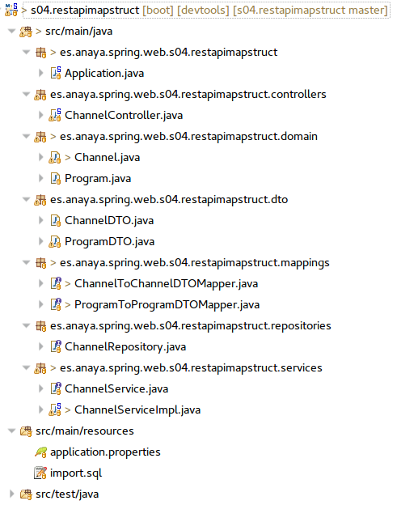
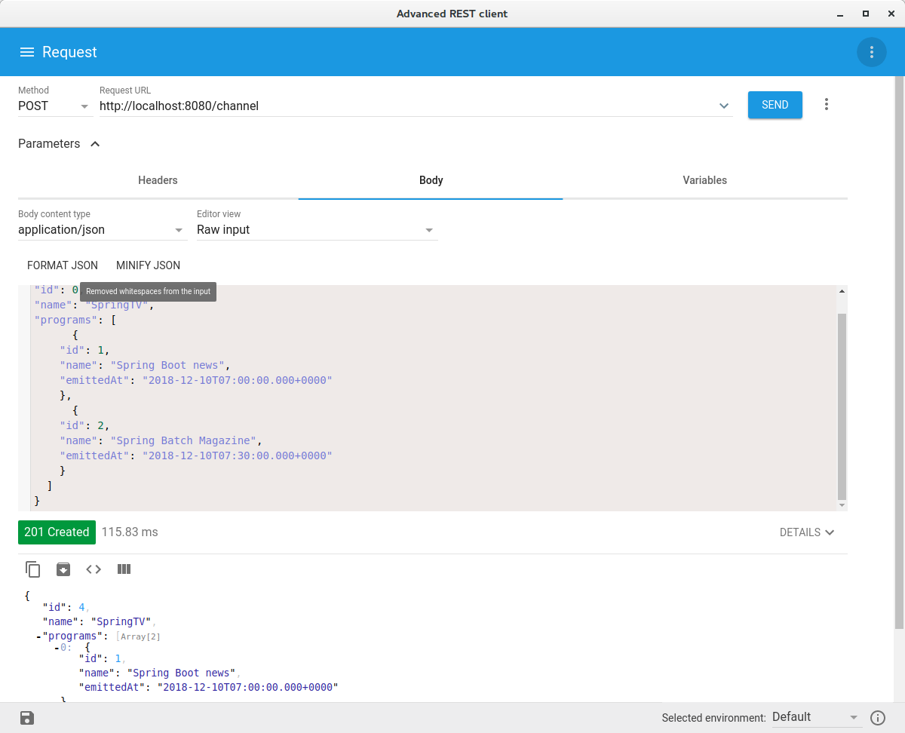

##  s04.restapimapstruct

El api anterior era relativamente simple. En este caso se hace una versión mejorada aplicando DTO, mapeos autmatizados con MapStruct y una forma de controlador alternativa. La estructura del proyecto es similar a las anteriores aplicaciones Spring MVC, solo que en este caso no hay vistas.

Esta sería la configuración de los elementos del proyecto:



**Figura - Estructura del proyecto.**


La entidad Channelrepresenta un canal de televisión. Contiene una colección de programas.

**Listado - Fichero Channel.java.**

```java
@Data
@Entity
public class Channel {
  @Id
  @GeneratedValue(strategy = GenerationType.IDENTITY)
  private Long id;
  private String name;
  
  @OneToMany(cascade=CascadeType.ALL, mappedBy="channel")  
  private List<Program> programs = new ArrayList<Program>();
}
```

La entidad Program, representa un programa de un canal de televisión.  Tiene una referencia a Channel, por lo que la relación es bidireccional, aunque no sea imprescindible en este caso.

**Listado - Fichero Program.java.**

```java
@Data
@Entity
@ToString(exclude= {"channel"})
public class Program {
    @Id
    @GeneratedValue(strategy = GenerationType.IDENTITY)
	private Long id;
	private String name;
	@Column(name="emitted_at")
	private Date emittedAt;
	@ManyToOne
	private Channel channel;
}
```

El DTO de Channel, que hace referencia a una colección de ProgramDTO.

**Listado - Fichero ChannelDTO.java.**

```java
public class ChannelDTO {
	private Long id;
	private String name;
	private List<ProgramDTO> programs = new ArrayList<ProgramDTO>();
...
}
```

El DTO de Program. No necesita, en principio, la referencia a ChannelDTO.

**Listado - Fichero ProgramDTO.java.**

```java
public class ProgramDTO {

	private Long id;
	private String name;
	private Date emittedAt;
...
}
```

El mapeador de Channel a ChannelDTO.

**Listado - Fichero ChannelToChannelDTO.java.**

```java
@Mapper(componentModel = "spring")
public interface ChannelToChannelDTOMapper {
	ChannelToChannelDTOMapper INSTANCE = 
			Mappers.getMapper(ChannelToChannelDTOMapper.class);
	
	ChannelDTO channelToChannelDTO(Channel channel);
	Channel channelDTOToChannel(ChannelDTO channelDTO);
}
```


El mapeador de Program a ProgramDTO.

**Listado - Fichero ProgramToProgramDTOMapper.java.**

```java
@Mapper(componentModel = "spring")
public interface ProgramToProgramDTOMapper {
	ProgramToProgramDTOMapper INSTANCE = 
			Mappers.getMapper(ProgramToProgramDTOMapper.class);
	
	ProgramDTO programToProgramDTO(Program program);
	Program programDTOToProgram(ProgramDTO programDTO);
}
```

El interface del servicio de Channel, define una operación por cada uno de las operaciones que precisa la API Rest.

**Listado - Fichero ChannelService.java.**

```java
public interface ChannelService {
    public List<ChannelDTO> getAllChannels(); 
    public ChannelDTO getChannel(Long id);
    public ChannelDTO createChannel(ChannelDTO channelDTO);
    public ChannelDTO updateChannel(ChannelDTO channelDTO);
    public Long deleteChannel(Long id);
}
```

La implementación del servicio utiliza las instancias de conversor de DTO y el repositorio, inyectados por constructor. En todo momento, el servicio debe retornar los DTOs y en el caso de modificaciones e inserciones, debe preocuparse de hacer las conversiones permanentes.

**Listado - Fichero ChannelServiceImpl.java.**

```java
@Service
public class ChannelServiceImpl implements ChannelService {

  private ChannelToChannelDTOMapper channelToChannelDTOMapper;

  private ChannelRepository channelRepository;

  public ChannelServiceImpl(
	ChannelToChannelDTOMapper channelToChannelDTOMapper,
      ChannelRepository channelRepository) {

    this.channelToChannelDTOMapper = channelToChannelDTOMapper;
    this.channelRepository = channelRepository;
  }

  @Override
  public List<ChannelDTO> getAllChannels() {
    return channelRepository
        .findAll()
        .stream()
        .map(channelToChannelDTOMapper::channelToChannelDTO)
        .collect(Collectors.toList());
  }

  @Override
  public ChannelDTO getChannel(Long id) {
    return channelToChannelDTOMapper
          .channelToChannelDTO(channelRepository.findById(id).get());
  }

  @Override
  public ChannelDTO createChannel(ChannelDTO channelDTO) {
    Channel savedChannel = channelRepository
          .save(channelToChannelDTOMapper
          .channelDTOToChannel(channelDTO));
    return channelToChannelDTOMapper
          .channelToChannelDTO(savedChannel);
  }
  
  @Override
  public ChannelDTO updateChannel(ChannelDTO channelDTO) {
      return createChannel(channelDTO);
  }
    
  @Override
  public Long deleteChannel(Long id) {
      channelRepository.deleteById(id);
      return id;
  }
}
```
Este sería el repositorio para Channel:


**Listado - Fichero ChannelRepository.java.**

```java
public interface ChannelRepository  extends JpaRepository<Channel, Long> {
    List<Channel> findByName(String name);
}
```

La parte interesante de este proyecto sin duda, está en el controlador. En este caso se muestra otra variante de las anotaciones. En lugar de indicar la clase como @RestController, se indica simplemente @Controller. Eso obliga a que en cada uno de ellos métodos se tenga que indicar la anotación @ResponseBody. Además, se añade una anotación @RequestMapping(“/channel”) a toda la clase, lo que nos permite ahorrarnos ese prefijo “/channel” en cada una de las peticiones. En muchas de ellas de hecho, no hará falta indicar ruta en el método, y entre ellos se distinguirán por el método (GET, POST, PUT, DELETE). A diferencia del ejemplo Rest Crud anterior, ahora se utilizan las anotaciones específicas de cada método. Otro detalle interesante es que los método retornan una instancia de ResponseEntity, la cual permite retornar tanto entidades con datos como el código de respuesta HTTP. En las API rest se pueden incluir estos códigos, los cuales ofrecen una información adicional a los clientes de la API.
*	@GetMapping: el método con esta anotación devuelve todos los registros. Además retorna el código HttpStatus.OK.
*	@GetMapping(“/{id}”): este método devuelve un registro concreto. Además retorna el código HttpStatus.OK.
*	@PostMapping: inserta un nuevo registro. Además retorna el código HttpStatus.CREATED.
*	@PutMapping(“/{id}”): este método actualiza un registro concreto. Además retorna el código HttpStatus.OK.
*	@DeleteMapping(“/{id}”): este método elimina un registro concreto. Además retorna el código HttpStatus.OK.

En todo momento se utilizan instancias de DTO

**Listado - Fichero ChannelController.java.**

```java
@Controller
@RequestMapping("/channel")
public class ChannelController {
 @Autowired
 ChannelService channelService;
 
  @GetMapping
  @ResponseBody
  public ResponseEntity<List<ChannelDTO>> getChannels() {
   System.out.println("See: " + channelService.getAllChannels());
    return new ResponseEntity<List<ChannelDTO>>(channelService.getAllChannels(),
      HttpStatus.OK);
  }
  
  @GetMapping(value="/{id}")
  public ResponseEntity<ChannelDTO> getChannel(@PathVariable("id") Long id) {
    return new ResponseEntity<ChannelDTO>(channelService.getChannel(id),
       HttpStatus.OK);
  }
  
  @PostMapping
  public ResponseEntity<ChannelDTO> createChannel(@RequestBody ChannelDTO channelDTO){
    return new ResponseEntity<ChannelDTO>(channelService.createChannel(channelDTO),
        HttpStatus.CREATED);
  }

  @PutMapping({"/{id}"})
  public ResponseEntity<ChannelDTO> updateChannel(@PathVariable Long id, @RequestBody ChannelDTO channelDTO){
    return new ResponseEntity<ChannelDTO>(channelService.updateChannel( channelDTO),
        HttpStatus.OK);
  }
  
  @DeleteMapping({"/{id}"})
  public ResponseEntity<Long> deleteChannel(@PathVariable Long id){
    return new ResponseEntity<Long>(channelService.deleteChannel(id),
        HttpStatus.OK);
  }
 
}
```

Como se puede apreciar en el pantallazo, el API funciona correctamente y permite insertar canales con sus programas en formato Json. La configuración de cascada hace que se inserten tanto la entidad Channel como las entidades Program vinculadas.

TODO


**Figura - Aspecto de la petición POST en Advanced Rest Client.**
