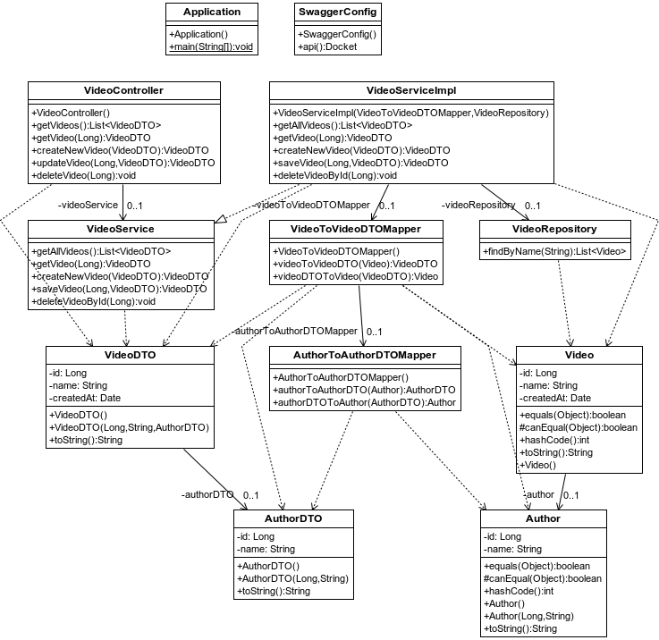
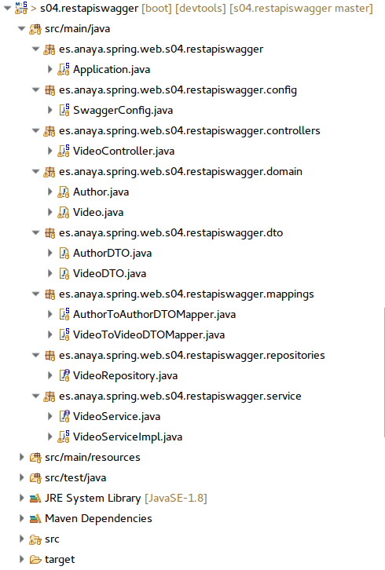
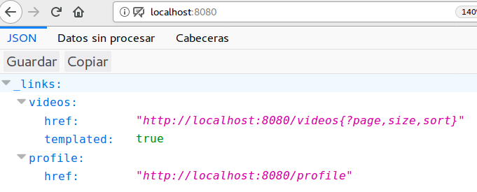
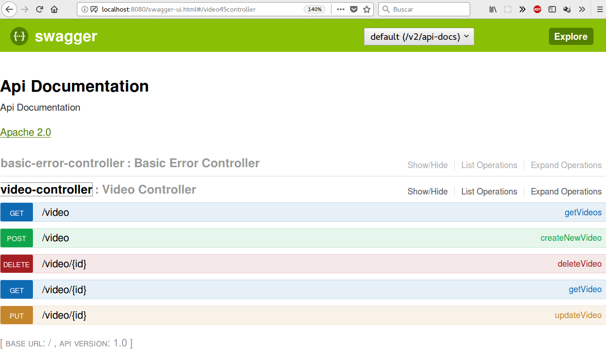

## Swagger
En el ámbito del desarrollo de las API REST no existe un canon definitivo,
pero herramientas como Swagger permiten crear las API de manera más estandarizada y al menos, predecible.
Swagger es un framework de desarrollo de API y también es, en cierta manera,
una navaja suiza: permite, entre muchas otras cosas, generar API (en formato
Open API) y documentación de forma automática.


Para mostrar el uso de Swagger en una API creada con Spring, utilizaremos un proyecto que gestiona datos de vídeos y sus creadores. Veremos como Swagger puede, de forma fácil, generar documentación de la API (en formato JSON y web), con el único coste de añadir al proyecto las dependencias de Swagger y crear una pequeña configuración para Spring.




**Figura - Componentes del proyecto**


En cuanto a la organización del proyecto, se utilizan distintas carpetas para distinguir el proposito de cada clase



**Figura - Organización del proyecto**


En cuanto al modelo, el proyecto trabaja con dos tipos de entidades, las cuales utilizan Lombok.

Por un lado, los autores de los vídeos


**Listado - Author.java**

```java
@Data
@Entity
@NoArgsConstructor
@AllArgsConstructor
@ToString(exclude= {"video"})
public class Author {
    @Id
    @GeneratedValue(strategy = GenerationType.IDENTITY)
	private Long id;
	private String name;
	
}

```

Y por otro, los vídeos:

**Listado - Video.java**

```java
@Data
@Entity
public class Video {
    @Id
    @GeneratedValue(strategy = GenerationType.IDENTITY)
	private Long id;
	private String name;
	private Date createdAt;
	@ManyToOne
	private Author author;
}
```

Ambos Tienen su DTO correspondiente y sus clases mapeadoras, como se ha visto ya en otros proyectos.

Para interactuar con el origen de datos, creamos un repository de Video, que no tiene nada de particular en este caso.

**Listado - VideoRepository.java**

```java
public interface VideoRepository  extends PagingAndSortingRepository<Video, Long> {
    List<Video> findByName(String name);
}
```

En cuanto al servicio, estos serán los métodos disponibles, los cuales utilizan y convierten de DTO al modelo y viceversa


**Listado - VideoService.java**

```java
public interface VideoService {
	public List<VideoDTO> getAllVideos();
	public VideoDTO getVideo(Long id);
	public VideoDTO createNewVideo(VideoDTO videoDTO);
	public VideoDTO saveVideo(Long id, VideoDTO videoDTO);
	public void deleteVideoById(Long id);

	
}


```

Y en cuanto a la implementación, podemos ver como el servicio utiliza el respositorio y aplica los mapeadores DTO.

**Listado - VideoServiceImpl.java**

```java
@Service
public class VideoServiceImpl implements VideoService {

	private VideoToVideoDTOMapper videoToVideoDTOMapper;

	private VideoRepository videoRepository;

	public VideoServiceImpl(VideoToVideoDTOMapper videoToVideoDTOMapper, 
							VideoRepository videoRepository) {
		this.videoToVideoDTOMapper = videoToVideoDTOMapper;
		this.videoRepository = videoRepository;
	}

	@Override
	public List<VideoDTO> getAllVideos() {
		Iterable<Video> videos = videoRepository.findAll();
		List<VideoDTO> videoDTOs = new ArrayList<VideoDTO>();
		
		for (Video v : videos) {
			videoDTOs.add(videoToVideoDTOMapper.videoToVideoDTO(v));
		}
		
		return videoDTOs;
	}

	@Override
	public VideoDTO getVideo(Long id) {
		return videoToVideoDTOMapper.videoToVideoDTO(videoRepository.findById(id).get());
	}

	@Override
	public VideoDTO createNewVideo(VideoDTO videoDTO) {
		return saveVideo(null, videoDTO);
	}
	
	@Override
	public VideoDTO saveVideo(Long id, VideoDTO videoDTO) {
		Video video = videoRepository.save(videoToVideoDTOMapper.videoDTOToVideo(videoDTO));
		
		return videoToVideoDTOMapper.videoToVideoDTO(video);
	}

	@Override
	public void deleteVideoById(Long id) {
		videoRepository.deleteById(id);
		
	}


}


```

Y este es el controlador que, utilizando todas las clases anteriores, genera la API REST:

**Listado - VideoController.java**

```java
@Controller
@RequestMapping("/video")
public class VideoController {
	@Autowired
	private VideoService videoService;
	
    @GetMapping
    @ResponseBody
    public List<VideoDTO> getVideos() {
        return videoService.getAllVideos();
    }
    
    @GetMapping(value="/{id}")
    @ResponseBody
    public VideoDTO getVideo(@PathVariable("id") Long id) {
        return videoService.getVideo(id);
    }
    
    @PostMapping
    @ResponseStatus(HttpStatus.OK)
    public VideoDTO createNewVideo(@RequestBody VideoDTO videoDTO){
        return videoService.createNewVideo(videoDTO);
    }

    @PutMapping({"/{id}"})
    @ResponseStatus(HttpStatus.OK)
    public VideoDTO updateVideo(@PathVariable Long id, @RequestBody VideoDTO videoDTO){
        return videoService.saveVideo(id, videoDTO);
    }

    @DeleteMapping({"/{id}"})
    @ResponseStatus(HttpStatus.OK)
    public void deleteVideo(@PathVariable Long id){
        videoService.deleteVideoById(id);
}

}

```

Hasta ahora, el proyecto no presentaba nada nuevo, no es más que otra API que hace uso de Lombok, mapeadores, etc.
Gracias a Swagger, podemos documentar nuestra API aplicando una simple configuración:


**Listado - SwaggerConfig.java**

```java

@EnableSwagger2
@Configuration
public class SwaggerConfig {

    @Bean
    public Docket api(){
        return new Docket(DocumentationType.SWAGGER_2)
                .select()
                .apis(RequestHandlerSelectors.any())
                .paths(PathSelectors.any())
                .build()
                .pathMapping("/");
    }

}

```

¿Qué efecto tiene esta configuración?
Genera unos endpoints donde veremos la documentación que ha generado Swagger de forma automática de nuestra API.

* http://localhost:8080/
* http://localhost:80080/profile		: información en formato JSON de las URL de la api
* http://localhost:80080/profile/videos : información extendida de la API
* http://localhost:8080/swagger-resources/configuration/ui
* http://localhost:8080/swagger-ui.html

Y esto es lo que veríamos, por ejemplo en la URL por defecto.



**Figura - JSON generador por swagger**

Y esta sería la documentación generada en http://localhost:8080/swagger-ui.html, con una presentación amigable:



**Figura - Documentación web generada por Swagger**