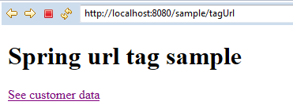
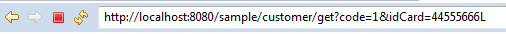
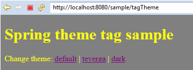
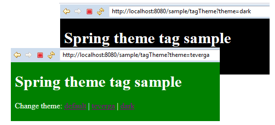
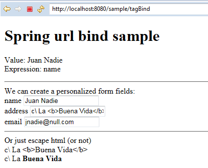
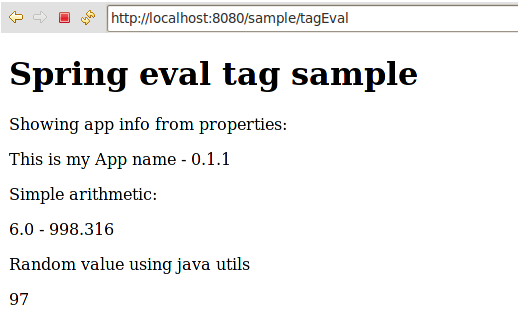
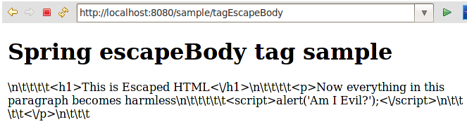
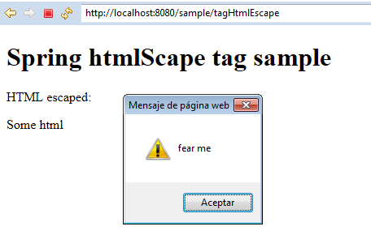
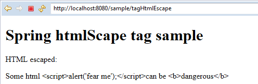

## Introducción a Spring Taglib

Los ficheros JSP son la vista de nuestra aplicación web. Ahí se prepara lo que va a ver el usuario y ahí es donde nos debemos preocupar de cómo presentamos la información. Lo ideal es que este tipo de páginas contengan el menor código posible, y se centren únicamente en presentar información.En cualquier caso, presentaremos las características más relevantes de las etiquetas para JSP de Spring.

### message
Si queremos que la aplicación pueda verse en más de un idioma, utilizaríamos la etiqueta spring:message. Esta etiqueta nos permite introducir contenidos de texto que en forma de código para que luego podamos aplicar internacionalización. 


```html
<!DOCTYPE html>
<%@ page language="java" contentType="text/html; charset=UTF-8" pageEncoding="UTF-8"%>
<%@taglib prefix="spring" uri="http://www.springframework.org/tags" %>
<html>
	<head>
		<meta charset="utf-8">
		<title><spring:message code="welcome.title" /></title>
	</head> 
	<body>
		<header>
		<h1><spring:message code="welcome.title" text="Welcome default title" /></h1>
		</header>
		<p>
			<spring:message code="welcome.content" text="This is the default content" />
		</p>
	</body>
</html>
```

Las etiquetas con el prefijo spring:message serán sustituidas por texto que se encuentra en ficheros properties. Esos ficheros deben contener los mensajes correspondientes al atributo code, por ejemplo:

```properties
welcome.title=Welcome to my app
welcome.content= Welcome to my Spring MVC app bla bla..
```
En caso de no encontrar ese mensaje en el fichero properties, esta etiqueta puede mostrar simplemente un texto por defecto indicado en el atributo text.

### Url

Esta etiqueta nos permite crear URLs para la aplicación. Aunque un enlace no parezca que tenga ningún misterio resulta una etiqueta imprescindible ya que al crear un enlace de esta manera Spring nos introducirá el contexto en el que se encuentra la aplicación web, que en definitiva es la url absoluta. Es decir, con esta etiqueta indicamos un enlace relativo como

 /customer/getAll

Y se genera un enlace completo con el http, el servidor, el puerto y la aplicación:

 http://localhost/application/customer/getAll


Además de eso, podemos agregar los parámetros para la url con otras etiquetas internas que nos facilitan el paso de parámetros. Si a esto le añadimos el atributo htmlScape Spring se ocupará de los caracteres extraños.
Este sería el código:

```html
<!DOCTYPE html>
<%@ page language="java" contentType="text/html; charset=UTF-8" pageEncoding="UTF-8"%>
<%@taglib prefix="spring" uri="http://www.springframework.org/tags" %>
<html>
	<head>
		<meta charset="utf-8">
		<title>Spring url tag sample</title>
	</head> 
	<body>
		<header>
		<h1>Spring url tag sample</h1>
		</header>
		<spring:url value="/customer/get" var="customerUrl" htmlEscape="true" >
   			<spring:param name="code" value="1" />
   			<spring:param name="idCard" value="44555666L" />
 		</spring:url>
		<p>
			<a href="${customerUrl}">See customer data</a>
		</p>
	</body>
</html>
```

Al ejecutarlo veremos un enlace convencional




**Figura - Aspecto de la página.**

Que al hacerle clic se convierte en:



**Figura - Aspeco de la página.**

### themes

Spring MVC nos permite aplicar distintos themes a nuestra aplicación web. El mecanismo es algo básico y consiste en poder aplicar distintas hojas de estilos o recursos a una misma página jsp. Para conseguir esto necesistamos lo siguiente: 
*	Crear distintos diseños basándonos en hojas de estilos y guardarlas bajo los recursos estáticos de la aplicación, aquellos que Spring no tratará a través de controladores y servirá directamente. Por defecto se suelen configurar en la carpeta resources de la raiz pública de la web. Eso es algo que se puede configurar con la etiqueta 	<resources mapping="/resources/**" location="/resources/" /> en el fichero servlet-context.xml de Spring.
*	Debemos crear un fichero properties llamado themes_NOMBRE_THEME.properties con el siguiente contenido (por ejemplo para el theme default):
	default=resources/css/default.css
Por cada theme tendremos que tener un fichero como ese.
*	Es imprescindible configurar una serie de beans de Spring para poder aplicar los themes. Puede hacerse en el fichero general o en un fichero aparte que luego sea incluido en el general. Los beans y configuraciones necesarias serían los siguientes:

```html
<!-- This sets how theme deifinition file looks like -->
 <bean id="themeSource" class="org.springframework.ui.context.support.ResourceBundleThemeSource">
        <property name="basenamePrefix" value="themes_" />
</bean>
 
<!-- This enables to change theme on the fly by setting theme parameter in any GET request  -->
<bean id="themeChangeInterceptor" class="org.springframework.web.servlet.theme.ThemeChangeInterceptor">
    <property name="paramName" value="theme" />
</bean>

<!-- This sets default theme default.-->
<bean id="themeResolver" class="org.springframework.web.servlet.theme.CookieThemeResolver">
    <property name="defaultThemeName" value="default" />
</bean>
```

Además hay que incluir esta opción para poder hacer cambios de theme y de locales de forma dinámica, sin reinstalar la aplicación y simplemente haciendo cualquier petición GET con el parámetro theme. Aplicando esta configuración en el fichero servlet-context.xml conseguiremos que ese cambio se resuelva:

```html
 <interceptors>
      <beans:bean class="org.springframework.web.servlet.i18n.LocaleChangeInterceptor">
            <beans:property name="paramName" value="lang" />
        </beans:bean>
      <beans:bean class="org.springframework.web.servlet.theme.ThemeChangeInterceptor">
            <beans:property name="paramName" value="theme" />
        </beans:bean>
 </interceptors>
```

El fichero jsp:
En el fichero jsp ya podemos indicar el theme de forma muy simple con la etiqueta theme:

```html
<!DOCTYPE html>
<%@ page language="java" contentType="text/html; charset=UTF-8" pageEncoding="UTF-8"%>
<%@taglib prefix="spring" uri="http://www.springframework.org/tags" %>
<html>
 <head>
  <meta charset="utf-8">
  <title>Spring theme tag sample</title>
  <link rel="stylesheet"  href='<spring:theme code='default'/>' type="text/css"/>
 </head> 
 <body>
	<header>
 	<h1>Spring theme tag sample</h1>
	</header>
	Change theme: 
    	<a href="?theme=default">default</a> | <a href="?theme=teverga">teverga</a> | <a href="?theme=dark">dark</a>
	</body>
</html>
```
Esto podremos ver en la web:



**Figura - Aspecto de la página.**

Si hacemos click en el theme teverga o dark, veremos cómo se cambia el estilo:



**Figura - Aspecto de la página.**

### bind 

En el contexto de una petición a la aplicación MVC podemos tener beans instanciados. Bind nos permite recuperar información sobre los campos de esos beans, desde su valor a sus posibles errores de validación,... su información de estado a fin de cuentas.
Supongamos que en el controlador hemos guardado un bean recien instanciado en el modelo. 

```java

	@RequestMapping(value = "/tagBind", method = RequestMethod.GET)
	public String tagBind (Locale locale, Model model) {
		model.addAttribute("customer", new Customer(31,"Juan Nadie","c\\ La <b>Buena Vida</b>", "jnadie@null.com"));
		
		return "tagBind";
	}
```
En el jsp es donde podemos comprobar o usar el valor de una instancia o una propiedad de una instancia para mostrarla, para usarla como campo de formulario, etc.

```html
<!DOCTYPE html>
<%@ page language="java" contentType="text/html; charset=UTF-8" pageEncoding="UTF-8"%>
<%@taglib prefix="spring" uri="http://www.springframework.org/tags" %>
<%@ taglib prefix="c" uri="http://java.sun.com/jsp/jstl/core" %>
<html>
	<head>
		<meta charset="utf-8">
		<title>Spring bind tag sample</title>
	</head> 
	<body>
		<header>
		<h1>Spring url bind sample</h1>
		</header>


		<p>
			<spring:bind path="customer.name" >
				Value: ${status.value} <br />
				Expression: ${status.expression}
			</spring:bind>
		</p>
			<hr />
		We can create a personalized form fields:
			<div>
				<spring:bind path="customer.name">
					<label>${status.expression}</label>
					<input type="text" name="${status.expression}" value="${status.value}" />
				</spring:bind>
			</div>
			<div>
				<spring:bind path="customer.address">
					<label>${status.expression}</label>
					<input type="text" name="${status.expression}" value="${status.value}" />
				</spring:bind>
			</div>
			<div>
				<spring:bind path="customer.email">
					<label>${status.expression}</label>
					<input type="text" name="${status.expression}" value="${status.value}" />
						<!--  In case of validation errors, we could display all of them -->
					    <c:if test="${status.error}">
                		Error codes:
                		<c:forEach items="${status.errorMessages}" var="error">
                    		<c:out value="${error}"/>
                		</c:forEach>
            </c:if>
				</spring:bind>
			</div>
			<hr />
			Or just escape html (or not)	
			<div>
				<spring:bind path="customer.address" htmlEscape="true">
					${status.value}
				</spring:bind>
			</div>

			<div>
				<spring:bind path="customer.address" htmlEscape="false">
					${status.value}
				</spring:bind>
			</div>
	</body>
</html>
```

Esto podremos ver en la web:



**Figura - Aspecto de la página.**

Como se puede apreciar, en caso de tener código html lo podemos controlar. 

### eval 

Esta etiqueta nos permite evaluar expresiones en el pseudolenguaje SPeL. Este lenguaje tiene una sencilla sintaxis que permite realizar entre otras: 
*	Algunas operaciones artiméticas básicas
*	Hacer llamadas a métodos de Java
*	Acceder a las propiedades y métodos de nuestros beans
*	Combinar las anteriores
*	Sacar valores de un fichero properties

El formato básico de la etiqueta es el siguiente: 

```html
<spring:eval expression="EXPRESIÓN" var="VARIABLE EN LA QUE GUARDAMOS EL VALOR RESULTANTE"/> 
```
Por ejemplo, supongamos que tenemos un precio guardado en la variable ${price} y lo queremos pasar a pesetas:  

```html
<spring:eval expression="${price} * 166.386" var="priceInPesetas"/>
	${price} - ${priceInPesetas} 
```


### Leyendo desde el properties

Es interesante la opción de poder sacar datos de un fichero properties. En ese fichero podriamos guardar valores especiales como el nombre de programa, la versión, valores constantes, etc..
Para conseguir esto debemos definir un fichero properties con una serie de variables, como por ejemplo el fichero sample.properties que contiene:

```properties
app.name=This is my App name
app.version=0.1.1
```

Ahora podemos hacer uso de Spring para que cargue ese fichero de properties como una especie de bean al que podremos acceder dentro de la aplicación ya sea a través de anotaciones o con las expresiones como vamos a hacer aquí.
Para que esto sea posible debemos indicar al fichero de configuración de Spring que usaremos una etiqueta de spring-utils, por tanto debemos incluir al inicio del fichero root-context.xml:

```html
<beans xmlns="http://www.springframework.org/schema/beans"
	xmlns:util="http://www.springframework.org/schema/util"  
	xmlns:xsi="http://www.w3.org/2001/XMLSchema-instance"
	xsi:schemaLocation="http://www.springframework.org/schema/beans http://www.springframework.org/schema/beans/spring-beans.xsd
	http://www.springframework.org/schema/util http://www.springframework.org/schema/util/spring-util-3.1.xsd">
…
```

Y para cargar el fichero properties:

```html
<util:properties id="someSettings" location="classpath:/some.properties" />  
```

Ahora mediante una expresión muy simple, ya podemos sacar valores del properties en nuestro jsp.
En el siguiente ejemplo se muestra cómo hacerlo, además de otras cosas. Por ejemplo,una variable ${price} que nos pasa el controlador la pasamos a pesetas. También hacemos uso de clases java.

```html
<!DOCTYPE html>
<%@ page language="java" contentType="text/html; charset=UTF-8" pageEncoding="UTF-8"%>
<%@taglib prefix="spring" uri="http://www.springframework.org/tags" %>
<html>
	<head>
		<meta charset="utf-8">
		<title>Spring eval tag sample</title>
	</head> 
	<body>
		<header>
		<h1>Spring eval tag sample</h1>
		</header>
		Showing app info from properties:
		<p>
			<spring:eval expression="@someSettings.getProperty('app.name')" /> -   
			<spring:eval expression="@someSettings.getProperty('app.version')" />  
		</p>
		Simple arithmetic:
		<p>
			<spring:eval expression="${price} * 166.386" var="priceInPesetas"/>
			${price} - ${priceInPesetas}  
		</p>
		Random value using java utils
		<p>
			<spring:eval expression="new java.util.Random().nextInt(100)" var="randomNumber"/>
			${randomNumber}  
		</p>
		
	</body>
</html>
```

Esto tendría el siguiente aspecto:



**Figura - Aspecto de la página.**

### escapeBody

Todo lo que esté contenido dentro de está etiqueta no será interpretado como HTML, es decir, cualquier cosa que tenga etiquetas será desarmado. Mediante dos atributos puede activarse/desactivarse tanto el HTML como el código JavaScript.
Es tan sencillo como meter la etiqueta para que afecte a determinada parte de la página:

```html
<!DOCTYPE html>
<%@ page language="java" contentType="text/html; charset=UTF-8" pageEncoding="UTF-8"%>
<%@taglib prefix="spring" uri="http://www.springframework.org/tags" %>
<html>
	<head>
		<meta charset="utf-8">
		<title>Spring escapeBody tag sample</title>
	</head> 
	<body>
		<header>
		<h1>Spring escapeBody tag sample</h1>
		</header>

		<p>
			<spring:escapeBody htmlEscape="true" javaScriptEscape="true">
				<h1>This is Escaped HTML</h1>
				<p>Now everything in this paragraph becomes harmless
					<script>alert('Am I Evil?');</script>
				</p>
			</spring:escapeBody>
		</p>
	</body>
</html>
```
Lo cual dejaría la página así:



**Figura - Aspecto de la página.**

### HtmlEscape

A veces puede que vayamos a mostrar datos en el JSP que hemos sacado de una BBDD. Si no se controla el formato de esos datos, estos pueden contener etiquetas HTML y si permitimos que se interpreten en el navegador puede resultar un agujero de seguridad para el usuario final.
Supongamos que en el controlador metemos este dato para que luego se muestre en la vista:

```html

	@RequestMapping(value = "/tagHtmlEscape", method = RequestMethod.GET)
	public String tagHtmlEscape (Locale locale, Model model) {
		logger.info("Showing htmlEscape tag sample.", locale);

		model.addAttribute("dataWithHtml", "Some html <script>alert('fear me');</script>can be <b>dangerous</b>");
		
		return "tagHtmlEscape";
	}
```
Si ese dato, el cual contiene HTML e incluso Javascript, no se controla o limpia, eso acabará llegando al navegador del usuario abriendo las puertas a bromas o incluso ataques de XSS. 



**Figura - Aspecto de la página.**

Existe una propiedad general para que ese tipo de HTML se desarme, y es tan sencillo como aplicar en el fichero web.xml la siguiente configuración:

```html
<context-param>
    		<param-name>defaultHtmlEscape</param-name>
    		<param-value>true</param-value>
	</context-param>
```
Existe una propiedad general para que ese tipo de HTML se desarme, y es tan sencillo como aplicar en el fichero web.xml la siguiente configuración:

```html
<spring:htmlEscape defaultHtmlEscape="false" /> 
```

El htmlEscape tambien se puede aplicar en los formularios y en otros tags de Spring como bind precisamente para que el HTML no pueda causar daño.
Otra opción serái tan simple como mostrar los datos usando la etiqueta out del taglib estándar JSTL, la cual desarma el HTML:



**Figura - Aspecto de la página.**

### Formularios

Unas etiquetas especialmente fundamentales en aplicaciones web son las relativas a los formularios. Spring dispone de un taglib que nos permite vincular de formá congruente el modelo con la vista. Dicho de forma muy resumida, podemos hacer que una instancia de un POJO se cargue en un formulario y viceversa.

**Del formulario al modelo**

Supongamos que mostramos al usuario un formulario para que de alta o modifique un cliente. Una de las tareas más tediosas en el desarrollo de aplicaciones web es la de recoger los datos de un formulario, validarlos y generar una instancia de una clase Cliente. Esa clase tendrá cada atributo asociado a cada campo del formulario. Una vez creada la instancia seguramente la pasaremos a Hibernate para que se encargue de guardarla.

Los taglib de Spring nos permiten vincular el formulario completo a esa clase de tal manera que Spring se encarga de cargar esa instancia de clase con los datos del formulario. Aquí es donde además, mediante anotaciones podemos aplicar validación al formulario. Esto es una verdadera maravilla, ya que al controlador lo que le llegará no será un conjunto de valores enviados por métodos POST, sino un único objeto del modelo cargado y validado.

```html
<%@ taglib uri="http://java.sun.com/jsp/jstl/core" prefix="c" %>
<%@taglib uri="http://www.springframework.org/tags" prefix="s"%>
<%@taglib uri="http://www.springframework.org/tags/form" prefix="sf"%>
<%@ page session="false" %>
<html>
<head>
	<title>New Rental</title>
</head>
<body>
<h1>
	New Rental
</h1>
<s:url value="/rentals/created" var="oknewURL" />
<sf:form method="post" action="${oknewURL}" modelAttribute="rental" >
	<sf:hidden path="id" />
	<div><sf:label path="since">Since (YYYY-MM-DD)</sf:label></div>
	<div><sf:input path="since" /><sf:errors path="since" /></div>
	<div><sf:label path="until">Until (YYYY-MM-DD)</sf:label></div>
	<div><sf:input path="until" /><sf:errors path="until" /></div>
	<div><sf:label path="car.id">Car</sf:label></div>
	<div>
		<sf:select path="car.id"  >
			<sf:options items="${cars}"  itemLabel="plate" itemValue="id"  />
		</sf:select><sf:errors path="car" />
	</div>
	<div><sf:label path="customer.id">Customer</sf:label></div>
	<div>
		<sf:select path="customer.id"  >
			<sf:options items="${customers}" itemLabel="name" itemValue="id"  />
		</sf:select><sf:errors path="customer" />
	</div>
	<div><input type="submit" value="create Rental" /></div>
</sf:form>
<div>

	<a href="<c:url value="/rentals/" />">Return to Rentals</a> 
</div>  
</body>
</html>
```

### Taglibs JSTL

Los tags de Spring se pueden combinar perfectamente con otros taglibs, siempre que indiquemos correctamente el prefijo correspondiente en cada etiqueta. Los taglib de JSTL son las etiquetas estándar que nos ofrece Java para las JSP, digamos que las más básicas.

#### Url

Esto genera una URL a la que le añade el contexto necesario. Es decir, a la etiqueta solamente le indicamos la página, y al procesarse genera una ruta absoluta de URL.
Esta sería una forma de aplicar la etiqueta:

```html
<!DOCTYPE html>
<%@ page language="java" contentType="text/html; charset=UTF-8" pageEncoding="UTF-8"%>
<%@ taglib prefix="c" uri="http://java.sun.com/jsp/jstl/core" %>
<html>
	<head>
		<meta charset="utf-8">
		<title>Welcome</title>
	</head> 
	<body>
		<c:url value="/showMessage.html" var="messageUrl" />
		<a href="${messageUrl}">Click to enter</a>
	</body>
</html>
```

Como se puede apreciar, primero usa c:url para crear la url y guardarla en una variable llamada messageUrl que luego ya se aplica en una etiqueta href.

#### Out

Out no es más que un out.println de jsp, es decir, hacer que se muestre algo en el JSP.

```html
<c:out value="${shipment.id}"/> 
```

