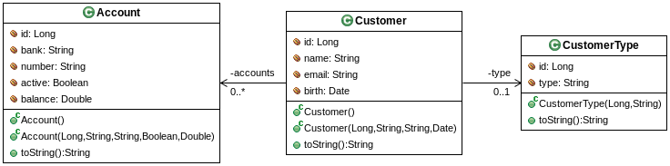
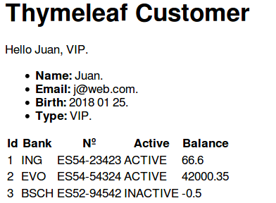

## Introducción a Thymeleaf

Thymeleaf es un lenguaje de plantillas que puede integrarse perfectamente con las aplicaciones Spring MVC, siendo además una nueva alternativa que está desplazando a las tradicionales páginas JSP.
Una de las mayores ventajas de Thymeleaf sin duda es su casi nula influencia en la apariencia de una plantilla cuando no está procesada. Es decir, un diseñador o cualquier persona que tenga que retocar el aspecto de una plantilla vería una página totalmente normal. En lugar de utilizar etiquetas especiales, Thymeleaf utiliza los atributos de las etiquetas existentes para el procesamiento dinámico, dejando los valores normales de las etiquetas como valores por defecto; esto provoca que las plantillas Thymeleaf, las cuales tienen extensión html sean cómodamente visibles y editables offline.
Además de permitirnos cargar las plantillas Thymeleaf como vistas desde los controladores, también obtenemos las siguientes ventajas:
*	Posibilidad de utilizar el SpEL en las plantillas
*	Formularios integrados con componentes
*	Internacionalización de mensajes
*	Estructuras de control básicas
*	Etiquetas de seguridad
Para disponer de Thymeleaf en un proyecto Spring Boot basta con añadir una dependencia en el fichero pom.xml. Sin Spring boot, sería preciso, además de la dependencia de Thymeleaf, configurar la resolución de plantillas bien a través de XML o a través de Beans.
Esta línea, aunque no es imprescindible, se suele poner al inicio de las plantillas

```html
<html xmlns:th="http://www.thymeleaf.org">
```
Thymeleaf puede procesar plantillas XML, xHTML y HTML5, válidas o no.

### Expresiones básicas
Y el aspecto que tiene una etiqueta, por ejemplo, h1, en una plantilla Thymeleaf sería el siguiente:

```html
<h1 th:text="#{title}">This is default title</h1>
```

En ese caso, se añade un atributo th:text que indica el texto que se quiere meter en la etiqueta. En este caso, el texto proviene de un mensaje configurado en los ficheros de mensajes que se utilizan en la internacionalización. En caso de no haber valor o de que la página no esté procesada por Thymeleaf, lo que se vería en el navegador sería “This is default title”.

ESi ese texto contenido en la variable, tuviera etiquetas HTML estás serían modificadas. Para preservar las etiquetas y que sean interpretadas por el navegador, se debería poner

```html
<h1 th:utext="#{title}">This is default title</h1>
```
En cuanto a los tipos de expresiones que se utilizan, en resumen, serían las siguientes:
*	#{variable}: mensajes de texto de ficheros de properties.
*	${variable}: referencia a variables y a objeto del modelo, por ejemplo, objetos que se nos pasan desde el controlador, como resultados de una consulta, una lista de entidades, un registro, etc,.
*	*{campo}: un campo que forma parte de una referencia a un objeto, se aplica cuando se utiliza una expresión ${variable}, por ejemplo en los campos de un formulario
*	@{campo}: expresiones para crear enlaces

En el acceso a variables se utiliza el símbolo $. Por ejemplo, para sacar el atributo name de una instancia de Person: 

```html
<span th:text="${person.name}">Default name</span>
```

Aunque también se pueden usar los corchetes 

```html
<span th:text="${person[‘name’]}">Default name</span>
```

En el caso de querer mostrar lo que contiene un objeto o una instancia y sus campos, podemos utilizar el atributo object.

```html
<ul th:object="${customer}">
<li><b>Name:</b> <span th:text="*{name}">Sebastian</span>.</li>
<li><b>Email:</b> <span th:text="*{email}">Pepper</span>.</li>
<li><b>Address:</b> <span th:text="*{address}">Saturn</span>.</li>
</ul>
```

En cuanto a expresiones básicas, dentro de los atributos de Thymeleaf se pueden usar las siguientes:
*	Literales de texto o de número: ‘hello’, 42, 0, 1, -42.0
*	Literales booleanas: true, false
*	Literal nula: null
*	Concatenaciones de cadenas: +
*	Sustituciones de literales:	Hello ${name}
*	Opedores aritméticos: +, -, *, /, %
*	Conversión a negativo: -
*	Operadores booleanos: and, or, not, !
*	Operadores de comparación: >, gt, <, lt,  >=, ge, <=, le, ==, eq, !=, en
*	Operador condicional if: cond ? then
*	Operador condicional if-then-else: cond ? then : else
*	Valor por defecto: cond ?: default

Todas estas expresiones pueden utilizarse tanto en literales, como en expresiones condicionales que se verán más adelante.

```html
<span th:text="’Hello‘ + ${name}">Hello</span>
```

En cuanto a los mensajes con traducción, en algunos casos pueden contener variables. 

```html
thanks.msg=Thanks for visiting us {0}
…
<h1 th:utext="#{thanks.msg(${loginname})}">Thanks dude</h1>
```

```html
<div class="posts" th:unless="${#lists.isEmpty(posts)}">
<table><tr><th th:thymeleaf"#{id}">Id</th></tr>
</div>
```

### Valores en atributos

Thymeleaf nos permite establecer los atributos de las etiquetas HTML.

```html
<input type="text" name="username" th:placeholder="#{form.username.placeholder}"/>
```
Se puede establecer tanto un atributo como varios a la vez. Los atributos disponibles son todos los atributos comunes de HTML.

### Utilidades thymeleaf

Thymeleaf ofrece las siguientes utilidades para las plantillas. Por ejemplo, para formatear una fecha:

```html
<span th:text="${#calendars.format(birth,'YYYY MM dd')}">1970 01 01</span>
```
**Utilidades de Thymeleaf**

Nombre del programa y su descripción. 
* #dates	Utilidades para el formateo de fechas
* #calendars	Utilidad como #dates pero para objetos java.util.Calendar. 
* #numbers	Utilidades para formatear números
* #strings	Utilidades para cadenas, append, subtring, etc.
* #objects	Utilidades para objetos en general
* #bools	Utilidades para booleanos
* #arrays	Utilidades para arrays
* #lists	Utilidades para coleciones tipo List
* #sets	Utilidades para colecciones tipo Set
* #maps	Utilidades para colecciones tipo Map
* #aggregates	Utilidades para crear agregaciones de colecciones
* #messages	Utilidades para obtener mensajes internacionalizados
* #ids	Utilidades para tratar con atributos ID que pueden repetirse en interaciones.

### Enlaces

Los enlaces en Thymeleaf se crean poniedo por delante el símbolo @. Como todos los enlaces pueden ser absolutos o relativos.

```html
<a href="home.html" th:href="@{http://localhost:8080/home}">Home</a>
<a href="home.html" th:href="@{/home}">Home</a>
```

También pueden añadirse variables en las URL. Como por ejemplo, enlaces de detalle:

```hmtl
<a th:href=""@{/update/{productID}(productID=${product.id})}">Update</a>
```
### Expresiones condicionales

Se pueden utilizar expresiones condicionales para distintos fines, como por ejemplo, aplicar diferentes estilos:

```html
<div th:class="${row.even}? 'white' : 'gray'"> </div>
```

La expresión if también permite mostrar o no bloques de la página de manera condicional, por ejemplo, en el caso de que se cumpla una condición:

```html
<div th:if="${user.age} > 17">...</div>
<div th:if="${user} != null">...</div>
```

La expresión unless también permite mostrar o no bloques de la página de manera condicional, por ejemplo, en el caso de que haya o no registros:

```html
<div class="posts" th:unless="${#lists.isEmpty(posts)}">
<table><tr><th th:thymeleaf"#{id}">Id</th></tr>
<tr th:each="sb : ${allSeedStarters}">
</div>
```

Otra opción que nos permite el operador ternario o de elvis es la de definir valores por defecto.

```html
<li><b>Email:<b><span th:text="*{email}?: 'No email'">fake@email.com</span>.</li>
…
```

También disponemos de la expresiones switch/case

```html
<div th:switch="${customer.type}">
  <p th:case="'VIP'">Customer is VIP</p>
  <p th:case="*”>Normal Customer</p>
</div>
```

### Fragmentos

Algo habitualmente necesario en la vista el la posibilidad de reutilizar determinadas secciones de las páginas, como la cabecera, pie, menús, etc. Al igual que el proyecto Apache Tiles, Thymeleaf permite definir fragments, los cuales pueden reutilizarse en cualquier parte.
Para definir un fragmento basta con crear una plantilla Thymeleaf, y dentro de ella incluir una o varias etiquetas con el atributo fragment:

```html
<!DOCTYPE HTML>
<html xmlns:th="http://www.thymeleaf.org">
<head>
<title>Spring Web : s04.thymeleaf : simple</title>
<meta charset="UTF-8">
</head>
<body>
	<div th:fragment="head">
		This is the header
	</div>
	<div th:fragment="title">
		<h1>Thymeleaf simple</h1>
	</div>
</body>
</html>
```

Ahora se pueden incluir esas secciones con el atributo th:include. Este tiene dos partes, en la primera se indica el nombre de plantilla y en la segunda se indica el fragmento.

```html
<body>
	<header>
		<div th:include="header :: head"></div>
		<div th:include="header :: title"></div>
	</header>
	<main> </main>
	<footer>
		<a href="/">Home</a>
	</footer>
</body>
```

### s04.thymeleaf

En este proyecto se ponen en práctica algunas de las etiquetas explicadas anteriormente. Se trata de una aplicación Spring MVC que muestra en una plantilla Thymeleaf los datos de un objeto compuesto: Customer, que contiene referencias a CustomerType y una colección de Account




**Figura - Aspecto de los elementos del proyecto.**

La clase Customer la principal y es quien hace referencia a las otras clases

**Listado - Fichero Customer.java.**

```java
public class Customer {
	private Long id;
	private String name;
	private String email;
	private Date birth;
	private CustomerType type;
	private List<Account> accounts = new ArrayList<Account>();
...	
}
```
La clase CustomerType representa el tipo de cliente, y cada cliente debe hacer referencia a un tipo:

**Listado - Fichero CustomerTypejava.***

```java
public class CustomerType {
	private Long id;
	private String type;
...
}
```

Y por último, cada cliente puede tener un conjunto de cuentas.

**Listado - Fichero Account.java.**

```java
public class Account {
		private Long id;
		private String bank;
		private String number;
		private Boolean active;
		private Double balance;
...
}
```
En el controlador se genera un cliente con todos sus campos y se le pasa a la vista. En este caso lo interesante es detenerse en la vista.

**Listado - Fichero customer.html.**

```html
<!DOCTYPE HTML>
<html xmlns:th="http://www.thymeleaf.org">
<head>
<title>Spring Web : s04.thymeleaf : simple</title>
	<meta charset="UTF-8">
</head>
<body>
	<header>
		<h1>Thymeleaf Customer</h1>
	</header>
	<main>
	<div>
 		<span th:text="'Hello ' + ${customer['name']}">Name</span>,
 		<span th:text="${customer['type']['type']}">Type</span>.
 	</div>
	<ul th:object="${customer}">
<li><b>Name:</b> <span th:text="*{name}">John Doe</span>.</li>
<li><b>Email:</b> <span th:text="*{email}">j@doe</span>.</li>
<li><b>Birth:</b> 
<span th:text="*{#calendars.format(birth,'YYYY MM dd')}">Birth date</span>.</li>
<li><b>Type:</b> <span th:text="*{type.type}">Type</span>.</li>

</ul>
   <div th:if="${#lists.isEmpty(customer.accounts)}">No accounts</div>
<div class="accounts" th:unless="${#lists.isEmpty(customer.accounts)}">
 <table>
    <thead>
      <tr>
        <th>Id</th>
        <th>Bank</th>
        <th>Nº</th>
        <th>Active</th>
        <th>Balance</th>
      </tr>
    </thead>
    <tbody>
    <tr th:each="account,iteration : ${customer.accounts}" th:class="${iteration.odd}? 'odd'">
      <td th:text="${account.id}">Id</td>
      <td th:text="${account.bank}">Spring bank</td>
      <td th:text="${account.number}">Number</td>
      <td th:text="${account.active}? 'ACTIVE' : 'INACTIVE'">yes</td>
      <td th:text="${account.balance}">Balance</td>
  </tr>
   </tbody>
   </table>
   </div>
	</main>
	<footer>
		<a href="/">Home</a> 
	</footer>
</body>
</html>
```

La tabla se muestra de manera condicional, únicamente se existen registros..



**Figura - Aspecto de la plantilla mostrando datos.**

Los formularios de Thymeleaf han sido mostrados ya a lo largo del apartado web, así como las etiquetas vinculadas a la seguridad.
