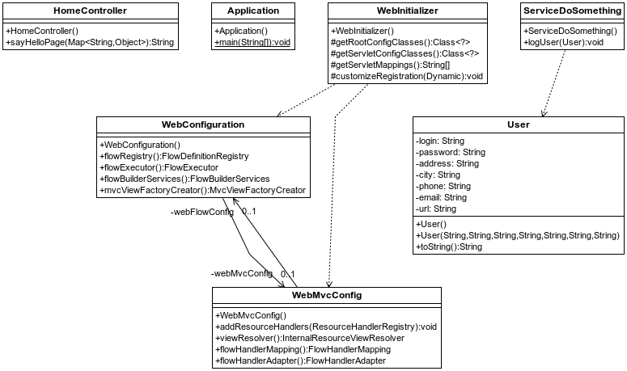
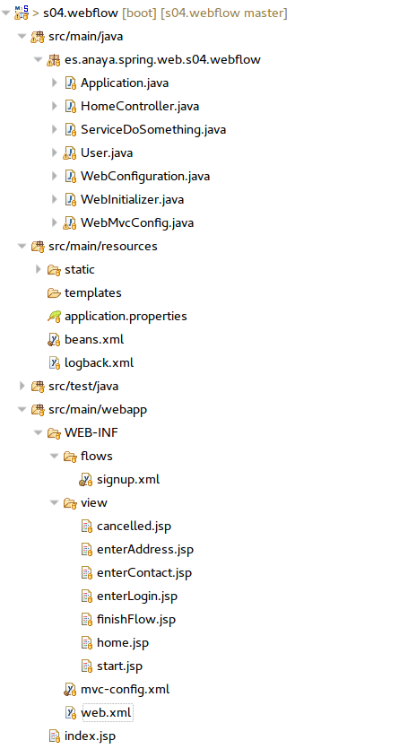
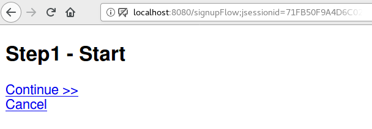
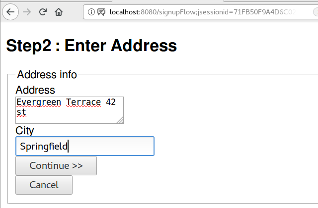
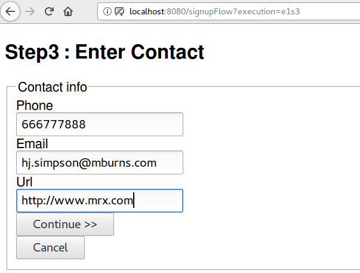
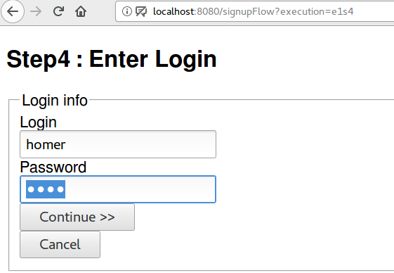
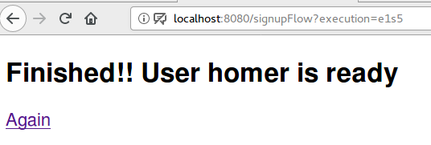

## Spring WebFlow
Los WebFlows de Spring tratan de facilitar el desarrollo de a
plicaciones que siguen un flujo
de ejecución, como por ejemplo un asistente, un wizard, etc... En lugar de tener que
programar un método controlador para cada paso Spring lo hace tan fácil como definir un
flujo de ejecución en un fichero XML. En ese fichero se describen los estados por los que
pasa el flujo y nos permite olvidarnos de controladores y preocuparnos únicamente de las
views (jsps en este caso) y de servicios del dominio que necesitemos.
Para ilustrar esto con un ejemplo hemos desarrollado una especie de "Alta de usuario" en la que
se van solicitando datos.



**Figura - Componentes del proyecto**

Al finalizar se llama a un método que guarda los datos y listo. El webflow contiene
básicamente estados que se van encadenando y los más comunes son:

* VIEW STATES: son estados que muestran una pantalla al usuario
* END STATE: describe el estado final
* ACTION STATE: un estado en el que se lleva a cabo una acción.
* DECISION STATE: un estado en el que podemos bifurcar el flujo de forma
condicional
* SUBFLOW STATE: un estado en el que se inicia otro flujo. Al terminar el mismo se
sigue en el flujo principal.

El tema del webflow no es uno de los paquetes habituales de Spring así que habrá que
bajarse dependencias vía Maven, como mínimo el binding y webflow de Spring. Un fichero
que define el flow o flujo de ejecución, debe ser un fichero xml.
En eclipse se puede crear un fichero de flow con el asistente. Sobre un proyecto Spring Web
Maven añadirmos un fichero de flow y nos saltará el asistente. Le damos un nombre y le indicamos un id para definir el flujo y luego el fichero de
configuración de Spring. El fichero de flow lo podemos poner en una carpeta flow dentro de
WEB-INF. Luego a en la configuración de Spring hay que indicarle dónde están los ficheros
de flow. 

Utilizaremos una configuración que mezcla XML y configuración por código.


### Dependencias

Estas serían las dependencias aplicadas para aplicar Spring WebFlow en un proyecto Spring Boot:

**Listado - Fichero pom.xml**

```xml

<dependencies>
		<dependency>
			<groupId>org.springframework.boot</groupId>
			<artifactId>spring-boot-starter-web</artifactId>
		</dependency>

		<dependency>
			<groupId>org.springframework.boot</groupId>
			<artifactId>spring-boot-starter-tomcat</artifactId>
			<scope>provided</scope>
		</dependency>

		<dependency>
			<groupId>org.apache.tomcat.embed</groupId>
			<artifactId>tomcat-embed-jasper</artifactId>
			<scope>provided</scope>
		</dependency>

		<dependency>
			<groupId>javax.servlet</groupId>
			<artifactId>jstl</artifactId>
		</dependency>

		<dependency>
			<groupId>org.springframework.webflow</groupId>
			<artifactId>spring-webflow</artifactId>
			<version>2.4.4.RELEASE</version>
		</dependency>

		<dependency>
			<groupId>org.springframework.boot</groupId>
			<artifactId>spring-boot-starter-test</artifactId>
			<scope>test</scope>
		</dependency>
	</dependencies>
```
	

El proyecto precisa multitud de componentes que resumimos en esta imagen y que vamos a ir desgranando.
	


**Figura - Organización del proyecto**


El proyecto utiliza la configuración clásica de un proyecto web dinámico para Java. Así que partimos del fichero web.xml, donde
ya deberíamos tener configurado el dispatcher de Spring, el cual se hace con el control de todas las peticiones.

**Listado - Fichero web.xml**

```xml

	<?xml version="1.0" encoding="ISO-8859-1"?>
<web-app xmlns:xsi="http://www.w3.org/2001/XMLSchema-instance"
         xmlns="http://java.sun.com/xml/ns/javaee"
         xsi:schemaLocation="http://java.sun.com/xml/ns/javaee
http://java.sun.com/xml/ns/javaee/web-app_2_5.xsd"
         id="WebApp_ID" version="2.5">

    <display-name>SignupSpringWebFlow</display-name>
        
    <!--
		- Servlet that dispatches request to registered handlers (Controller implementations).
	-->
    <servlet>
        <servlet-name>dispatcherServlet</servlet-name>
        <servlet-class>org.springframework.web.servlet.DispatcherServlet</servlet-class>
    <init-param>
        <param-name>contextConfigLocation</param-name>
        <param-value>/WEB-INF/mvc-config.xml</param-value>
    </init-param>
        <load-on-startup>1</load-on-startup>
    </servlet>

    <servlet-mapping>
        <servlet-name>dispatcherServlet</servlet-name>
        <url-pattern>/</url-pattern>
    </servlet-mapping>

</web-app>
```

En el fichero de configuración de beans es donde se configura el uso de los componentes de WebFlow,
además de la configuración básica. En este caso, se define un flow de altas de usuario.

**Listado - Fichero beans.xml**

```xml

<?xml version="1.0" encoding="UTF-8"?>
<beans xmlns="http://www.springframework.org/schema/beans"
       xmlns:xsi="http://www.w3.org/2001/XMLSchema-instance"
       xmlns:flow="http://www.springframework.org/schema/webflow-config"
       xsi:schemaLocation="http://www.springframework.org/schema/webflow-config
http://www.springframework.org/schema/webflow-config/spring-webflow-config-2.4.xsd
http://www.springframework.org/schema/beans
http://www.springframework.org/schema/beans/spring-beans-3.0.xsd">


    <bean class="org.springframework.webflow.mvc.servlet.FlowHandlerMapping">
        <property name="flowRegistry" ref="activationFlowRegistry"/>
    </bean>

    <flow:flow-builder-services id="flowBuilderServices"
                                view-factory-creator="mvcViewFactoryCreator"/>

    <bean id="mvcViewFactoryCreator" class="org.springframework.webflow.mvc.builder.MvcViewFactoryCreator">
        <property name="viewResolvers" ref="jspViewResolver"/>
    </bean>

    <flow:flow-registry id="activationFlowRegistry" flow-builder-services="flowBuilderServices">
        <flow:flow-location id="signupFlow" path="/WEB-INF/flows/signup.xml"/>
    </flow:flow-registry>

    <bean class="org.springframework.webflow.mvc.servlet.FlowHandlerAdapter">
        <property name="flowExecutor" ref="activationFlowExecutor"/>
    </bean>
    <flow:flow-executor id="activationFlowExecutor" flow-registry="activationFlowRegistry"/>


</beans>
```
En cuanto a la configuración por código de Spring, utilizamos un par de clases para la configuración.
En primer lugar, en WebConfiguration crearemos los beans necesarios para webflow, pasándole además la ruta del fichero XML donde se configura el flow o flujo:

**Listado - Fichero WebConfiguration.java**

```java

import org.springframework.beans.factory.annotation.Autowired;
import org.springframework.context.annotation.Bean;
import org.springframework.context.annotation.Configuration;
import org.springframework.webflow.config.AbstractFlowConfiguration;
import org.springframework.webflow.definition.registry.FlowDefinitionRegistry;
import org.springframework.webflow.engine.builder.support.FlowBuilderServices;
import org.springframework.webflow.executor.FlowExecutor;
import org.springframework.webflow.mvc.builder.MvcViewFactoryCreator;

@Configuration
public class WebConfiguration extends AbstractFlowConfiguration {
 
    @Autowired
    private WebMvcConfig webMvcConfig;
 
    @Bean
    public FlowDefinitionRegistry flowRegistry() {
        return getFlowDefinitionRegistryBuilder(flowBuilderServices())
          .addFlowLocation("/WEB-INF/flows/signup.xml", "signupFlow")
          .build();
    }
 
    @Bean
    public FlowExecutor flowExecutor() {
        return getFlowExecutorBuilder(flowRegistry()).build();
    }
 
    @Bean
    public FlowBuilderServices flowBuilderServices() {
        return getFlowBuilderServicesBuilder()
          .setViewFactoryCreator(mvcViewFactoryCreator())
          .setDevelopmentMode(true).build();
    }
 
    @Bean
    public MvcViewFactoryCreator mvcViewFactoryCreator() {
        MvcViewFactoryCreator factoryCreator = new MvcViewFactoryCreator();
        factoryCreator.setViewResolvers(
          Collections.singletonList(this.webMvcConfig.viewResolver()));
        factoryCreator.setUseSpringBeanBinding(true);
        return factoryCreator;
    }
}
```

Por otro lado, tenemos la clase que aplica la configuración general web, que añade la configuración de WebFlow anterior:

**Listado - WebMvcConfig.java**

```java
package es.anaya.spring.web.s04.webflow;
import org.springframework.beans.factory.annotation.Autowired;
import org.springframework.context.annotation.Bean;
import org.springframework.context.annotation.ComponentScan;
import org.springframework.context.annotation.Configuration;
import org.springframework.context.annotation.ImportResource;
import org.springframework.web.servlet.config.annotation.EnableWebMvc;
import org.springframework.web.servlet.config.annotation.ResourceHandlerRegistry;
import org.springframework.web.servlet.config.annotation.WebMvcConfigurerAdapter;
import org.springframework.web.servlet.view.InternalResourceViewResolver;
import org.springframework.web.servlet.view.JstlView;
import org.springframework.webflow.mvc.servlet.FlowHandlerAdapter;
import org.springframework.webflow.mvc.servlet.FlowHandlerMapping;

@EnableWebMvc
@Configuration
public class WebMvcConfig extends WebMvcConfigurerAdapter {

    @Autowired
    private WebConfiguration webFlowConfig;

    @Override
    public void addResourceHandlers(ResourceHandlerRegistry registry) {
        registry.addResourceHandler("/resources/**").addResourceLocations("/resources/");
    }

    @Bean
    public InternalResourceViewResolver viewResolver() {
        InternalResourceViewResolver viewResolver = new InternalResourceViewResolver();
        viewResolver.setViewClass(JstlView.class);
        viewResolver.setPrefix("/WEB-INF/view/");
        viewResolver.setSuffix(".jsp");
        return viewResolver;
    }

    @Bean
    public FlowHandlerMapping flowHandlerMapping() {
        FlowHandlerMapping handlerMapping = new FlowHandlerMapping();
        handlerMapping.setOrder(-1);
        handlerMapping.setFlowRegistry(this.webFlowConfig.flowRegistry());
        return handlerMapping;
    }

    @Bean
    public FlowHandlerAdapter flowHandlerAdapter() {
        FlowHandlerAdapter handlerAdapter = new FlowHandlerAdapter();
        handlerAdapter.setFlowExecutor(this.webFlowConfig.flowExecutor());
        handlerAdapter.setSaveOutputToFlashScopeOnRedirect(true);
        return handlerAdapter;
    }

}
```

El flow o flujo de estados del proceso de alta se define en el fichero signup.xml, que en cierto modo muestra los estados por los que pasará el flujo.
Como se puede ver cada estado indica:
* Un identificador
* Una instancia del modelo asociada, a la que en este caso llamaremos newUser.
* Identificador para el siguiente estado

Opcionalmente, se pueden indicar procesos que se deben aplicar como la llamada a logUser en el estado userReady.

**Listado - Fichero signup.xml**

```xml
<?xml version="1.0" encoding="UTF-8"?>
<flow xmlns="http://www.springframework.org/schema/webflow"
      xmlns:xsi="http://www.w3.org/2001/XMLSchema-instance"
      xsi:schemaLocation="http://www.springframework.org/schema/webflow
                          http://www.springframework.org/schema/webflow/spring-webflow-2.0.xsd">


	<var name="newUser" class="es.anaya.spring.web.s04.webflow.User" />

	<!-- By default, the first state is the start state. -->
	<view-state id="start">
		<transition to="enterAddress" />
	</view-state>

	<view-state id="enterAddress" model="newUser">
		<transition on="submit" to="enterContact" />
	</view-state>

	<view-state id="enterContact" model="newUser">
		<transition on="contactEntered" to="enterLogin" />
	</view-state>

	<view-state id="enterLogin" model="newUser">
		<transition on="loginEntered" to="userReady" />
	</view-state>

	<!-- In this state the flow performs an action an then goes on. -->
	<action-state id="userReady">
		<evaluate expression="serviceDoSomething.logUser(newUser)" />
		<transition to="finishFlow" />
	</action-state>

	<view-state id="finishFlow" model="newUser">
		<transition to="finished" />
	</view-state>

	<end-state id="finished">
		<output name="newUser" />
	</end-state>

	<end-state id="cancelled" />

	<!-- With this in any place that we press Cancel we go to cancelled state -->
	<global-transitions>
		<transition on="cancel" to="cancelled" />
	</global-transitions>


</flow>
```

La clase controller no hace nada en particular ya que el control lo toma WebFlow. 

Todos los datos del proceso de alta se almacenan en esta una instancia de la clase User, que contiene el registro de toda la información.
Esta instancia se va pasando de una pantalla a otra, conforme se aportan los datos que luego se asignan a sus atributos.

**Listado - User.java**

```java
import java.io.Serializable;


public class User implements Serializable {
	private String login;
	private String password;
	private String address;
	private String city;
	private String phone;
	private String email;
	private String url;
	
	public User() {
	}
	...
	// Getters/setters
	
}
```

En la parte de vistas, empezamos por la página home:

**Listado - home.jsp**

```html
<!DOCTYPE html>

<%@ page language="java" contentType="text/html; charset=UTF-8" pageEncoding="UTF-8"%>
    
<html>
	<head>
		<meta charset="utf-8">
		<title>Welcome</title>
	</head> 
	<body>
		<h2>${message}</h2>
		<a href="signup" title="Go to flow's first stage">Init flow</a>
	</body>
</html>
```

De home, podremos pasar a start:

**Listado - start.jsp**

```html
<!DOCTYPE html>

<%@ page language="java" contentType="text/html; charset=UTF-8" pageEncoding="UTF-8"%>
    
<html>
	<head>
		<meta charset="utf-8">
		<title>Welcome to signup</title>
	</head> 
	<body>
		<h2>Step1 - Start</h2>
		<div>
		    <a href="${flowExecutionUrl}&_eventId=_enterAddress">Continue &gt;&gt;</a> <br />
            <a href="${flowExecutionUrl}&_eventId=_cancel">Cancel</a>
        </div>
	</body>
</html>

```

Empezamos por la pantalla de introducción de dirección. En todo momento se pasa un campo oculto con una clave de flow.

**Listado - enterAddress.jsp**

```html
<!DOCTYPE html>
<%@ taglib prefix="sf" uri="http://www.springframework.org/tags/form" %>
<%@ page language="java" contentType="text/html; charset=UTF-8" pageEncoding="UTF-8"%>
    
<html>
	<head>
		<meta charset="utf-8">
		<title>Step2 : Enter Address</title>
	</head> 
	<body>
		<h2>Step2 : Enter Address</h2>
		<div>
		<sf:form modelAttribute="newUser">
			<fieldset><legend>Address info</legend>		
			<input type="hidden" name="_flowExecutionKey" value="{$flowExecutionKey}">	
				<label for="address">Address</label><br />
				<sf:textarea  path="address" /><br />
				<label for="city">City</label><br />
				<sf:input path="city"  /><br />
				<input type="submit" name="_eventId_submit" value="Continue &gt;&gt;"  /><br />
				<input type="submit" name="_eventId_cancel" value="Cancel"  />
			</fieldset>
		</sf:form>
        </div>
	</body>
</html>

```
Seguimos con la de datos de contacto

**Listado - enterContact.jsp**

```html
<!DOCTYPE html>
<%@ taglib prefix="sf" uri="http://www.springframework.org/tags/form" %>
<%@ page language="java" contentType="text/html; charset=UTF-8" pageEncoding="UTF-8"%>
    
<html>
	<head>
		<meta charset="utf-8">
		<title>Step3 : Enter Contact</title>
	</head> 
	<body>
		<h2>Step3 : Enter Contact</h2>
		<div>
		<sf:form modelAttribute="newUser">
			<fieldset><legend>Contact info</legend>		
			<input type="hidden" name="_flowExecutionKey" value="{$flowExecutionKey}">	
				<label for="phone">Phone</label><br />
				<sf:input path="phone"  /><br />
				<label for="email">Email</label><br />
				<sf:input path="email"  /><br />
				<label for="url">Url</label><br />
				<sf:input path="url"  /><br />
				<input type="submit" name="_eventId_contactEntered" value="Continue &gt;&gt;"  /><br />
				<input type="submit" name="_eventId_cancel" value="Cancel"  />
			</fieldset>
		</sf:form>
        </div>
	</body>
</html>


```

Y llegamos a la entrada de login y contraseña:

**Listado - enterLogin.jsp**

```html
<!DOCTYPE html>
<%@ taglib prefix="sf" uri="http://www.springframework.org/tags/form" %>
<%@ page language="java" contentType="text/html; charset=UTF-8" pageEncoding="UTF-8"%>
    
<html>
	<head>
		<meta charset="utf-8">
		<title>Step4 : Enter Login</title>
	</head> 
	<body>
		<h2>Step4 : Enter Login</h2>
		<div>
		<sf:form modelAttribute="newUser">
			<fieldset><legend>Login info</legend>		
			<input type="hidden" name="_flowExecutionKey" value="{$flowExecutionKey}">	
				<label for="login">Login</label><br />
				<sf:input path="login"  /><br />
				<label for="password">Password</label><br />
				<sf:password path="password"  /><br />
				<input type="submit" name="_eventId_loginEntered" value="Continue &gt;&gt;"  /><br />
				<input type="submit" name="_eventId_cancel" value="Cancel"  />
			</fieldset>
		</sf:form>
        </div>
	</body>
</html>


```
Y finishFlow sería el final del flujo

**Listado - finishFlow.jsp**

```html
<!DOCTYPE html>

<%@ page language="java" contentType="text/html; charset=UTF-8" pageEncoding="UTF-8"%>
    
<html>
	<head>
		<meta charset="utf-8">
		<title>Finished!! user is ready</title>
	</head> 
	<body>
		<h2>Finished!! User ${newUser.login} is ready</h2>
		<div>
		    <a href="signup">Again</a>
        </div>
	</body>
</html>


```

En caso de cancelación, se mostraría esta página:

**Listado - cancelled.jsp**

```html

<!DOCTYPE html>

<%@ page language="java" contentType="text/html; charset=UTF-8" pageEncoding="UTF-8"%>
    
<html>
	<head>
		<meta charset="utf-8">
		<title>Welcome to signup</title>
	</head> 
	<body>
		<h2>Cancelled!!</h2>
		<div>
			Proccess was cancelled
        </div>
	</body>
</html>

```

### Ejecución

Una vez puesto en marcha el proyecto Spring Boot, basta con poner en el navegador:

http://localhost:8080/signupFlow

Y veremos lo siguiente:



**Figura - Inicio del flow**

Siguiente paso:



**Figura - Continuación del flow**

Siguiente paso:



**Figura - Continuación del flow**

Siguiente paso:



**Figura - Continuación del flow**

Y el paso final, la confirmación:



**Figura - Continuación del flow**
