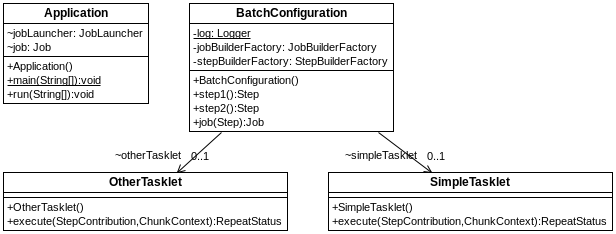

## s05.batch

En los sistemas empresariales no siempre se ejecuta todo en tiempo real, porque no lo mandan las reglas de negocio o porque sencillamente porque no hay necesidad. Ese tipo de operaciones se suelen ejecutar como tareas de procesamiento en lote o procesos batch. Se trata de un procesamiento de datos prolongado que se pone en marcha de forma automatizada con el fin de transformar determinada información. Un escenario típico puede ser el de migraciones de datos, generación de ficheros específicos, etc. Ejemplos concretos podrían ser la generación de nóminas, generación de ficheros para procesamiento bancario, etc.
Spring dispone de un conjunto de herramientas para facilitar este tipo de tareas, agrupadas en torno a Spring Batch, las cuales definen una serie de interfaces para crear este tipo de tareas. Para mostrar cómo se puede crear un proyecto Spring Batch, en primer lugar mostramos un proyecto muy sencillo que encadena dos tareas, las cuales se denominan Tasklet. Lo interesante en este caso, es ver cómo se deben configurar y lanzar estas tareas a través de una clase de configuración; el proyecto sirve, expresamente, para mostrar esa organización.

Estos son los elementos que forma parte de esta prueba de concepto. En este proyecto Spring Batch, se crea un proceso que ejecuta dos tareas o Tasklets.



**Figura - Elementos del proyecto**


Esta clase representa una tarea simple. No es obligatorio usarla, pero puede servir para crear tareas destinadas a Spring Batch. Solamente se necesita implementar una interface con un método execute. Si no es necesario que la tarea se repita, se devuelve null.

**Listado - Fichero SimpleTasklet.java.**

```java
@Component
public class SimpleTasklet implements Tasklet{
   
  @Override
  public RepeatStatus execute(StepContribution contribution, ChunkContext chunkContext) {
    System.out.println("The simple tasklet");
    return null;
  }
}
```

La clase OtherTasklet es muy similar y no merece la pena mostrarla.
La clase que configura la tarea Batch es la realmente interesante. Lo que hace es definir una serie de Beans:
*	step1: representa una paso en la tarea, a la que llamamos step1 y le asignamos el tasklet SimpleTasklet.
*	step2: representa otro paso, al que se le llama step2 y se le asigna una instancia de OtherTasklet
*	Job: representa la tarea que ejecutará Spring Batch. En este caso encadena dos pasos, step1 y step2.
Como es obvio, se pueden encadenar todos los pasos que se precisen.

**Listado - Fichero BatchConfiguration.java.**

```java

@Configuration
@EnableBatchProcessing
public class BatchConfiguration {
  private static final Logger log = 
		  LoggerFactory.getLogger(BatchConfiguration.class);
  
  @Autowired
  private JobBuilderFactory jobBuilderFactory;

  @Autowired
  private StepBuilderFactory stepBuilderFactory;
  
  @Autowired
  SimpleTasklet simpleTasklet;
  
  @Autowired
  OtherTasklet otherTasklet;
  
  @Bean
  public Step step1() {
	 	log.info("This is step 1 ");
	 	return stepBuilderFactory.get("step1")
	 		.tasklet(simpleTasklet)
	 		.build();
  }
  
  @Bean
  public Step step2() {
	 	log.info("This is step 2 ");
	 return stepBuilderFactory.get("step2")
		.tasklet(otherTasklet)
		.build();
  }
  
  @Bean
  public Job job(Step step1) throws Exception {
  return jobBuilderFactory.get("job1")
    .incrementer(new RunIdIncrementer())
    .start(step1())
    .next(step2())
    .build();
  }
}
```

La clase  que inicia el proyecto, pone el marcha la tarea de forma explícita. Para este caso tan simplificado, se añaden unas anotaciones que evitan que se configure un DataSource (no se usa) y que la tarea se lance sola. Para lanzar esta tarea se utilizará una instancia inyectada de JobLauncher a la que se inyectará una instancia de Job, que es la tarea que se ha configurado en el proyecto.

**Listado - Fichero Application.java.**

```java

@SpringBootApplication(exclude = {DataSourceAutoConfiguration.class,BatchAutoConfiguration.class})
public class Application implements CommandLineRunner {
 @Autowired
 JobLauncher jobLauncher;
 
 @Autowired
 Job job;
	
  public static void main(String [] args) {
    System.exit(SpringApplication.exit(SpringApplication.run(
    		Application.class, args)));
  }
  
  @Override
  public void run(String... args) throws Exception {
	  JobParameters jobParameters = 
			  new JobParametersBuilder()
			  	.addLong("time", System.currentTimeMillis())
			  	.toJobParameters();
      jobLauncher.run(job, jobParameters);
  }
}
```


Al ejecutar la aplicación veremos lo siguiente, la tarea se inicia y encadena los dos Tasklets:

```bash
This is step 1 
This is step 2 
 Registering beans for JMX exposure on startup
Started Application in 0.972 seconds (JVM running for 1.417)
No datasource was provided...using a Map based JobRepository
No TaskExecutor has been set, defaulting to synchronous executor.
Job: [SimpleJob: [name=job1]] launched with the following parameters: [{time=1517819028258}]
 Executing step: [step1]
The simple tasklet
 Executing step: [step2]
Just another tasklet
Job: [SimpleJob: [name=job1]] completed with the following parameters: [{time=1517819028258}] and the following status: [COMPLETED]
```
