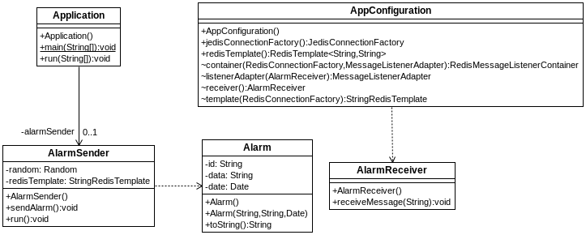

## s05.redisqueue

Redis también puede servir como infraestructura para el envío de mensajes. El siguiente proyecto muestra un ejemplo en el que se implementa un sistema de envío de alarmas. Las alarmas son objetos serializables que se envían pasando por Redis. Un emisor en un hilo que se conecta a Redis a un canal concreto para mandar mensajes continuamente, y en Spring definimos un Bean que haga de listener en el mismo canal. 



**Figura - Elementos del proyecto**


Esta en la clase que representa las alarmas, implementando Serializable:

**Listado - Fichero Alarm.java.**

```java
public class Alarm implements Serializable {
	private String id;
	private String data;
	private Date date;
...
}
```

Esta es la clase emisora de mensajes. Necesita una instancia de RedisTemplate para mandar los mensajes a un canal concreto. La propia clase genera las instancias de Alarm y las manda a través de Redis con la orden convertAndSend.

**Listado - Fichero AlarmSender.java.**

```java
@Component
public class AlarmSender implements Runnable {
    private Random random = new Random();
    
  @Autowired
  private StringRedisTemplate redisTemplate;

    public AlarmSender() {  }

    public void sendAlarm() {
      int number = random.nextInt(20);
      Alarm alarm = new Alarm("Alarm"+number, "Alarm nº " + number, new Date());
        System.out.println("Sending alarm: " + alarm);
        redisTemplate.convertAndSend("alarm_channel", alarm.toString());
    }

  @Override
  public void run() {
    try {
      do {
        Thread.sleep(random.nextInt(5000));
        sendAlarm();
      } while(true);
    } catch (InterruptedException eix) {
      System.err.println("Exception sending: " + eix.getMessage());
    }
    
  }
}
```

La clase de configuración crea instancias necesarias para la conexión, la obtención de un RedisTemplate y en este caso, necesita crear instancias de RedisMessageListenerContainer donde definirá el canal de envío de mensajes, y de MessageListenerAdapter, para indicar qué clase y qué método se encarga de la recepción de los mensajes.

**Listado - Fichero AppConfiguration.java.**

```java
@Configuration
public class AppConfiguration {
  
  @Bean
  public JedisConnectionFactory jedisConnectionFactory() {
      return new JedisConnectionFactory();
  }
   
  @Bean
  public RedisTemplate<String, String> redisTemplate() {
    StringRedisTemplate template = new StringRedisTemplate();
      template.setConnectionFactory(jedisConnectionFactory());
      return template;
  }

  @Bean
  RedisMessageListenerContainer container(RedisConnectionFactory connectionFactory,
      MessageListenerAdapter listenerAdapter) {

    RedisMessageListenerContainer container = new RedisMessageListenerContainer();
    container.setConnectionFactory(connectionFactory);
    container.addMessageListener(listenerAdapter, new PatternTopic("alarm_channel"));

    return container;
  }

  @Bean
  MessageListenerAdapter listenerAdapter(AlarmReceiver receiver) {
    return new MessageListenerAdapter(receiver, "receiveMessage");
  }

  @Bean
  AlarmReceiver receiver() {
    return new AlarmReceiver();
  }

  @Bean
  StringRedisTemplate template(RedisConnectionFactory connectionFactory) {
    return new StringRedisTemplate(connectionFactory);
  }
  
}
```

El receptor no necesita nada más que un método, ya que en la configuración ya le hemos indicado que esta clase es la que recibe los mensajes, y que se invocará al método receiveMessage pasándole como parámetro el mensaje recibido.

**Listado - Fichero AlarmReceiver.java.**

```java
public class AlarmReceiver {
	public void receiveMessage(String alarm) {
		System.out.println("Received message: " + alarm);
	}
}
```

En este caso, la clase principal se ocupa simplemente de poner en marcha el hilo emisor de mensajes.

**Listado - Fichero Application.java.**

```java
@SpringBootApplication
public class Application implements CommandLineRunner {

  @Autowired 
  private AlarmSender alarmSender;

  public static void main(String[] args) {
    SpringApplication.run(Application.class, args);
  }

  @Override
  public void run(String... args) throws Exception {
    
    System.out.println("Sending message...");
    alarmSender.run();
    System.exit(0);
  }

}
```

Y por la consola se puede verificar que los mensajes se mandan y se reciben perfectamente:


```bash
Sending message...
Sending alarm: Alarm [id=Alarm6, data=Alarm nº 6, date=Thu Feb 01 10:07:05 CET 2018]
Received message: Alarm [id=Alarm6, data=Alarm nº 6, date=Thu Feb 01 10:07:05 CET 2018]
Sending alarm: Alarm [id=Alarm5, data=Alarm nº 5, date=Thu Feb 01 10:07:09 CET 2018]
Received message: Alarm [id=Alarm5, data=Alarm nº 5, date=Thu Feb 01 10:07:09 CET 2018]
```

Incluso dentro del cli de redis podemos mandar nuevos mensajes o ver los que están pasando por él:

```bash
127.0.0.1:6379> publish alarm_channel "hello"
(integer) 1
127.0.0.1:6379> 
127.0.0.1:6379> subscribe alarm_channel
Reading messages... (press Ctrl-C to quit)
1) "subscribe"
2) "alarm_channel"
3) (integer) 1
1) "message"
2) "alarm_channel"
3) "Alarm [id=Alarm5, data=Alarm n\xc2\xba 5, date=Thu Feb 01 10:30:30 CET 2018]"
1) "message"
2) "alarm_channel"
3) "Alarm [id=Alarm9, data=Alarm n\xc2\xba 9, date=Thu Feb 01 10:30:32 CET 2018]"
```
