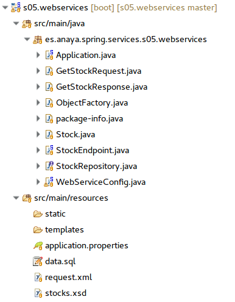
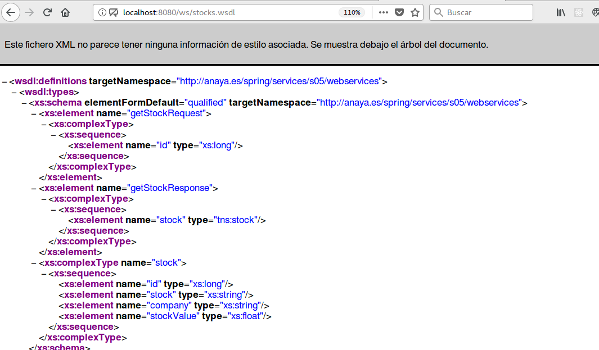

## s05.webservice

Los WebServices supusieron un avance fundamental para la integración de sistemas mixtos, dando una respuesta eficaz a la necesidad de poder interactuar entre proyectos remotos y desarrollados en distintas plataformas. En pleno auge del uso de XML, los WebServices suponían una modernización de las RPC o Remote Procedure Call, es decir, un mecanismo para poder hacer llamadas a procedimientos remotos. Básicamente se trata de hacer llamadas a métodos utilizando XML para las comunicaciones: tanto para los parámetros como para los resultados, los cuales se serializan en XML.
Todas los frameworks importantes ofrecen algún mecanismo para construir o consumir servicios web, y Java no se queda atrás. Lo bueno es que Spring facilita más aún la generación de servicios Web. 

Lo primero que necesitaremos es definir el WebService en un fichero xsd, el cual será almacenado en la carpeta resources de nuestro proyecto Spring. Este fichero define un WebService que nos dará información de valores de bolsa.
Al inicio del esquema se indica un espacio de nombres que podemos hacer coincidir (opcionalmente) con el del package del proyecto, de tal manera que cuando se autogenere código se hará dentro de un paquete con el mismo nombre.

**Listado - Fichero stocks.xsd.**

```xml
<xs:schema xmlns:xs="http://www.w3.org/2001/XMLSchema" xmlns:tns="http://anaya.es/spring/services/s05/webservices"
           targetNamespace="http://anaya.es/spring/services/s05/webservices" elementFormDefault="qualified">

    <xs:element name="getStockRequest">
        <xs:complexType>
            <xs:sequence>
                <xs:element name="id" type="xs:long"/>
            </xs:sequence>
        </xs:complexType>
    </xs:element>

    <xs:element name="getStockResponse">
        <xs:complexType>
            <xs:sequence>
                <xs:element name="stock" type="tns:stock"/>
            </xs:sequence>
        </xs:complexType>
    </xs:element>

    <xs:complexType name="stock">
        <xs:sequence>
            <xs:element name="id" type="xs:long"/>
            <xs:element name="stock" type="xs:string"/>
            <xs:element name="company" type="xs:string"/>
            <xs:element name="stockValue" type="xs:float"/>
        </xs:sequence>
    </xs:complexType>

</xs:schema>
```

El servicio tiene una llamada getStockRequest la cual espera un parámetro tipo long. La respuesta devuelve un objeto tipo Stock, el cual está definido al final. Stock representa un valor en bolsa. 
Para crear WebServices con Spring, podemos hacer uso de la autogeneración de código, ya que definiendo el wsd podemos obtenerlo automáticamente. Para ello, es necesario incluir unas dependencias en el fichero pom.xml del proyecto

**Listado - Fichero pom.xml.**

```xml
<build>
    <plugins>
      <plugin>
        <groupId>org.springframework.boot</groupId>
        <artifactId>spring-boot-maven-plugin</artifactId>
      </plugin>
      <plugin>
        <groupId>org.codehaus.mojo</groupId>
        <artifactId>jaxb2-maven-plugin</artifactId>
        <version>1.6</version>
        <executions>
          <execution>
            <id>xjc</id>
            <goals>
              <goal>xjc</goal>
            </goals>
          </execution>
        </executions>
        <configuration>
          <schemaDirectory>${project.basedir}/src/main/resources/</schemaDirectory>
          <outputDirectory>${project.basedir}/src/main/java</outputDirectory>
          <clearOutputDir>false</clearOutputDir>
        </configuration>
      </plugin>
    </plugins>
  </build>
```

Una vez actualizado el proyecto en un entorno como Eclipse, se crearán los siguientes ficheros Java de forma automática:
*	Stock.java: el POJO que representa un valor de bolsa, con anotaciones XML.
*	GetStockRequest.java: representa la llamada al WebService y contiene un getter/setter para tomar el parámetros id.
*	GetStockResponse.java: representa la respuesta, y contiene un getter/setter para la instancia de Stock que se pasará como resultado.
*	ObjectFactory.java: una clase Java que permite crear instancias de Stock, GetStockRequest y GetStockResponse.
*	package-info.java: contiene dos líneas relacionando el namespace de XML con el paquete de Java.


Como resultado, tendremos todos estos ficheros en el proyecto. 



**Figura - Elementos del proyecto**

La clase POJO que representa el Stock, ha sido retocada, ya que la información de Stocks se sacará de una BD, así que se le añaden las ya conocidas etiquetas de @Entity, @Table, @Id, y @GeneratedValue. 

**Listado - Fichero Stock.java.**

```java
@XmlAccessorType(XmlAccessType.FIELD)
@XmlType(name = "stock", propOrder = {
    "id",
    "stock",
    "company",
    "stockValue"
})
@Entity
@Table(name="STOCK")
public class Stock {
    @Id
    @GeneratedValue(strategy = GenerationType.AUTO)
    @XmlElement(required = true)
    protected Long id;
    @XmlElement(required = true)
    protected String stock;
    @XmlElement(required = true)
    protected String company;
    protected float stockValue;
...
}
```


La clase fundamental que define cómo se debe responder al WebService es la que se anota como @Endpoint. Al hacerlo, Spring ya sabe que esta clase sirve como soporte a un WebService. En este caso se le inyecta un repositorio para sacar la información de Stocks.
La forma en la que le llega la petición está encapsulada en una instancia GetStockRequest, de donde se sacará el parámetro, y la respuesta debe encapsularse en GetStockResponse. El método que da respuesta a la llamada del WebService está anotado con PayloadRoot y @ResponsePayload.

**Listado - Fichero StockEndpoint.java.**

```java
@Endpoint
public class StockEndpoint {
  private static final String NAMESPACE_URI = 		"http://anaya.es/spring/services/s05/webservices";

  private StockRepository stockRepository;

  @Autowired
  public StockEndpoint(StockRepository stockRepository) {
    this.stockRepository = stockRepository;
  }

  @PayloadRoot(namespace = NAMESPACE_URI, 
		    localPart = "getStockRequest")
  @ResponsePayload
  public GetStockResponse getStock(@RequestPayload GetStockRequest request) {
    GetStockResponse response = new GetStockResponse();
   response.setStock(stockRepository.findById(request.getId()).get());  
    return response;
  }
}
```

Y para que todo funcione, es necesario configurar los WebServices en la aplicación. Se hace con una clase anotada con @Configuration y en este caso @EnableWs. Spring define un Servlet específico para dar respuesta a las llamadas de WebServices, y en primer lugar configura que todo aquello que vaya a la url /ws/* será soportado por ese Servlet.
A continuación indica la configuración de la definición del WebService, el cual debe tener como mínimo:
*	Un puerto para cada WebService.
*	Una URI (la misma /ws/)
*	Un espacio de nombres.
Y obviamente, se configura el fichero xml o el esquema del WebService.


**Listado - Fichero WebServiceConfig.java.**

```java
@EnableWs
@Configuration
public class WebServiceConfig extends WsConfigurerAdapter {
  @Bean
  public ServletRegistrationBean messageDispatcherServlet(ApplicationContext applicationContext) {
    MessageDispatcherServlet servlet = new MessageDispatcherServlet();
    servlet.setApplicationContext(applicationContext);
    servlet.setTransformWsdlLocations(true);
    return new ServletRegistrationBean(servlet, "/ws/*");
  }

  @Bean(name = "stocks")
  public DefaultWsdl11Definition defaultWsdl11Definition(XsdSchema stocksSchema) {
    DefaultWsdl11Definition wsdl11Definition = new DefaultWsdl11Definition();
    wsdl11Definition.setPortTypeName("StocksPort");
    wsdl11Definition.setLocationUri("/ws");
    wsdl11Definition.setTargetNamespace("http://anaya.es/spring/services/s05/webservices");
    wsdl11Definition.setSchema(stocksSchema);
    return wsdl11Definition;
  }

  @Bean
  public XsdSchema stocksSchema() {
    return new SimpleXsdSchema(new ClassPathResource("stocks.xsd"));
  }
}
```

Si ponemos en marcha el proyecto y visitamos la url http://localhost:8080/ws/stocks.wsdl, veremos cómo está publicada la definición del WebService en formato XML, es decir, el wsdl.

TODO



**Figura - WSDL de nuestro WebService.**


¿Cómo se puede probar si el WebService funciona correctamente? Antes de ver cómo programar un cliente, veremos que se puede probar el WebService haciendo una petición por web a la aplicación. Obviamente la petición debe estar en formato xml. Herramientas de consola como curl nos permiten hacer este tipo de pruebas En primer lugar, necesitaremos el siguiente fichero XML que contiene una petición:

**Listado - Fichero request.xml.**

```xml
<soapenv:Envelope 
 xmlns:soapenv="http://schemas.xmlsoap.org/soap/envelope/"
 xmlns:gs="http://anaya.es/spring/services/s05/webservices">
   <soapenv:Header/>
   <soapenv:Body>
      <gs:getStockRequest>
         <gs:id>2</gs:id>
      </gs:getStockRequest>
   </soapenv:Body>
</soapenv:Envelope>
```

Y ahora ya se puede lanzar la petición, cuya salida nos demuestra el correcto funcionamiento del WebService:

```bash
javacurl --header "content-type: text/xml" -d @request.xml http://localhost:8080/ws

<SOAP-ENV:Envelope xmlns:SOAP-ENV="http://schemas.xmlsoap.org/soap/envelope/"><SOAP-ENV:Header/><SOAP-ENV:Body><ns2:getStockResponse xmlns:ns2="http://anaya.es/spring/services/s05/webservices"><ns2:stock><ns2:id>2</ns2:id><ns2:stock>GOOG</ns2:stock><ns2:company>Google</ns2:company><ns2:stockValue>1060.12</ns2:stockValue></ns2:stock></ns2:getStockResponse></SOAP-ENV:Body></SOAP-ENV:Envelope>
```
