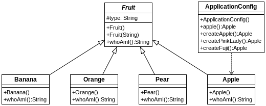

## Testing de instanciación
[Proyecto s07.beantest]

Este es un proyecto que simplemente crea instancias de objetos que representan frutas. Las instancias se crean de tres maneras posibles: 
*	Por anotaciones en las propias clases
*	A través de una clase de configuración
*	A través de XML en el fichero beans.xml
El proyecto muestra por una lado todas esas maneras de crear instancias y de paso como testear si efectivamente se han instanciado. Los tests son muy simples, basta con comprobar si las instancias existen realmente (no son nulas).



**Figura - Clases del proyecto**

Fruit es la superclase de la que descienden el resto.

**Listado - Fichero Fruit.java**

```java
public abstract class Fruit {
	protected String type = "Default";
	
	public Fruit () {}

	public Fruit(String type) {
		this.type = type;
	}
	
	public String whoAmI () {
		return type + " apple";
	}
}
```
La primera fruta es la banana:

**Listado - Fichero Banana.java, la clase que generará al menos una instancia**

```java
import org.springframework.stereotype.Component;

@Component
public class Banana extends Fruit {
	@Override
	public String whoAmI () {
		return type + " banana";
	}
}
```

El test unitario en este caso comprueba si existe un componente llamado, por defecto, banana.

**Listado - Fichero BananaTest.java**

```java
@RunWith(SpringJUnit4ClassRunner.class)
@SpringBootTest
public class BananaTest {
	@Autowired
	private Banana banana;
	
	@Test
	public void bananaAutowiredShouldExist() {
		assertNotNull(banana);
	}	
}
```

La clase Pear es muy simple, será instanciada externamente a través de la configuración XML:

**Listado - Fichero Pear.java**

```java
public class Pear extends Fruit {
	@Override
	public String whoAmI () {
		return type + " pear";
	}
}
```

En un proyecto Spring podemos instanciar los beans de varias maneras combinadas. Para los bean utilizaremos el fichero XML:

**Listado - Fichero de configuración XML de Spring**

```xml
<?xml version="1.0" encoding="UTF-8"?>
<beans xmlns="http://www.springframework.org/schema/beans"
	xmlns:xsi="http://www.w3.org/2001/XMLSchema-instance"
	xsi:schemaLocation="http://www.springframework.org/schema/beans 
	http://www.springframework.org/schema/beans/spring-beans.xsd">

	<bean id="pear1" class="es.anaya.spring.testing.s07.beantest.Pear" />
	<bean id="pear2" class="es.anaya.spring.testing.s07.beantest.Pear" />
	<bean id="pear3" primary="true" class="es.anaya.spring.testing.s07.beantest.Pear" />
</beans>
```


El testeo de estas instancias es similar al anterior. Comprobaremos cada uno de los beans para ver si son distintos de null. Observa cómo le indicamos al test el contexto Spring y le indicamos cuál es el fichero de beans.xml a través de anotaciones:

**Listado - Fichero PearTest.java**

```java
@RunWith(SpringJUnit4ClassRunner.class)
@ContextConfiguration({"classpath:beans.xml"})
public class PearTest {

	@Autowired
	private Pear primaryPear;
	
	@Autowired
	@Resource(name="pear1")
	private Pear pear1;
	
	@Test
	public void primaryAutowiredPearShouldExist() {
		assertNotNull(primaryPear);
	}
	
	@Test
	public void pearAutowiredShouldExist() {
		assertNotNull(pear1);
	}
}
```

Las manzanas serán instanciadas a través de una clase de configuración java:

**Listado - Fichero Apple.java, con la que haremos instancias y testing**

```java
public class Apple extends Fruit {
	@Override
	public String whoAmI () {
		return type + " apple";
	}
}
```


La generación de instancias de Apple se  hace indicando distintos identificadores:

**Listado - Fichero de configuración  Spring para crear algunas instancias de Apple**

```java
@Configuration
public class ApplicationConfig {

	@Bean
	public Apple apple () {
		return new Apple();
	}
	
	@Bean("simpleApple")
	public Apple createApple () {
		return new Apple();
	}
	
	@Bean(name="pinkLadyApple")
	public Apple createPinkLady () {
		return new Apple();
	}
	
	@Bean(name="fujiApple")
	public Apple createFuji() {
		return new Apple();
	}
}
```
¿Una vez más, en el test unitario comprobaremos si esas instancias no son null. Observa las distintas maneras de acceder a los beans: por nombre, por qualifier, como recurso,... cualquier de ellas nos sirve.

**Listado - Test unitarios de instanciación**


```java
@RunWith(SpringJUnit4ClassRunner.class)
@ContextConfiguration(classes = ApplicationConfig.class)
public class AppleTest {

	@Autowired
	private Apple apple;
	
	@Autowired
	@Value("#{apple}")
	private Apple simpleApple;
	
	@Autowired
	@Qualifier("pinkLadyApple")
	private Apple pinkLadyApple;
	
	@Autowired
	@Resource(name="fujiApple")
	private Apple fujiApple;
	
	@Test
	public void contextLoads() {
	}
	
	@Test
	public void appleShouldAutowire () {
		assertNotNull(apple);
	}

	@Test
	public void appleShouldAutowireByValue() {
		assertNotNull(simpleApple);
	}
	
	@Test
	public void appleShouldAutowireByQualifier () {
		assertNotNull(pinkLadyApple);
	}
	
	@Test
	public void appleShouldAutowireByResourceName () {
		assertNotNull(fujiApple);
	}
}
```
